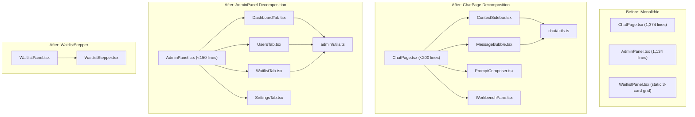
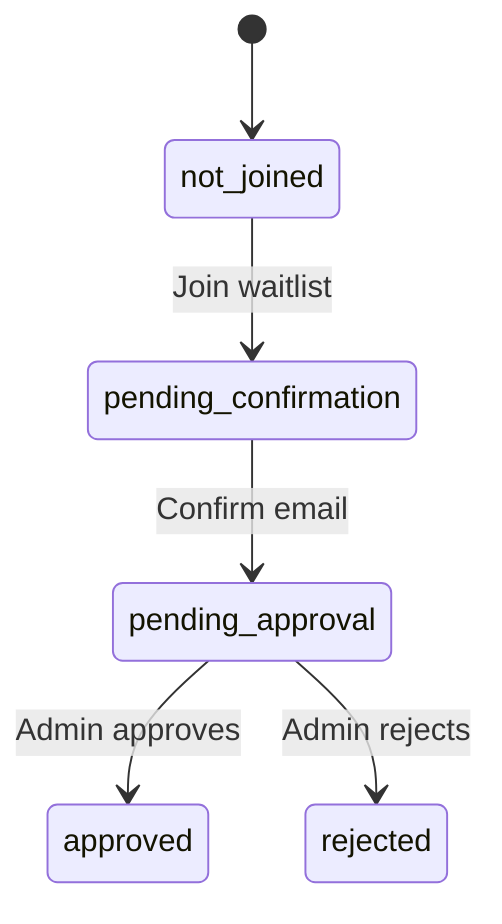

# Design Document: Design Debt Resolution

## Overview

This design addresses three interconnected design debts in the Chat3D frontend:

1. **ChatPage.tsx** (1,374 lines) — a monolithic component containing the context sidebar, message thread, prompt composer, and 3D workbench pane all inlined in a single file. It will be decomposed into four focused sub-components under `packages/frontend/src/components/chat/`.

2. **AdminPanel.tsx** (1,134 lines) — a monolithic component containing dashboard KPIs, user management, waitlist moderation, and settings tabs all inlined. It will be decomposed into four tab sub-components under `packages/frontend/src/components/admin/`.

3. **WaitlistStepper** — a new accessible visual step indicator component that replaces the static 3-card grid currently in `WaitlistPanel.tsx` with a dynamic stepper that reflects the user's actual waitlist status.

All three changes are pure frontend refactors/additions. No backend changes, no new API contracts, no new routes. The existing test suite (`chat.page.test.tsx`) must pass without modification to test assertions.

### Design Decisions

- **Props-down, callbacks-up**: Each extracted sub-component receives data and handlers via typed props. No new context providers or state management libraries are introduced. The parent component remains the state owner.
- **Shared utilities via co-located files**: Utility functions used by multiple sub-components within the same feature directory are moved to a `utils.ts` file in that directory (e.g., `components/chat/utils.ts`), not to a global utils folder.
- **No barrel exports**: Each component is imported directly by path. No `index.ts` re-export files — consistent with the existing project convention.
- **Preserve test contracts**: The ChatPage extraction is a pure structural refactor. The existing test file imports `ChatPage` and tests it as a composed unit. Since the public API (component name, route behavior, data-testid attributes) is unchanged, tests pass without modification.

## Architecture

The extraction follows a straightforward "lift and shift" pattern: identify self-contained JSX blocks in the monolithic component, extract them into separate files with typed props interfaces, and replace the inline markup with component composition.



### File Structure

```
packages/frontend/src/components/
├── chat/
│   ├── ContextSidebar.tsx
│   ├── MessageBubble.tsx
│   ├── PromptComposer.tsx
│   ├── WorkbenchPane.tsx
│   └── utils.ts
├── admin/
│   ├── DashboardTab.tsx
│   ├── UsersTab.tsx
│   ├── WaitlistTab.tsx
│   ├── SettingsTab.tsx
│   └── utils.ts
├── ChatPage.tsx          (refactored, <200 lines)
├── AdminPanel.tsx        (refactored, <150 lines)
├── WaitlistPanel.tsx     (updated to use WaitlistStepper)
└── WaitlistStepper.tsx
```

## Components and Interfaces

### ChatPage Extraction

#### `chat/utils.ts` — Shared Utilities

Functions used by more than one extracted sub-component are moved here. Based on source analysis:

- `toErrorMessage(error: unknown): string` — used across multiple components (also duplicated in AdminPanel and WaitlistPanel; each keeps its own copy per DRY-with-restraint).
- `fileExtension(path: string): string` — used by MessageBubble and WorkbenchPane.
- `uniqueFilesByPath(files: Array<{path: string; filename: string}>): Array<{path: string; filename: string}>` — used by MessageBubble and WorkbenchPane.
- `formatEstimatedCostUsd(value: number): string` — used by MessageBubble.

Functions used only by ChatPage orchestration remain in `ChatPage.tsx`:
- `asContextId`, `formatState`, `routeForContext`, `toBase64`, `sanitizeUploadFilename`, `inferAttachmentKind`, `contextBucketLabel`, `groupContexts`.

#### `ContextSidebar.tsx`

```typescript
import type { ChatContext } from "../../api/chat.api";

type ContextBucket = "Today" | "Last 7 days" | "Older";

interface ContextSidebarProps {
  groupedContexts: Record<ContextBucket, ChatContext[]>;
  activeContextId: string | null;
  isDraftRoute: boolean;
  busyAction: string | null;
  token: string | null;
  onNavigateNew: () => void;
  onCreateNamed: (name: string) => void;
  onSelect: (contextId: string) => void;
  onRename: (context: ChatContext) => void;
  onDelete: (context: ChatContext) => void;
}
```

Renders the left sidebar: "New Chat" button, "Create named context" button, and the grouped context list with rename/delete actions.

#### `MessageBubble.tsx`

```typescript
import type { ChatTimelineItem } from "../../features/chat/chat-adapters";

interface MessageBubbleProps {
  item: ChatTimelineItem;
  isSelected: boolean;
  busyAction: string | null;
  onSelect: (itemId: string) => void;
  onRate: (item: { id: string; rating: -1 | 0 | 1 }, rating: -1 | 1) => void;
  onRegenerate: (assistantItemId: string) => void;
  onDownloadFile: (filePath: string) => void;
}
```

Renders a single timeline item (user or assistant message) including: role avatar, timestamp, markdown content, attachments, code blocks, file download buttons, rating controls, and regenerate button.

#### `PromptComposer.tsx`

```typescript
import type { QueryAttachment } from "../../api/query.api";

interface PromptComposerProps {
  prompt: string;
  onPromptChange: (value: string) => void;
  queuedAttachments: QueryAttachment[];
  busyAction: string | null;
  hasAssistantItems: boolean;
  activeContextId: string | null;
  onSubmit: () => void;
  onAttachFiles: (files: File[]) => void;
  onRemoveAttachment: (path: string) => void;
  onRegenerate: () => void;
}
```

Renders the prompt input area: textarea, attachment pills, paperclip button, regenerate shortcut, and send button.

#### `WorkbenchPane.tsx`

```typescript
import type { ChatTimelineItem } from "../../features/chat/chat-adapters";
import type { LlmModel } from "../../api/query.api";

type RightPaneTab = "preview" | "parameters" | "files" | "history";

interface WorkbenchPaneProps {
  selectedAssistantItem: ChatTimelineItem | null;
  selectedAssistantFiles: Array<{ path: string; filename: string }>;
  selectedPreviewFile: { path: string; filename: string } | null;
  queryStates: Array<{ id: number; state: string; detail: string; createdAt: string }>;
  conversationModels: LlmModel[];
  codegenModels: LlmModel[];
  conversationModelId: string;
  codegenModelId: string;
  outputFormat: "stl" | "3mf" | "step";
  detailLevel: "low" | "medium" | "high";
  advancedPrompt: string;
  activeContextId: string | null;
  busyAction: string | null;
  token: string | null;
  onConversationModelChange: (id: string) => void;
  onCodegenModelChange: (id: string) => void;
  onOutputFormatChange: (format: "stl" | "3mf" | "step") => void;
  onDetailLevelChange: (level: "low" | "medium" | "high") => void;
  onAdvancedPromptChange: (value: string) => void;
  onSaveModelSelection: () => void;
  onDownloadFile: (filePath: string) => void;
}
```

Renders the right-side workbench: tab bar (Preview / Parameters / Files / History), 3D model viewer, parameter controls, file list, and query state history.

#### Refactored `ChatPage.tsx`

After extraction, ChatPage retains:
- All `useState` / `useEffect` / `useCallback` / `useMemo` hooks (state ownership stays in the parent).
- All async action functions (`createContextAction`, `submitPromptAction`, `downloadFileAction`, etc.).
- The mobile pane tab bar (small, layout-only).
- Composition of `<ContextSidebar>`, `<MessageBubble>` (mapped over `visibleTimelineItems`), `<PromptComposer>`, and `<WorkbenchPane>`.
- The optimistic pending message block (small, tightly coupled to ChatPage state).

### AdminPanel Extraction

#### `admin/utils.ts` — Shared Utilities

```typescript
export function toErrorMessage(error: unknown): string;
export function sortUsersByCreatedDate(users: AdminUser[]): AdminUser[];
export function sortWaitlistByCreatedDate(entries: AdminWaitlistEntry[]): AdminWaitlistEntry[];
export function toRoleTone(role: AdminUser["role"]): string;
export function toStatusTone(status: AdminUser["status"]): string;
export function toWaitlistTone(status: AdminWaitlistEntry["status"]): string;
export function formatPct(value: number): string;

export interface ConfirmState {
  title: string;
  description: string;
  confirmLabel: string;
  danger?: boolean;
  onConfirm: () => Promise<void>;
}
```

#### `DashboardTab.tsx`

```typescript
interface DashboardKpis {
  pendingWaitlistCount: number;
  avgWaitlistApprovalHours: number | null;
  newRegistrations7d: number;
  activeUsers7d: number;
  deactivatedUsersCount: number;
  querySuccessRate24h: number;
  querySuccessRate7d: number;
}

interface DashboardTabProps {
  kpis: DashboardKpis;
  pendingWaitlistEntries: AdminWaitlistEntry[];
  queueEntry: AdminWaitlistEntry | null;
  token: string | null;
  onSwitchTab: (tab: string) => void;
  onOpenConfirm: (state: ConfirmState) => void;
  onApproveEntry: (entry: AdminWaitlistEntry) => Promise<void>;
  onToggleWaitlist: (currentEnabled: boolean) => void;
  onSetStatusFilter: (filter: string) => void;
  settingsDraftWaitlistEnabled: boolean;
}
```

#### `UsersTab.tsx`

```typescript
interface UsersTabProps {
  users: AdminUser[];
  search: string;
  statusFilter: string;
  busyUserIds: Set<string>;
  onSearchChange: (value: string) => void;
  onStatusFilterChange: (value: string) => void;
  onSelectUser: (userId: string) => void;
}
```

#### `WaitlistTab.tsx`

```typescript
interface WaitlistTabProps {
  waitlistEntries: AdminWaitlistEntry[];
  pendingEntries: AdminWaitlistEntry[];
  queueEntry: AdminWaitlistEntry | null;
  queueIndex: number;
  moderationReason: string;
  busyWaitlistEntryIds: Set<string>;
  token: string | null;
  onQueueIndexChange: (index: number) => void;
  onModerationReasonChange: (value: string) => void;
  onOpenConfirm: (state: ConfirmState) => void;
  onApproveEntry: (entry: AdminWaitlistEntry) => Promise<void>;
  onRejectEntry: (entry: AdminWaitlistEntry) => Promise<void>;
}
```

#### `SettingsTab.tsx`

```typescript
interface SettingsDraft {
  waitlistEnabled: boolean;
  invitationsEnabled: boolean;
  invitationWaitlistRequired: boolean;
  invitationQuotaPerUser: number;
}

interface SettingsTabProps {
  settings: AdminSettings | null;
  draft: SettingsDraft;
  hasChanges: boolean;
  isSaving: boolean;
  onDraftChange: (draft: SettingsDraft) => void;
  onSave: () => void;
  onReset: () => void;
  onOpenConfirm: (state: ConfirmState) => void;
}
```

### WaitlistStepper

#### `WaitlistStepper.tsx`

```typescript
type WaitlistStepperStatus =
  | "not_joined"
  | "pending_confirmation"
  | "pending_approval"
  | "approved"
  | "rejected";

interface WaitlistStepperProps {
  status: WaitlistStepperStatus;
}
```

The stepper renders three steps: "Join", "Confirm Email", "Approved". Each step has three visual states: completed (check icon, success color), active (pulsing/highlighted, primary color), upcoming (muted). The "rejected" status shows a distinct failed treatment on the "Approved" step (X icon, destructive color).



Step state mapping:

| `status`               | Step 1 (Join) | Step 2 (Confirm Email) | Step 3 (Approved) |
|------------------------|---------------|------------------------|--------------------|
| `not_joined`           | active        | upcoming               | upcoming           |
| `pending_confirmation` | completed     | active                 | upcoming           |
| `pending_approval`     | completed     | completed              | active             |
| `approved`             | completed     | completed              | completed          |
| `rejected`             | completed     | completed              | rejected           |

ARIA attributes:
- Container: `role="group"`, `aria-label="Waitlist progress"`
- Each step: `aria-current="step"` on the active step
- Each step: `aria-label` describing the step name and state (e.g., "Join, completed")

Integration: `WaitlistPanel.tsx` maps its `WaitlistStatusResponse["status"]` to `WaitlistStepperStatus` and renders `<WaitlistStepper>` above the flow content, replacing the existing static 3-card grid.

Status mapping from API to stepper:
- No status loaded → `"not_joined"`
- `"pending_email_confirmation"` → `"pending_confirmation"`
- `"pending_admin_approval"` → `"pending_approval"`
- `"approved"` → `"approved"`
- `"rejected"` → `"rejected"`

## Data Models

No new data models are introduced. All components consume existing types:

- `ChatContext`, `ChatItem` from `api/chat.api`
- `ChatTimelineItem`, `ChatSegment`, `ChatFileEntry` from `features/chat/chat-adapters`
- `LlmModel`, `QueryAttachment` from `api/query.api`
- `AdminUser`, `AdminWaitlistEntry`, `AdminSettings` from `api/admin.api`
- `WaitlistStatusResponse`, `WaitlistStatus` from `api/waitlist.api`

The only new type is `WaitlistStepperStatus`, a union of five string literals that maps from the API's `WaitlistStatus` (plus a `"not_joined"` state for when no status is loaded).


## Correctness Properties

*A property is a characteristic or behavior that should hold true across all valid executions of a system — essentially, a formal statement about what the system should do. Properties serve as the bridge between human-readable specifications and machine-verifiable correctness guarantees.*

### Property 1: MessageBubble renders role and text content

*For any* valid `ChatTimelineItem`, rendering `MessageBubble` with that item should produce output that contains the item's role indicator ("user" or "assistant") and the text content of each non-empty segment.

Reasoning: MessageBubble has the most complex rendering logic of all extracted components — it handles user messages, assistant messages, attachments, code blocks, meta segments with usage stats, and model segments with file lists. A property test generating random timeline items with varying segment counts and kinds ensures the core content is always rendered regardless of shape. Edge cases (empty segments, attachment-only segments) are covered by the generator.

**Validates: Requirements 1.5**

### Property 2: PromptComposer disabled state consistency

*For any* combination of `busyAction` value and `prompt` string, the Send button in `PromptComposer` should be disabled if and only if `busyAction` is non-null OR the trimmed prompt is empty.

Reasoning: The PromptComposer's send button has a compound disabled condition. A property test generating random busyAction values (null or various strings) and random prompt strings (including whitespace-only) verifies the disabled logic is correct across all input combinations. This catches regressions where the disabled condition is accidentally simplified or inverted during extraction.

**Validates: Requirements 1.6**

### Property 3: WaitlistStepper step state mapping

*For any* `WaitlistStepperStatus` value, the step states produced by the stepper's internal mapping function should match the expected completed/active/upcoming/rejected assignment defined in the requirements status table.

Reasoning: The stepper maps 5 status values to 3 step states each (15 total assignments). This combines requirements 3.4–3.8 into a single property. Since the domain is finite (5 statuses), the property test exhaustively covers all cases. The mapping function can be extracted as a pure function and tested directly, or tested via rendered output.

**Validates: Requirements 3.4, 3.5, 3.6, 3.7, 3.8**

### Property 4: WaitlistStepper structure and accessibility

*For any* `WaitlistStepperStatus` value, the rendered `WaitlistStepper` should contain exactly three steps labeled "Join", "Confirm Email", and "Approved", and should have a container with `role="group"` and `aria-label="Waitlist progress"`. When a step is active, it should have `aria-current="step"`.

Reasoning: This combines requirements 3.1 (three labeled steps) and 3.11 (ARIA attributes) into a single property. For all 5 status values, the structural and accessibility invariants must hold. The property ensures that no status value accidentally breaks the step count or drops ARIA attributes.

**Validates: Requirements 3.1, 3.11**

### Property 5: UsersTab renders all user emails

*For any* non-empty list of `AdminUser` objects, rendering `UsersTab` with that list (and status filter "all") should produce output containing every user's email address.

Reasoning: UsersTab receives a filtered user list and renders it. The property ensures no users are silently dropped during rendering. Generating random user lists with varying lengths and email formats verifies the list rendering is complete.

**Validates: Requirements 2.5**

## Error Handling

Error handling patterns are preserved from the existing monolithic components — no new error handling is introduced.

### ChatPage Sub-components

- Sub-components do not perform async operations directly. All API calls remain in `ChatPage.tsx` and errors are surfaced via the existing `error` state and `<InlineAlert>` pattern.
- Sub-components receive `busyAction` as a prop to disable interactive elements during in-flight operations, preventing double-submission.
- If a sub-component receives unexpected prop values (e.g., empty arrays), it renders empty states using the existing `<EmptyState>` component — no silent failures.

### AdminPanel Sub-components

- Same pattern: all API calls and error state remain in `AdminPanel.tsx`.
- Tab sub-components receive error state indirectly (the parent renders `<InlineAlert>` above the tabs).
- Confirmation dialogs are triggered via `onOpenConfirm` callback — the parent owns the `<Dialog>` and `confirmBusy` state.

### WaitlistStepper

- The stepper is a pure presentational component. It receives a status prop and renders accordingly.
- If an unexpected status value is passed (defensive coding), the stepper defaults to the `"not_joined"` state — all steps shown as upcoming except "Join" as active.
- No API calls, no async operations, no error state.

## Testing Strategy

### Dual Testing Approach

Both unit tests and property-based tests are required:

- **Unit tests**: Verify specific examples, edge cases, integration points, and the existing test suite contract.
- **Property tests**: Verify universal properties across randomly generated inputs using `fast-check`.

### Property-Based Testing Configuration

- **Library**: `fast-check` (to be added as a dev dependency to `@chat3d/frontend`)
- **Minimum iterations**: 100 per property test
- **Each property test must reference its design document property** with a tag comment:
  ```
  // Feature: 001-design-debt-resolution, Property N: <property title>
  ```
- **Each correctness property is implemented by a single property-based test.**

### Unit Tests

Unit tests focus on:

1. **Existing test suite preservation** (Requirement 1.9): Run `packages/frontend/src/__tests__/chat.page.test.tsx` without modification. This validates that the ChatPage extraction preserves the public behavioral contract.

2. **WaitlistStepper examples** (Requirements 3.4–3.8): While Property 3 covers the mapping exhaustively, individual status examples serve as readable documentation tests.

3. **Component rendering smoke tests**: Each extracted component gets a basic render test with representative props to catch import/export issues.

4. **Edge cases**:
   - MessageBubble with zero segments
   - MessageBubble with attachment-only segments (no text)
   - ContextSidebar with empty context list
   - UsersTab with empty user list
   - WaitlistStepper with `"rejected"` status (distinct visual treatment)

### Property Tests

| Property | Test File | Generator Strategy |
|----------|-----------|-------------------|
| Property 1: MessageBubble renders role and text | `chat/MessageBubble.test.tsx` | Generate `ChatTimelineItem` with random role, random segment count (1–5), random text strings, random segment kinds |
| Property 2: PromptComposer disabled state | `chat/PromptComposer.test.tsx` | Generate random `busyAction` (null or arbitrary string) and random `prompt` (including whitespace-only strings) |
| Property 3: WaitlistStepper step mapping | `WaitlistStepper.test.tsx` | Generate from the 5-element `WaitlistStepperStatus` union using `fc.constantFrom(...)` |
| Property 4: WaitlistStepper structure/ARIA | `WaitlistStepper.test.tsx` | Same generator as Property 3 |
| Property 5: UsersTab renders all emails | `admin/UsersTab.test.tsx` | Generate lists of `AdminUser` objects with random emails, roles, statuses |

### Test Execution

```bash
# Run all frontend tests (includes existing + new)
npm --workspace @chat3d/frontend run test

# Typecheck
npm --workspace @chat3d/frontend run typecheck
```
