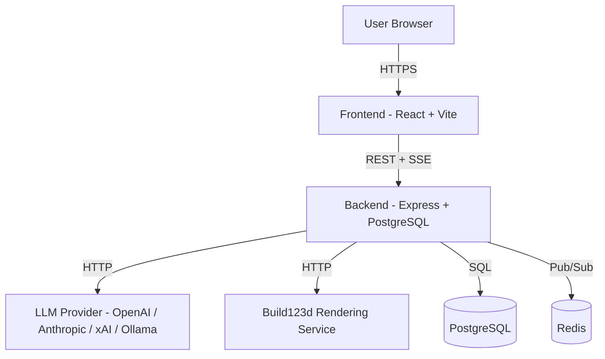
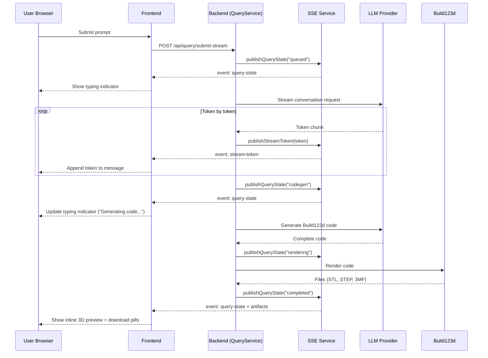
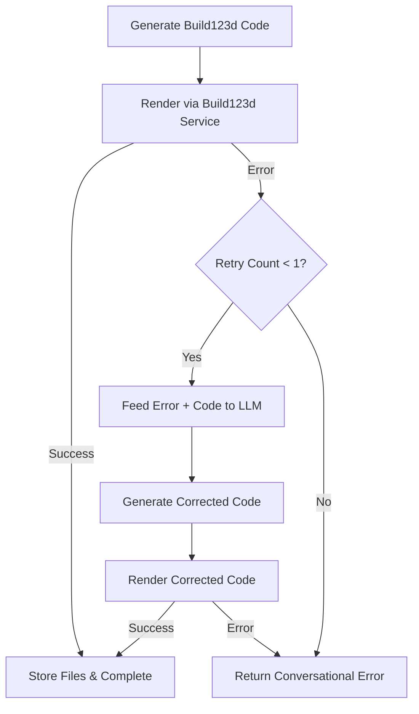

# Design Document: UX Gaps — Conversational Experience

## Overview

This design addresses the five remaining UX gaps identified in the product vision (#[[file:docs/product-vision.md]]) and formalized in the requirements document (#[[file:.kiro/specs/ux-gaps-conversational-experience/requirements.md]]). The goal is to transform Chat3D from a functional prompt-to-CAD pipeline into a polished conversational workspace where users iterate on 3D models through natural dialogue.

The design spans four phases:

1. **Phase 1 (Reqs 1–6):** Make the conversation feel real — streaming responses, typing indicator, inline 3D preview with turntable animation, progressive disclosure, compact download pills, example prompts.
2. **Phase 2 (Reqs 7–9):** Improve model generation quality — Build123d API reference enrichment, error recovery loop, conversational error display.
3. **Phase 3 (Reqs 10–12):** Enable iterative refinement — conversation history for LLM context, follow-up modification prompts, model version history.
4. **Phase 4 (Reqs 13–16):** Polish — capability hints/help, visible camera controls, fullscreen toggle, mobile auto-switch.
5. **Navigation cleanup (Reqs 17–21):** Remove app shell sidebar from chat, consolidate navigation into header dropdown, restrict admin-only pages with route guards.
6. **Inline preview & history (Reqs 22–23):** Turntable animation behavior, immutable chat history with per-message artifacts.

### Key Design Decisions

- **Streaming via SSE, not WebSocket:** The backend already uses SSE (`SseService`) for real-time updates. We extend this pattern for token streaming rather than introducing a new transport. The existing `publishQueryState` mechanism is augmented with a `streaming-token` event type.
- **Inline 3D preview as a new component:** A lightweight `InlineModelViewer` component is created for in-message previews, distinct from the full `ModelViewer` in the WorkbenchPane. This avoids bloating the chat thread with the full workbench viewer's parameter/file tabs.
- **No Vercel AI SDK:** The product vision mentions "Vercel AI SDK streaming" but the current backend uses direct provider API calls (`generateWithProvider`). We implement streaming at the provider level using each provider's native streaming API (OpenAI `stream: true`, Anthropic streaming messages, etc.) and pipe tokens through SSE. This avoids adding a heavy dependency for a single feature.
- **Error recovery is backend-only:** The error recovery loop (Req 8) is entirely within `QueryService.submitQuery`. The frontend sees the retry as a transparent state transition (`rendering` → `retrying` → `completed` or `failed`).
- **Immutable chat items:** Each assistant response is already stored as a separate `chat_items` row with a unique `assistantItemId`. Files are stored at `modelcreator/{assistantItemId}.{extension}`. This existing model naturally supports immutable history (Req 23) — no schema changes needed.

## Architecture

### System Context



### Streaming Architecture (Phase 1)



### Error Recovery Loop (Phase 2)



### Navigation Architecture (Reqs 17–21)

```mermaid
graph LR
    subgraph "Chat Page (full viewport)"
        CS[ContextSidebar] --- CT[Chat Thread] --- WP[WorkbenchPane]
    end

    subgraph "Header Bar"
        HB[Brand + Page Title] --- NB[Notification Bell - admin only]
        NB --- TT[Theme Toggle]
        TT --- DD[Username Dropdown]
    end

    DD -->|Profile| PP[/profile]
    DD -->|Admin - admin only| AP[/admin]
    DD -->|Query Workbench - admin only| QW[/query]
    DD -->|Logout| LO[Logout]
```

**Routing changes:**
- Chat routes (`/chat`, `/chat/new`, `/chat/:contextId`) render without the `AppShell` sidebar — the ChatPage occupies the full viewport width.
- Non-chat pages (`/profile`, `/admin`) retain the standard layout or use a minimal header-only layout.
- `/query`, `/notifications`, `/admin` are wrapped in `RequireRole` with `roles={["admin"]}` and `redirectTo="/chat"`.
- The notification bell icon and unread badge in the header are conditionally rendered only for admin users.

## Components and Interfaces

### New Frontend Components

| Component | Location | Purpose |
|-----------|----------|---------|
| `InlineModelViewer` | `components/chat/InlineModelViewer.tsx` | Lightweight Three.js viewer for in-message 3D preview with turntable animation |
| `TypingIndicator` | `components/chat/TypingIndicator.tsx` | Animated dots displayed while backend is processing |
| `DownloadPill` | `components/chat/DownloadPill.tsx` | Compact inline pill button for file downloads |
| `CollapsibleSection` | `components/chat/CollapsibleSection.tsx` | Expand/collapse wrapper for code and file details |
| `ExamplePrompts` | `components/chat/ExamplePrompts.tsx` | Clickable example prompt cards for empty chat state |
| `CapabilityHints` | `components/chat/CapabilityHints.tsx` | "What can I build?" help popover content |
| `CameraControlsToolbar` | `components/chat/CameraControlsToolbar.tsx` | Overlay buttons for reset view, zoom to fit, fullscreen |
| `AdminRouteGuard` | `components/AdminRouteGuard.tsx` | Route wrapper using `RequireRole` with redirect to `/chat` |

### Modified Frontend Components

| Component | Changes |
|-----------|---------|
| `MessageBubble` | Integrate `InlineModelViewer`, `DownloadPill`, `CollapsibleSection`; replace current download bar and raw file list |
| `ChatPage` | Add streaming state management, typing indicator, empty state with `ExamplePrompts`; handle mobile auto-switch |
| `WorkbenchPane` | Add model version history list in history tab; integrate `CameraControlsToolbar` |
| `ModelViewer` | Add turntable animation, true fullscreen (viewport overlay), `CameraControlsToolbar` |
| `PromptComposer` | Disable send during streaming; add "What can I build?" help trigger |
| `App (AuthenticatedApp)` | Remove sidebar for chat routes; add admin-only items to header dropdown; wrap admin routes with `RequireRole`; conditionally render notification bell |

### New Backend Interfaces

```typescript
// New SSE event types for streaming
interface StreamTokenEvent {
  type: "stream-token";
  contextId: string;
  assistantItemId: string;
  token: string;        // incremental text chunk
  done: boolean;        // true when conversation stage completes
}

interface QueryStateEvent {
  type: "query-state";
  contextId: string;
  assistantItemId: string;
  state: "queued" | "conversation" | "codegen" | "rendering" | "retrying" | "completed" | "failed";
  detail?: string;
}

// New streaming endpoint
// POST /api/query/submit-stream
// Response: 202 Accepted with { contextId, assistantItemId }
// Tokens delivered via SSE stream-token events

// Error recovery input to codegen LLM
interface ErrorRecoveryPrompt {
  originalPrompt: string;
  failingCode: string;
  errorMessage: string;
  conversationText: string;
}
```

### Modified Backend Services

| Service | Changes |
|---------|---------|
| `QueryService.submitQuery` | Add streaming conversation generation; add error recovery loop after rendering failure; include conversation history in LLM context |
| `LlmService.generateConversationText` | Add streaming variant that yields tokens via callback |
| `LlmService.generateBuild123dCode` | Enrich system prompt with Build123d API reference; accept error recovery context |
| `SseService` | Add `publishStreamToken` method for token-level events |
| `RenderingService` | No changes — error messages are already returned and will be fed back to LLM |

### Frontend Streaming Hook

```typescript
// hooks/useStreamingQuery.ts
interface UseStreamingQueryOptions {
  token: string | null;
  onToken: (token: string) => void;
  onStateChange: (state: QueryStateEvent) => void;
  onComplete: () => void;
  onError: (error: string) => void;
}

// Listens to SSE events filtered by assistantItemId
// Manages streaming text accumulation
// Handles connection interruption with partial response display
```

## Data Models

### Existing Models (No Schema Changes)

The existing data model already supports the requirements:

- **`chat_contexts`** — One row per conversation. Contains `name`, `owner_id`, model preferences.
- **`chat_items`** — One row per user prompt or assistant response. Each assistant item has a unique `id` used as `assistantItemId`. The `messages` JSONB column stores segments (message, 3dmodel, meta, errormessage, attachment).
- **`files`** — User files stored at `modelcreator/{assistantItemId}.{extension}`, already unique per iteration.

This means Req 23 (immutable chat history) is naturally supported: each `submitQuery` call creates a new `chat_items` row for the assistant response. Previous rows are never modified by new queries.

### New Data Structures (In-Memory / JSONB)

```typescript
// Build123d API reference — loaded from a static JSON/TS file
// Stored in memory, hot-reloadable via file watcher (Req 7.4)
interface Build123dApiEntry {
  className: string;
  signature: string;
  description: string;
  category: "primitive" | "operation" | "boolean" | "fillet-chamfer" | "sketch" | "other";
}

interface Build123dExampleSnippet {
  operation: string;       // "extrude" | "revolve" | "boolean" | "loft"
  description: string;
  code: string;
}

// Conversation context passed to LLM (Req 10)
// Built from the last N chat_items in the context
interface ConversationHistoryEntry {
  role: "user" | "assistant";
  text: string;
  code?: string;           // Build123d code from assistant responses
  sequencePosition: number;
}

// Model version for WorkbenchPane history tab (Req 12)
interface ModelVersionEntry {
  assistantItemId: string;
  sequenceNumber: number;
  timestamp: string;
  promptSummary: string;   // Truncated originating prompt
  previewFilePath: string | null;
  files: Array<{ path: string; filename: string }>;
}
```

### SSE Event Schema Extensions

The existing `SseService` publishes events with `eventType` and `payload`. New event types:

| Event Type | Payload | Purpose |
|------------|---------|---------|
| `stream-token` | `{ contextId, assistantItemId, token, done }` | Incremental conversation text |
| `query-state` | `{ contextId, assistantItemId, state, detail? }` | Pipeline stage transitions (extends existing pattern) |
| `query-artifacts` | `{ contextId, assistantItemId, files, previewFilePath }` | Final artifact list after completion |


## Correctness Properties

*A property is a characteristic or behavior that should hold true across all valid executions of a system — essentially, a formal statement about what the system should do. Properties serve as the bridge between human-readable specifications and machine-verifiable correctness guarantees.*

### Property 1: Streaming token concatenation equals complete response

*For any* sequence of stream tokens delivered by the Streaming_Endpoint, concatenating all tokens in order should produce a string identical to the complete Assistant_Response conversation text stored in the database.

**Validates: Requirements 1.1, 1.3**

### Property 2: Send button disabled during streaming

*For any* streaming state (tokens being delivered or backend processing active), the PromptComposer send button should be disabled and not accept user interaction.

**Validates: Requirements 1.5**

### Property 3: Typing indicator visible during processing states

*For any* query state in the set {`conversation`, `codegen`, `rendering`, `retrying`}, the Typing_Indicator should be visible in the Chat_Thread.

**Validates: Requirements 2.2**

### Property 4: Inline 3D preview rendered when preview-ready artifacts present

*For any* Assistant_Response that contains at least one file with a `.stl` or `.3mf` extension, the Chat_Thread should render an InlineModelViewer component within that message.

**Validates: Requirements 3.1**

### Property 5: User interaction pauses turntable animation

*For any* active Inline_3D_Preview displaying a Turntable_Animation, when a user interaction event (mousedown, touchstart) occurs on the viewer, the animation should pause immediately (rotation delta becomes zero).

**Validates: Requirements 3.3, 22.3**

### Property 6: Turntable rotation speed within specified range

*For any* frame time delta during active Turntable_Animation, the rotation increment should correspond to a full rotation period between 10 and 15 seconds (i.e., angular velocity between `2π/15` and `2π/10` radians per second).

**Validates: Requirements 22.1**

### Property 7: Code and file sections collapsed by default

*For any* Assistant_Response rendered in the Chat_Thread, the code section and file details section should be in collapsed state on initial render, regardless of whether the response contains code, files, or both.

**Validates: Requirements 4.1, 23.4**

### Property 8: Expand/collapse round-trip restores original state

*For any* collapsible section in an Assistant_Response, expanding and then collapsing the section should return it to the same visual and DOM state as the initial collapsed state.

**Validates: Requirements 4.4**

### Property 9: Collapsible controls have accessible labels and keyboard support

*For any* expand/collapse control in the Chat_Thread, the control should have a non-empty `aria-label` or `aria-expanded` attribute and should respond to Enter and Space key events.

**Validates: Requirements 4.5**

### Property 10: Download pills rendered for all file types in assistant responses

*For any* Assistant_Response with downloadable files, each file should be rendered as a Download_Pill element with the correct format label (STL, STEP, 3MF, B123D) derived from the file extension.

**Validates: Requirements 5.1, 5.3, 23.5**

### Property 11: Clicking example prompt populates composer

*For any* Example_Prompt element displayed in the empty chat state, clicking it should set the PromptComposer's prompt value to exactly the example prompt's text content.

**Validates: Requirements 6.2**

### Property 12: Build123d API reference included in codegen prompt

*For any* codegen request processed by the Query_Service, the system prompt sent to the LLM should contain the Build123d_API_Reference text, including class names and constructor signatures.

**Validates: Requirements 7.1**

### Property 13: Hot-reload of Build123d API reference

*For any* update to the Build123d API reference file, the next codegen request should use the updated reference content without a service restart. Reading the reference then writing a modified version then reading again should reflect the modification.

**Validates: Requirements 7.4**

### Property 14: Error recovery feeds error context to LLM with at most one retry

*For any* rendering failure, the Query_Service should invoke the codegen LLM exactly once more with the error message and failing code included in the prompt. If the retry also fails, no further retries should occur and the error should be returned to the user.

**Validates: Requirements 8.1, 8.2, 8.5**

### Property 15: Conversational error messages contain error detail and follow-up suggestion

*For any* rendering or code generation error, the resulting Assistant_Response should contain: (a) the specific error detail from the rendering service or LLM, and (b) a follow-up action suggestion string.

**Validates: Requirements 9.1, 9.2, 9.3**

### Property 16: Conversation context correctly constructed from chat history

*For any* follow-up prompt in an existing chat context, the LLM conversation input should include previous user prompts, assistant texts, and generated Build123d code, with each entry labeled with its role (`user` or `assistant`) and sequence position, and the most recent code referenced as the baseline for modification.

**Validates: Requirements 10.1, 10.3, 10.4, 11.1**

### Property 17: Conversation context capped at five exchange pairs

*For any* chat context with N exchange pairs (where N > 5), the Conversation_Context passed to the LLM should contain exactly the last 5 pairs, discarding older entries.

**Validates: Requirements 10.2**

### Property 18: Immutable chat history — new generations preserve previous items

*For any* follow-up prompt or regeneration in a chat context, the operation should create exactly one new assistant item, and all previously existing assistant items should remain unchanged (same id, same messages, same files).

**Validates: Requirements 11.2, 23.1, 23.6**

### Property 19: Model version history lists all artifact-bearing assistant items

*For any* chat context with multiple assistant items containing 3D artifacts, the WorkbenchPane history tab should list each as a ModelVersionEntry with a sequence number, timestamp, and truncated prompt summary, in chronological order.

**Validates: Requirements 12.1**

### Property 20: Assistant responses displayed in chronological order

*For any* list of assistant items in a chat context, the Chat_Thread should render them in ascending chronological order (earliest first).

**Validates: Requirements 23.2**

### Property 21: Camera controls toolbar visible when model is loaded

*For any* ModelViewer in the "loaded" state, the Camera_Controls_Toolbar should be rendered and visible, containing Reset View, Zoom to Fit, and Fullscreen toggle buttons.

**Validates: Requirements 14.1**

### Property 22: Camera controls have accessible labels and keyboard support

*For any* button in the Camera_Controls_Toolbar, the button should have a non-empty `aria-label` attribute and should respond to Enter and Space key events.

**Validates: Requirements 14.4**

### Property 23: Fullscreen toggle round-trip restores original size

*For any* ModelViewer, entering fullscreen and then exiting fullscreen (via button or Escape key) should restore the viewer to its original dimensions within the WorkbenchPane.

**Validates: Requirements 15.3**

### Property 24: Mobile auto-switch to workbench on new generation only

*For any* viewport below the desktop breakpoint, when a new preview-ready artifact generation completes, the active mobile pane should switch to "workbench". Conversely, browsing existing history items should not trigger an auto-switch.

**Validates: Requirements 16.1, 16.2**

### Property 25: No application shell sidebar on chat routes

*For any* chat route (`/chat`, `/chat/new`, `/chat/:contextId`), the Application_Shell_Sidebar should not be rendered in the DOM.

**Validates: Requirements 17.1**

### Property 26: Admin-only header dropdown items visible iff user is admin

*For any* authenticated user, the Header_Dropdown should include "Admin", "Query Workbench" menu items if and only if the user's role is `"admin"`. Non-admin users should not see these items.

**Validates: Requirements 18.2, 18.3, 19.2, 19.3**

### Property 27: Notification bell visible iff user is admin

*For any* authenticated user, the notification bell icon and unread count badge in the header should be rendered if and only if the user's role is `"admin"`.

**Validates: Requirements 20.2, 20.3**

### Property 28: Sidebar excludes Query and Notifications for all users

*For any* authenticated user (admin or non-admin), the Application_Shell_Sidebar navigation groups should not contain "Query" or "Notifications" items.

**Validates: Requirements 19.1, 20.1**

### Property 29: Admin route guard redirects non-admin users

*For any* non-admin user and any admin-only route (`/query`, `/notifications`, `/admin`), navigating to that route should result in a redirect to `/chat` using replace navigation. For any admin user, the same routes should render their respective pages without redirect.

**Validates: Requirements 19.4, 20.4, 21.1, 21.2, 21.3, 21.4, 21.5**

## Error Handling

### Streaming Errors

| Scenario | Handling |
|----------|----------|
| SSE connection drops mid-stream | Frontend displays partial response received so far + inline error "Stream interrupted. Your partial response is shown above." User can re-submit. |
| Backend crashes during conversation stage | `publishQueryState("failed")` is sent. Typing indicator replaced by conversational error. Assistant item updated with error message. |
| LLM provider returns 429 (rate limit) | Error propagated through `LlmServiceError`. Displayed as conversational error with suggestion "The AI provider is busy. Try again in a moment." |
| LLM provider timeout | Same as crash handling. Conversational error with suggestion to retry. |

### Error Recovery Loop

| Scenario | Handling |
|----------|----------|
| First render attempt fails | Error + failing code fed to codegen LLM. State transitions to `retrying`. Frontend shows "Retrying with error feedback..." |
| Retry attempt succeeds | Corrected artifacts stored normally. State transitions to `completed`. User sees successful result. |
| Retry attempt also fails | Final error returned as conversational message. State transitions to `failed`. No further retries. |
| Codegen LLM fails during retry | Treated as retry failure. Error returned to user. |

### Navigation & Auth Errors

| Scenario | Handling |
|----------|----------|
| Non-admin accesses admin route | `RequireRole` redirects to `/chat` with `replace` navigation. No error shown — user lands on chat naturally. |
| Token expires during streaming | SSE connection closes. Frontend detects auth error and prompts re-login. Partial response preserved in UI. |
| File download fails | Download_Pill shows error state. Toast notification with retry option. |

### 3D Preview Errors

| Scenario | Handling |
|----------|----------|
| Inline preview fails to load model | Skeleton replaced by error message + "Retry" button. WorkbenchPane preview unaffected. |
| WorkbenchPane preview fails | Existing error handling preserved (red error box + retry button). |
| WebGL context lost | Three.js handles context restoration. If unrecoverable, error state shown with retry. |

## Testing Strategy

### Property-Based Testing

Property-based tests use **fast-check** (already installed in the project) to verify universal properties across randomly generated inputs. Each property test runs a minimum of 100 iterations.

**Backend property tests** (`packages/backend/src/__tests__/`):

| Property | Test File | What It Generates |
|----------|-----------|-------------------|
| P1: Token concatenation | `streaming.property.test.ts` | Random strings split into random token chunks |
| P12: API reference in prompt | `query-codegen.property.test.ts` | Random prompts and context names |
| P13: Hot-reload reference | `query-codegen.property.test.ts` | Random API reference content |
| P14: Error recovery | `error-recovery.property.test.ts` | Random error messages and code strings |
| P15: Error message content | `error-messages.property.test.ts` | Random error details |
| P16: Context construction | `conversation-context.property.test.ts` | Random chat item sequences with varying roles and code |
| P17: Context cap at 5 | `conversation-context.property.test.ts` | Random chat histories with 1–20 items |
| P18: Immutable history | `chat-history.property.test.ts` | Random chat contexts with multiple items |

**Frontend property tests** (`packages/frontend/src/__tests__/`):

| Property | Test File | What It Generates |
|----------|-----------|-------------------|
| P2: Send disabled | `streaming-ui.property.test.ts` | Random streaming states |
| P3: Typing indicator | `typing-indicator.property.test.ts` | Random query states |
| P4: Inline preview | `inline-preview.property.test.ts` | Random assistant responses with/without artifacts |
| P5: Interaction pauses animation | `turntable.property.test.ts` | Random interaction event types |
| P6: Rotation speed | `turntable.property.test.ts` | Random frame deltas |
| P7: Collapsed default | `progressive-disclosure.property.test.ts` | Random assistant responses |
| P8: Expand/collapse round-trip | `progressive-disclosure.property.test.ts` | Random section states |
| P9: Accessible controls | `progressive-disclosure.property.test.ts` | Random collapsible sections |
| P10: Download pills | `download-pills.property.test.ts` | Random file lists with various extensions |
| P11: Example prompts | `example-prompts.property.test.ts` | Random example prompt selections |
| P19: Version history | `version-history.property.test.ts` | Random assistant item lists |
| P20: Chronological order | `chat-thread.property.test.ts` | Random timestamp sequences |
| P21: Camera toolbar visible | `camera-controls.property.test.ts` | Random viewer states |
| P22: Camera accessible labels | `camera-controls.property.test.ts` | Random toolbar button sets |
| P23: Fullscreen round-trip | `fullscreen.property.test.ts` | Random initial dimensions |
| P24: Mobile auto-switch | `mobile-auto-switch.property.test.ts` | Random viewport widths and generation events |
| P25: No sidebar on chat | `navigation.property.test.ts` | Random chat route paths |
| P26: Admin dropdown items | `navigation.property.test.ts` | Random user roles |
| P27: Notification bell | `navigation.property.test.ts` | Random user roles |
| P28: Sidebar excludes items | `navigation.property.test.ts` | Random user roles |
| P29: Route guard | `route-guard.property.test.ts` | Random user roles × admin routes |

### Unit Testing

Unit tests complement property tests by covering specific examples, edge cases, and integration points:

- **Streaming edge cases:** Empty token, single-token response, very large token, connection timeout
- **Error recovery edge cases:** Empty error message, error during retry codegen, timeout during retry render
- **Progressive disclosure:** Nested code blocks, empty code sections, multiple file types
- **Download pills:** Unknown file extension, missing file path, concurrent downloads
- **Navigation:** Deep-linked chat routes (`/chat/abc-123`), browser back/forward after redirect
- **Turntable:** Zero-size model, model load failure during animation, rapid interaction toggling
- **Mobile auto-switch:** Viewport resize during generation, multiple rapid generations

### Test Configuration

- Property tests: minimum 100 iterations per property via `fc.assert(fc.property(...), { numRuns: 100 })`
- Each property test tagged with: `// Feature: ux-gaps-conversational-experience, Property {N}: {title}`
- Backend tests: `npm --workspace @chat3d/backend run test`
- Frontend tests: `npm --workspace @chat3d/frontend run test`
- Frontend typecheck: `npm --workspace @chat3d/frontend run typecheck`
