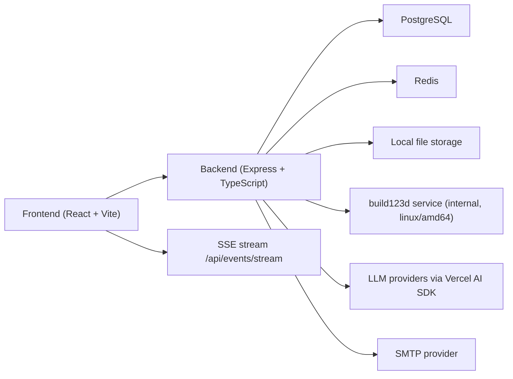

# Chat3D Docker-Native Delivery Plan

## Status

- Runtime target: Docker-native frontend + backend + postgres + redis + build123d.
- Current state: active runtime is fully in `packages/frontend` and `packages/backend`.
- Communication model: Server-Sent Events (SSE) for live updates and notifications.

## Scope

This plan tracks the production runtime only:
- `packages/frontend`
- `packages/backend`
- `services/build123d`
- `docker-compose.yml`

Archived code paths are out of scope for feature delivery.

## Architecture Baseline



## Feature Baseline

- Auth: email/password with role-based access (`admin`, `user`).
- Waitlist: configurable gate for new registrations with approval workflow.
- Invitations: admin-configurable limits and policy controls.
- Admin console: user management, waitlist operations, platform settings.
- Chat: context list, threaded conversation, file/model workflow, SSE updates.
- Account lifecycle: reset/update/deactivate/reactivate/delete flows.

## Build123d Integration Notes

- build123d runs as an internal container in `docker-compose.yml`.
- Container is pinned to `linux/amd64` for cross-platform consistency.
- Dockerfile keeps linux package updates in a separate layer from pip installs.
- Pip is configured for resilient download retries in slow networks.

## Milestone Ledger

| Milestone | Scope | Status |
|---|---|---|
| M1 | Docker monorepo baseline and workspace setup | Completed |
| M2 | Backend service bootstrap (Express + TS + DB wiring) | Completed |
| M3 | Frontend app bootstrap and runtime shell | Completed |
| M4 | Auth/session foundation + protected routes | Completed |
| M5 | Roles and admin route protection | Completed |
| M6 | Waitlist model, API, and moderation flow | Completed |
| M7 | Invitations and policy controls | Completed |
| M8 | Chat data contracts + SSE event flow | Completed |
| M9 | Query/render integration + file lifecycle | Completed |
| M10 | Runtime hardening, tests, and quality gates | Completed |
| M11 | Legacy behavior parity for core chat workflows | Completed |
| M12 | Chat UX parity in active app shell | Completed |
| M13 | File/image and model workbench parity | Completed |
| M14 | Deprecated runtime dependency decommission | Completed |
| M15 | High-value parity follow-ups and cleanup | Completed |
| UX0 | Public pages + auth surface redesign | Completed |
| UX1 | Design system baseline and shared primitives | Completed |
| UX2 | Navigation shell and responsive IA | Completed |
| UX3 | 3-pane chat redesign + mobile segmented UX | Completed |
| UX4 | Admin dashboard and operations UX | Completed |
| UX5 | Account/notifications/waitlist polish | Completed |
| UX6 | Accessibility and UX quality gate | Completed |

## Active Guardrails

- Guard script blocks deprecated runtime dependencies in active package manifests.
- Guard script scans active source trees for forbidden legacy integrations.
- Build and deploy flow should prefer changed containers, not full stack rebuilds.

## Validation Commands

Use these commands for every milestone completion:

```bash
npm run guard:active-runtime
npm --workspace @chat3d/backend run test
npm --workspace @chat3d/backend run build
npm --workspace @chat3d/frontend run test
npm --workspace @chat3d/frontend run typecheck
npm run m1:typecheck:workspaces
```

For container verification after runtime changes:

```bash
docker compose build backend frontend
docker compose up -d backend frontend
docker compose ps backend frontend
curl -fsS http://localhost:3001/health
curl -fsS http://localhost:3001/ready
```

For build123d changes:

```bash
docker compose build build123d
docker compose up -d build123d
docker compose ps build123d
```

## Remaining Work Backlog

- R1: deep UI polish pass for interaction details and advanced states.
- R2: admin analytics refinement with KPI definitions and threshold alerts.
- R3: e2e scenario expansion for chat + rendering + waitlist + admin workflows.
- R4: production deployment runbook hardening and rollback drills.

## Definition of Done

A change is complete only when all apply:
- Code merged in active runtime paths only.
- Required tests and checks pass locally.
- Affected containers build and boot successfully.
- Migration plan ledger/checklist updated.
- Deployment performed for changed runtime surfaces.
