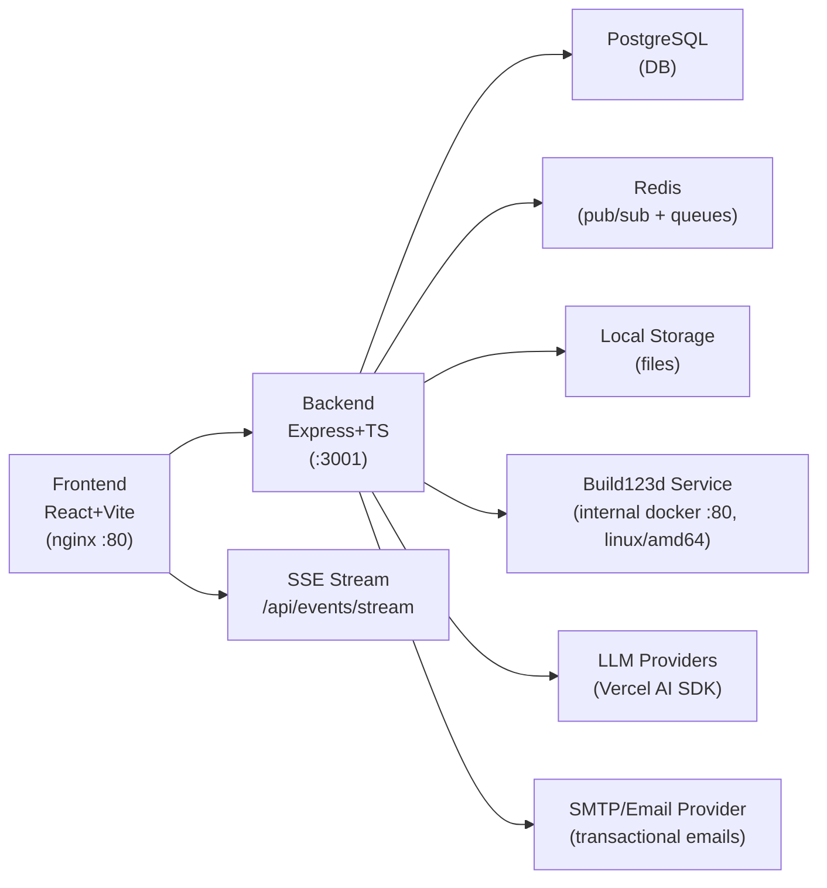

# Chat3D Migration Plan: AWS Amplify -> Dockerized Express + React

## Context

Chat3D is an AI-powered 3D CAD modeling app that lets users create 3D models via natural language chat. It currently runs on AWS Amplify (AppSync GraphQL, Lambda, DynamoDB, S3, Cognito). We are rebuilding it as a self-hosted Docker stack with an Express API + PostgreSQL backend and React frontend.

Core migration constraints and additions:
- Replace AWS-managed backend primitives with self-hosted equivalents.
- Use Server-Sent Events (SSE) for dynamic updates, messaging, and notifications (no polling).
- Add user roles (`admin`, `user`) and an admin panel.
- Add waitlisting with double-email flow and single-use registration tokens.
- Add invitation system with admin-controlled policy and quotas.
- Add profile/account lifecycle actions with email-confirmed workflows.
- Keep Build123d rendering, remove Patreon, remove Mixpanel, remove OpenSCAD.
- Move LLM invocation to Vercel AI SDK.

---

## Target Architecture



All services orchestrated via `docker-compose.yml`.

---

## Project Structure

```
chat3d/
|- docker-compose.yml
|- .env.example
|- packages/
|  |- shared/
|  |  |- src/types.ts
|  |  |- src/events.ts
|  |  |- package.json
|  |  \- tsconfig.json
|  |- backend/
|  |  |- Dockerfile
|  |  |- package.json
|  |  |- tsconfig.json
|  |  \- src/
|  |     |- index.ts
|  |     |- config.ts
|  |     |- db/
|  |     |  |- connection.ts
|  |     |  \- migrations/
|  |     |     |- 001_initial_schema.ts
|  |     |     |- 002_auth_admin_waitlist_invites.ts
|  |     |     \- 003_notifications_account_lifecycle.ts
|  |     |- middleware/
|  |     |  |- auth.ts
|  |     |  |- requireRole.ts
|  |     |  \- errorHandler.ts
|  |     |- routes/
|  |     |  |- auth.routes.ts
|  |     |  |- admin.routes.ts
|  |     |  |- profile.routes.ts
|  |     |  |- waitlist.routes.ts
|  |     |  |- invitations.routes.ts
|  |     |  |- events.routes.ts
|  |     |  |- chat.routes.ts
|  |     |  |- query.routes.ts
|  |     |  |- files.routes.ts
|  |     |  \- llm.routes.ts
|  |     |- services/
|  |     |  |- auth.service.ts
|  |     |  |- admin.service.ts
|  |     |  |- waitlist.service.ts
|  |     |  |- invitation.service.ts
|  |     |  |- accountLifecycle.service.ts
|  |     |  |- notification.service.ts
|  |     |  |- sse.service.ts
|  |     |  |- email.service.ts
|  |     |  |- chat.service.ts
|  |     |  |- query.service.ts
|  |     |  |- llm.service.ts
|  |     |  |- rendering.service.ts
|  |     |  \- file.service.ts
|  |     |- workers/
|  |     |  |- email.worker.ts
|  |     |  \- accountDeletion.worker.ts
|  |     \- utils/
|  |        \- retry.ts
|  \- frontend/
|     |- Dockerfile
|     |- nginx.conf
|     |- package.json
|     |- tsconfig.json
|     |- vite.config.ts
|     |- index.html
|     \- src/
|        |- main.tsx
|        |- App.tsx
|        |- index.css
|        |- api/
|        |  |- client.ts
|        |  |- auth.api.ts
|        |  |- admin.api.ts
|        |  |- profile.api.ts
|        |  |- waitlist.api.ts
|        |  |- invitations.api.ts
|        |  |- chat.api.ts
|        |  \- query.api.ts
|        |- contexts/
|        |  |- AuthContext.tsx
|        |  \- NotificationsContext.tsx
|        |- hooks/
|        |  |- useAuth.tsx
|        |  \- useSSE.ts
|        |- Components/
|        |  |- LoginForm.tsx
|        |  |- RegisterForm.tsx
|        |  |- AdminPanel.tsx
|        |  |- InviteManager.tsx
|        |  |- NotificationCenter.tsx
|        |  |- ChatMessage.tsx
|        |  |- ChatMessageAI.tsx
|        |  |- ChatMessageUser.tsx
|        |  |- ModelViewer.tsx
|        |  \- ChatContextComponent.tsx
|        \- Pages/
|           |- Chat.tsx
|           |- Layout.tsx
|           |- Profile.tsx
|           |- Admin.tsx
|           |- WaitlistJoin.tsx
|           \- CompleteRegistration.tsx
|- services/
|  \- build123d/
|     |- Dockerfile
|     |- requirements.txt
|     \- app/
|        \- main.py
```

---

## Database Schema (PostgreSQL)

### Core users and auth

```sql
CREATE TYPE user_role AS ENUM ('admin', 'user');
CREATE TYPE user_status AS ENUM ('active', 'deactivated', 'pending_registration');

CREATE TABLE users (
    id UUID PRIMARY KEY DEFAULT gen_random_uuid(),
    email VARCHAR(255) UNIQUE NOT NULL,
    password_hash VARCHAR(255) NOT NULL,
    display_name VARCHAR(255),
    role user_role NOT NULL DEFAULT 'user',
    status user_status NOT NULL DEFAULT 'active',
    deactivated_until TIMESTAMPTZ,
    created_at TIMESTAMPTZ NOT NULL DEFAULT NOW(),
    updated_at TIMESTAMPTZ NOT NULL DEFAULT NOW()
);
CREATE INDEX idx_users_role ON users(role);
CREATE INDEX idx_users_status ON users(status);
```

### Feature flags and policy

```sql
CREATE TABLE app_settings (
    id BOOLEAN PRIMARY KEY DEFAULT TRUE CHECK (id = TRUE),
    waitlist_enabled BOOLEAN NOT NULL DEFAULT FALSE,
    invitations_enabled BOOLEAN NOT NULL DEFAULT TRUE,
    invitation_waitlist_required BOOLEAN NOT NULL DEFAULT FALSE,
    invitation_quota_per_user INTEGER NOT NULL DEFAULT 3 CHECK (invitation_quota_per_user >= 0),
    updated_by UUID REFERENCES users(id),
    updated_at TIMESTAMPTZ NOT NULL DEFAULT NOW()
);
```

### Waitlist and registration tokens

```sql
CREATE TYPE waitlist_status AS ENUM ('pending_email_confirmation', 'pending_admin_approval', 'approved', 'rejected');

CREATE TABLE waitlist_entries (
    id UUID PRIMARY KEY DEFAULT gen_random_uuid(),
    email VARCHAR(255) UNIQUE NOT NULL,
    marketing_consent BOOLEAN NOT NULL DEFAULT FALSE,
    email_confirmed_at TIMESTAMPTZ,
    status waitlist_status NOT NULL DEFAULT 'pending_email_confirmation',
    approved_by UUID REFERENCES users(id),
    approved_at TIMESTAMPTZ,
    created_at TIMESTAMPTZ NOT NULL DEFAULT NOW(),
    updated_at TIMESTAMPTZ NOT NULL DEFAULT NOW()
);

CREATE TYPE registration_token_source AS ENUM ('waitlist', 'admin_invite', 'user_invite');

CREATE TABLE registration_tokens (
    id UUID PRIMARY KEY DEFAULT gen_random_uuid(),
    token_hash VARCHAR(255) UNIQUE NOT NULL,
    email VARCHAR(255) NOT NULL,
    source registration_token_source NOT NULL,
    invited_by_user_id UUID REFERENCES users(id),
    max_uses INTEGER NOT NULL DEFAULT 1,
    used_count INTEGER NOT NULL DEFAULT 0,
    expires_at TIMESTAMPTZ,
    consumed_at TIMESTAMPTZ,
    created_at TIMESTAMPTZ NOT NULL DEFAULT NOW()
);
CREATE INDEX idx_registration_tokens_email ON registration_tokens(email);
```

### Invitations

```sql
CREATE TYPE invitation_status AS ENUM ('pending', 'waitlisted', 'registration_sent', 'accepted', 'expired', 'revoked');

CREATE TABLE invitations (
    id UUID PRIMARY KEY DEFAULT gen_random_uuid(),
    inviter_user_id UUID NOT NULL REFERENCES users(id) ON DELETE CASCADE,
    invitee_email VARCHAR(255) NOT NULL,
    status invitation_status NOT NULL DEFAULT 'pending',
    registration_token_id UUID REFERENCES registration_tokens(id),
    created_at TIMESTAMPTZ NOT NULL DEFAULT NOW(),
    updated_at TIMESTAMPTZ NOT NULL DEFAULT NOW(),
    UNIQUE (inviter_user_id, invitee_email)
);
CREATE INDEX idx_invitations_inviter ON invitations(inviter_user_id);
CREATE INDEX idx_invitations_email ON invitations(invitee_email);
```

### Account action confirmations (email-confirmed workflows)

```sql
CREATE TYPE account_action_type AS ENUM ('password_reset', 'email_change', 'data_export', 'account_delete', 'account_reactivate');
CREATE TYPE account_action_status AS ENUM ('pending', 'completed', 'expired', 'cancelled');

CREATE TABLE account_actions (
    id UUID PRIMARY KEY DEFAULT gen_random_uuid(),
    user_id UUID NOT NULL REFERENCES users(id) ON DELETE CASCADE,
    action_type account_action_type NOT NULL,
    token_hash VARCHAR(255) UNIQUE NOT NULL,
    payload JSONB NOT NULL DEFAULT '{}'::jsonb,
    status account_action_status NOT NULL DEFAULT 'pending',
    expires_at TIMESTAMPTZ,
    completed_at TIMESTAMPTZ,
    created_at TIMESTAMPTZ NOT NULL DEFAULT NOW()
);
CREATE INDEX idx_account_actions_user ON account_actions(user_id);
```

### Notifications and SSE replay

```sql
CREATE TABLE notifications (
    id BIGSERIAL PRIMARY KEY,
    user_id UUID NOT NULL REFERENCES users(id) ON DELETE CASCADE,
    event_type VARCHAR(100) NOT NULL,
    payload JSONB NOT NULL,
    read_at TIMESTAMPTZ,
    created_at TIMESTAMPTZ NOT NULL DEFAULT NOW()
);
CREATE INDEX idx_notifications_user_created ON notifications(user_id, created_at DESC);
```

### Existing chat domain

Keep and migrate existing chat tables (`chat_contexts`, `chat_items`) with ownership and indexes.

---

## Backend API Design

### Auth (`/api/auth`)
| Method | Route | Purpose |
|---|---|---|
| POST | `/api/auth/register` | Register with email/password, validates registration token policy |
| POST | `/api/auth/login` | Login, returns JWT |
| POST | `/api/auth/logout` | Token invalidation/rotation handling |
| GET | `/api/auth/me` | Current authenticated user |

Registration rules:
- If waitlisting is enabled, direct registration is blocked unless request contains a valid unconsumed `registration_token`.
- Registration token is single-use (`max_uses=1` default), tied to email, verified against DB.

### Waitlist (`/api/waitlist`)
| Method | Route | Purpose |
|---|---|---|
| POST | `/api/waitlist/join` | Submit email + marketing consent |
| GET | `/api/waitlist/confirm-email` | Confirm email and consent via token |
| GET | `/api/waitlist/status` | Check waitlist status by email/token |

Email flow:
1. Waitlist join -> send confirmation email.
2. Email confirmation -> status becomes `pending_admin_approval`.
3. Admin approval -> generate registration token and send registration email.

### Invitations (`/api/invitations`)
| Method | Route | Purpose |
|---|---|---|
| GET | `/api/invitations` | List inviter's invitations + usage |
| POST | `/api/invitations` | Invite one or more emails (enforces quota + feature flag) |
| DELETE | `/api/invitations/:id` | Revoke pending invitation |

Behavior:
- Admin sets `invitations_enabled`, `invitation_quota_per_user`, and `invitation_waitlist_required`.
- If `invitation_waitlist_required=true`, invited users receive waitlist email.
- Else invited users receive direct registration email with single-use token.

### Admin (`/api/admin`)
Requires `role=admin`.

| Method | Route | Purpose |
|---|---|---|
| GET | `/api/admin/users` | List/search users |
| PATCH | `/api/admin/users/:id/activate` | Activate/reactivate user |
| PATCH | `/api/admin/users/:id/deactivate` | Deactivate user |
| POST | `/api/admin/users/:id/reset-password` | Trigger password reset email |
| GET | `/api/admin/waitlist` | List waitlist entries |
| PATCH | `/api/admin/waitlist/:id/approve` | Approve waitlist and send registration link |
| PATCH | `/api/admin/waitlist/:id/reject` | Reject waitlist entry |
| GET | `/api/admin/settings` | Read feature flags/policy |
| PATCH | `/api/admin/settings` | Update waitlist/invitation settings |

### Profile / Account Lifecycle (`/api/profile`)
| Method | Route | Purpose |
|---|---|---|
| POST | `/api/profile/reset-password/request` | Send password reset confirmation email |
| POST | `/api/profile/change-email/request` | Send email change confirmation |
| POST | `/api/profile/export-data/request` | Send data export confirmation |
| POST | `/api/profile/delete-account/request` | Send delete confirmation |
| POST | `/api/profile/reactivate/request` | Send reactivation confirmation |
| GET | `/api/profile/actions/confirm` | Confirm action via token |

Deletion lifecycle:
- Confirmed deletion sets user to `deactivated` and `deactivated_until = now() + interval '30 days'`.
- During the 30-day window: user can self-reactivate (email-confirmed) or admin can reactivate.
- After 30 days: background worker hard-deletes or anonymizes account data per retention policy.

### SSE Events (`/api/events`)
| Method | Route | Purpose |
|---|---|---|
| GET | `/api/events/stream` | User-scoped SSE stream for chat updates + notifications |
| GET | `/api/events/replay` | Replay missed notifications since event id/timestamp |

Event types:
- `chat.item.updated`
- `chat.query.state`
- `notification.created`
- `admin.settings.updated`
- `account.status.changed`

SSE requirements:
- JWT-authenticated stream.
- Heartbeats every 15-30 seconds.
- `Last-Event-ID` support for reconnect.
- Per-user channel isolation.

### Existing domain endpoints
Retain and migrate:
- `/api/chat/*`
- `/api/query/*`
- `/api/files/*`
- `/api/llm/*`

---

## LLM Integration - Vercel AI SDK

Replaces provider-specific adapters from Amplify Lambda code.

Provider mapping:
- `anthropic` -> `@ai-sdk/anthropic`
- `openai` -> `@ai-sdk/openai`
- `xai` -> `@ai-sdk/xai`
- `ollama` -> `ollama-ai-provider`

Two-stage pipeline:
1. Conversation model with tool use.
2. Build123d code generation model.

Pipeline state transitions are published via SSE (`chat.query.state`) instead of polling.

---

## Build123d Rendering

Self-hosted in this repository under `services/build123d` and orchestrated by `docker-compose`.
- `docker-compose` runs `build123d` as `platform: linux/amd64` (required because native arm runtime is not supported).
- Backend calls local service URL (`http://build123d:80` in-container by default).
- No external Build123d endpoint is required for local/prod Docker deployments.
- POST `${BUILD123D_URL}/render/` over the internal Docker network.
- Parse success/error payloads.
- Store generated files on local mounted volume.
- Publish render progress and completion through SSE.

---

## File Storage

Local filesystem mounted at `/data/storage`:
- `modelcreator/{messageId}.b123d`
- `modelcreator/{messageId}.3mf`
- `modelcreator/{messageId}.step`
- `modelcreator/{messageId}.stl`
- `upload/*`

Served through `/api/files/*`.

---

## Frontend Migration

### Key replacements
| Current (Amplify) | New |
|---|---|
| GraphQL subscriptions / polling fallback | SSE via `EventSource` (`useSSE`) |
| `<Authenticator>` | `AuthProvider` + custom auth views |
| `generateClient<Schema>()` | REST client with JWT |
| Cognito account flows | Profile routes + email-confirmed actions |

### UI framework decision
- Adopt `Tailwind CSS v4` + `shadcn/ui` (Radix-based primitives) as the primary UI system for the Dockerized frontend.
- Do not add new `semantic-ui-react` usage during migration. Existing Semantic UI usage is treated as temporary legacy UI.
- Keep a token-driven style baseline (color, spacing, radius, typography) in one shared frontend theme layer.
- Timing by milestone:
1. M6: establish the UI foundation and use it for new admin UI work.
2. M7: use the same foundation for new profile/account lifecycle screens.
3. M8: migrate chat pages/components from `semantic-ui-react` to `shadcn/ui` + Tailwind while moving to REST/SSE flows.
4. M10: remove remaining Semantic UI runtime dependencies and CDN stylesheet includes.

### New product areas
- Admin panel for user management and feature flags.
- Waitlist entry + confirmation screens.
- Invitation manager in profile.
- Notification center fed by SSE events.

---

## Email Workflows (Mandatory Confirmation)

Every sensitive action sends a signed, single-use, expiring link:
- Waitlist email confirmation.
- Waitlist approval -> registration link.
- Invitation -> waitlist or registration link based on policy.
- Password reset.
- Email change confirmation.
- Data export request confirmation.
- Account deletion confirmation.
- Account reactivation confirmation.

Token handling:
- Store only token hash in DB.
- Enforce TTL and one-time consumption.
- Log audit trail for every consumed token.

---

## Docker Setup

### `docker-compose.yml` services
- `postgres` (PostgreSQL 16)
- `redis` (pub/sub + queue)
- `build123d` (FastAPI render service, forced `linux/amd64`)
- `backend` (Express API)
- `frontend` (nginx + built React)

### `.env.example` (minimum)
```
DB_PASSWORD=chat3d_dev
JWT_SECRET=change-this
BUILD123D_PORT=30222
BUILD123D_URL=http://build123d:80
OPENAI_API_KEY=
ANTHROPIC_API_KEY=
XAI_API_KEY=
OLLAMA_BASE_URL=http://host.docker.internal:11434
OLLAMA_TOKEN=
SMTP_HOST=
SMTP_PORT=587
SMTP_USER=
SMTP_PASS=
MAIL_FROM=no-reply@example.com
APP_BASE_URL=http://localhost
```

---

## Implementation Phases

### Order Sanity Check (Reviewed)

This plan still makes sense, with one ordering adjustment for lower risk: build the SSE/event spine early, before most product flows, so waitlist/admin/chat can all publish realtime updates from day one without retrofitting.

Revised build order:
1. Foundation and schema.
2. Auth and roles.
3. SSE and notification spine.
4. Waitlist + registration tokens.
5. Invitations + policy rules.
6. Admin APIs + admin panel.
7. Profile/account lifecycle flows.
8. Chat + file domain migration.
9. Query/LLM/rendering orchestration.
10. Hardening, cutover, decommission.

### Progress Tracking Rules

- Every subtask uses a stable ID (`M{milestone}.{subtask}`).
- Mark done by changing `[ ]` to `[x]`.
- Do not start a milestone until all dependencies are `[x]`.
- Each completed milestone must have evidence: PR/commit, test command, and demo note.

### Milestone Ledger

| Milestone | Status | Depends On | Evidence |
|---|---|---|---|
| M1 Foundation + Schema | Completed | - | `npm run m1:typecheck:workspaces`, `npm --workspace @chat3d/backend run build`, `docker-compose config -q`, `docker-compose up -d postgres redis backend frontend && docker-compose ps`, `npm run m1:backend:bootstrap`, Postgres validation queries for migrations/tables/admin/settings |
| M2 Auth + Roles | Completed | M1 | `npm --workspace @chat3d/backend run test`, `npm --workspace @chat3d/backend run build`, `npm --workspace @chat3d/frontend run test`, `npm --workspace @chat3d/frontend run typecheck`, `npm run m1:typecheck:workspaces` |
| M3 SSE + Notification Spine | Completed | M2 | `npm --workspace @chat3d/backend run test`, `npm --workspace @chat3d/backend run build`, `npm --workspace @chat3d/frontend run test`, `npm --workspace @chat3d/frontend run typecheck`, `npm run m1:typecheck:workspaces` |
| M4 Waitlist + Registration Tokens | Completed | M2, M3 | `npm --workspace @chat3d/backend run test`, `npm --workspace @chat3d/backend run build`, `npm --workspace @chat3d/frontend run test`, `npm --workspace @chat3d/frontend run typecheck`, `npm run m1:typecheck:workspaces` |
| M5 Invitations + Policy Controls | Completed | M4 | `npm --workspace @chat3d/backend run test`, `npm --workspace @chat3d/backend run build`, `npm --workspace @chat3d/frontend run test`, `npm --workspace @chat3d/frontend run typecheck`, `npm run m1:typecheck:workspaces` |
| M6 Admin APIs + Admin Panel | Completed | M5 | `npm --workspace @chat3d/backend run test`, `npm --workspace @chat3d/backend run build`, `npm --workspace @chat3d/frontend run test`, `npm --workspace @chat3d/frontend run typecheck`, `npm run m1:typecheck:workspaces` |
| M7 Profile + Account Lifecycle | Completed | M6 | `npm --workspace @chat3d/backend run test`, `npm --workspace @chat3d/backend run build`, `npm --workspace @chat3d/frontend run test`, `npm --workspace @chat3d/frontend run typecheck`, `npm run m1:typecheck:workspaces` |
| M8 Chat CRUD + Files Migration | Completed | M2, M3 | `npm --workspace @chat3d/backend run test`, `npm --workspace @chat3d/backend run build`, `npm --workspace @chat3d/frontend run test`, `npm --workspace @chat3d/frontend run typecheck`, `npm run m1:typecheck:workspaces` |
| M9 Query + LLM + Build123d Pipeline | Completed | M8 | `npm --workspace @chat3d/backend run test`, `npm --workspace @chat3d/backend run build`, `npm --workspace @chat3d/frontend run test`, `npm --workspace @chat3d/frontend run typecheck`, `npm run m1:typecheck:workspaces` |
| M10 Hardening + Cutover + Decommission | Completed | M7, M9 | `npm --workspace @chat3d/backend run test`, `npm --workspace @chat3d/backend run build`, `npm --workspace @chat3d/frontend run test`, `npm --workspace @chat3d/frontend run typecheck`, `npm run m1:typecheck:workspaces` |
| M11 Gap Closure + Productionization | Planned | M10 | Gap closure PRs with API contract tests, SMTP integration tests, SSE multi-instance test, and deploy validation notes |
| M12 Legacy Chat UX Port (Amplify -> Docker Frontend) | Planned | M11 | Chat route parity demo on `/packages/frontend`, component tests, and Docker smoke validation |
| M13 Chat Feature Parity (3D Viewer, Files, Actions) | Planned | M12 | End-to-end query/render/download/rate/regenerate verification in Docker |
| M14 Amplify Runtime Decommission + Dependency Purge | Planned | M13 | `aws-amplify`/`semantic-ui` runtime dependency removal PR, clean lockfile, and regression runbook |

### M1: Foundation + Schema

- Objective: runnable Docker baseline, migration framework, and initial schema.
- Subtasks:
- [x] M1.1 Create monorepo package structure and TypeScript workspace wiring.
- [x] M1.2 Add `docker-compose.yml` with `postgres`, `redis`, backend, frontend.
- [x] M1.3 Implement DB connection and migration runner.
- [x] M1.4 Add migration `001_initial_schema` for chat domain tables.
- [x] M1.5 Add migration `002_auth_admin_waitlist_invites` for users/settings/waitlist/invites/tokens.
- [x] M1.6 Add migration `003_notifications_account_lifecycle` for notifications/account actions.
- [x] M1.7 Seed initial admin user and default `app_settings`.
- Exit criteria:
- [x] M1.E1 `docker compose up` starts all base services.
- [x] M1.E2 Fresh DB bootstrap succeeds end-to-end.

### M2: Auth + Roles

- Objective: secure auth baseline with `admin` and `user` authorization.
- Subtasks:
- [x] M2.1 Implement password hashing and JWT issuance/verification.
- [x] M2.2 Add auth middleware and role guard middleware.
- [x] M2.3 Implement `/api/auth/register`, `/api/auth/login`, `/api/auth/me`.
- [x] M2.4 Enforce `users.status` checks (`active` only for login/use).
- [x] M2.5 Frontend auth context and route guards.
- Exit criteria:
- [x] M2.E1 Non-admins are blocked from admin routes.
- [x] M2.E2 Auth integration test suite passes.

### M3: SSE + Notification Spine

- Objective: no-polling realtime transport available to all later features.
- Subtasks:
- [x] M3.1 Implement `/api/events/stream` with JWT auth.
- [x] M3.2 Add heartbeat, reconnect support, and `Last-Event-ID`.
- [x] M3.3 Add `notifications` persistence and replay endpoint.
- [x] M3.4 Implement backend event publisher abstraction (`notification.service`, `sse.service`).
- [x] M3.5 Implement frontend `useSSE` + notification context.
- Exit criteria:
- [x] M3.E1 Realtime event delivery verified for authenticated user.
- [x] M3.E2 Reconnect/replay behavior verified.

### M4: Waitlist + Registration Tokens

- Objective: waitlist gate and approval flow with email confirmation.
- Subtasks:
- [x] M4.1 Implement `/api/waitlist/join` with marketing consent capture.
- [x] M4.2 Implement waitlist email confirmation token flow.
- [x] M4.3 Implement admin approve/reject endpoints for waitlist entries.
- [x] M4.4 Generate single-use registration tokens tied to email.
- [x] M4.5 Enforce registration token validation in `/api/auth/register` when waitlist is enabled.
- [x] M4.6 Send approval email with registration link token.
- Exit criteria:
- [x] M4.E1 Waitlisted user cannot register before admin approval.
- [x] M4.E2 Approved user can register exactly once with token.

### M5: Invitations + Policy Controls

- Objective: user invitations with admin-defined quota and waitlist behavior.
- Subtasks:
- [x] M5.1 Implement `/api/invitations` CRUD for inviter users.
- [x] M5.2 Enforce `invitations_enabled` gate and per-user quota.
- [x] M5.3 Implement invite path switch: direct registration or waitlist (`invitation_waitlist_required`).
- [x] M5.4 Add invitation email templates and token issuance where applicable.
- [x] M5.5 Add SSE notifications for invitation lifecycle changes.
- Exit criteria:
- [x] M5.E1 Quota and feature flag behavior verified by integration tests.
- [x] M5.E2 Invited user receives correct email flow in both policy modes.

### M6: Admin APIs + Admin Panel

- Objective: full admin control plane for users, waitlist, and settings.
- Subtasks:
- [x] M6.1 Implement `/api/admin/users` list/search.
- [x] M6.2 Implement activate/deactivate and admin-triggered password reset.
- [x] M6.3 Implement `/api/admin/settings` read/update endpoints.
- [x] M6.4 Build admin frontend page with users, waitlist moderation, and settings toggles.
- [x] M6.5 Emit SSE events on admin setting changes and account status changes.
- [x] M6.6 Add frontend UI foundation (`Tailwind CSS v4`, `shadcn/ui`, shared design tokens) and apply it to admin screens.
- Exit criteria:
- [x] M6.E1 Admin can fully manage waitlist and invitation policies from UI.
- [x] M6.E2 User activation/deactivation path works and is audited.
- [x] M6.E3 Admin views ship on the new UI foundation; no new Semantic UI components are introduced.

### M7: Profile + Account Lifecycle

- Objective: self-service account actions with email-confirmed security.
- Subtasks:
- [x] M7.1 Implement request endpoints for password reset, email change, data export, account delete, account reactivate.
- [x] M7.2 Implement token confirmation endpoint for all account actions.
- [x] M7.3 Implement `deactivated` + `deactivated_until` (30-day window) behavior.
- [x] M7.4 Add worker for post-window delete/anonymize policy.
- [x] M7.5 Build profile UI for all lifecycle actions.
- [x] M7.6 Implement profile/account screens using the shared `shadcn/ui` + Tailwind component baseline from M6.
- Exit criteria:
- [x] M7.E1 Account deletion enters deactivated state for 30 days.
- [x] M7.E2 User/admin reactivation works during grace period.

### M8: Chat CRUD + Files Migration

- Objective: migrate core chat and file features off Amplify.
- Subtasks:
- [x] M8.1 Implement chat context/item REST endpoints with ownership checks.
- [x] M8.2 Implement file upload/download/delete endpoints over local storage.
- [x] M8.3 Migrate frontend chat pages/components to REST APIs.
- [x] M8.4 Replace Amplify storage integrations with `/api/files/*`.
- [x] M8.5 Publish chat update events over SSE (`chat.item.updated`).
- [x] M8.6 Replace `semantic-ui-react` chat UI with `shadcn/ui` + Tailwind styles.
- Exit criteria:
- [x] M8.E1 End-to-end chat CRUD works without Amplify.
- [x] M8.E2 File upload and model file download verified.
- [x] M8.E3 Chat shell/messages/actions are on the new UI stack (no Semantic UI in active chat flows).

### M9: Query + LLM + Build123d Pipeline

- Objective: restore AI query flow and model rendering with SSE progress updates.
- Subtasks:
- [x] M9.1 Implement LLM model registry and provider clients via Vercel AI SDK.
- [x] M9.2 Port two-stage orchestration (conversation + Build123d code generation).
- [x] M9.3 Integrate Build123d service render call and store outputs.
- [x] M9.4 Emit query/render lifecycle events (`chat.query.state`) through SSE.
- [x] M9.5 Migrate frontend query submit flow to SSE-driven state updates.
- Exit criteria:
- [x] M9.E1 Query produces rendered files and assistant response.
- [x] M9.E2 No polling codepath remains in chat realtime UX.

### M10: Hardening + Cutover + Decommission

- Objective: production readiness and complete Amplify removal.
- Subtasks:
- [x] M10.1 Add request validation, rate limits, audit logs, and abuse controls.
- [x] M10.2 Finalize CORS, auth token handling, and security headers.
- [x] M10.3 Add health/readiness checks and operational runbooks.
- [x] M10.4 Remove Amplify runtime dependencies and obsolete integration code.
- [x] M10.5 Update README and deployment docs for Docker-only operation.
- [x] M10.6 Remove remaining Semantic UI dependencies/includes (`semantic-ui-react`, `semantic-ui-css`, CDN stylesheet references).
- Exit criteria:
- [x] M10.E1 Full regression checklist passes in Docker.
- [x] M10.E2 Amplify is not required for runtime behavior.
- [x] M10.E3 Frontend has no Semantic UI runtime dependency.

### Post-M10 Gap Analysis (2026-02-18)

| Gap ID | Plan Requirement | Current Implementation Snapshot | Gap | Next Step |
|---|---|---|---|---|
| G1 | API contract parity for auth/waitlist (`POST /api/auth/logout`, `GET /api/waitlist/confirm-email`, `GET /api/waitlist/status`) | `auth.routes.ts` exposes `register/login/me`; `waitlist.routes.ts` exposes `POST /join` and `POST /confirm` | Planned contract is only partially implemented, with route/method drift | Add missing endpoints; keep current routes as compatibility aliases until clients migrate |
| G2 | Transactional email provider integration (SMTP) | `email.service.ts` stores messages in-memory and logs to console | No real delivery pipeline, retry strategy, or provider health signal | Implement SMTP-backed sender (for example `nodemailer`) with retries, timeout handling, and test doubles |
| G3 | Redis-backed fanout/queueing for realtime and multi-instance scaling | `sse.service.ts` uses in-process `Map<userId, clients>` only; Redis is not used by backend runtime | Realtime only works reliably within a single backend instance | Add Redis pub/sub adapter for notification fanout and SSE delivery across instances |
| G4 | LLM provider matrix via Vercel AI SDK (`anthropic`, `openai`, `xai`, `ollama`) | `llm.service.ts` currently supports `mock` and `openai` only | Planned provider coverage is incomplete | Add provider adapters and env-driven model routing; extend `/api/llm/models` and tests for each provider mode |
| G5 | Build123d internal-service isolation | Build123d is intended as internal-only service but can be exposed via host port mapping in compose variants | Internal boundary is policy-only without explicit deployment guardrails | Define env/profile-based port exposure policy, default to internal-only in prod, and verify backend-only reachability in deployment checks |
| G6 | Frontend product-area completeness: waitlist flows, invitation management, notification center | Current frontend includes auth/chat/query/admin/profile panels; no dedicated waitlist screens, invitation manager UI, or notification feed UI | Several planned user-facing flows are backend-only today | Add waitlist join/confirm/status screens, invitation manager in profile, and notification center based on SSE replay/stream |
| G7 | Automated account deletion lifecycle operations | `account-deletion.worker.ts` exists but runs manually only | No scheduled execution path in Docker operations | Add scheduled worker execution (containerized cron/supercronic or external scheduler contract) and runbook steps |
| G8 | Decommission boundary for legacy integrations (Mixpanel/Patreon/OpenSCAD) | Runtime no longer depends on Amplify, but legacy root app still carries old dependencies/code paths | Risk of accidental drift and unclear source-of-truth for active runtime | Isolate legacy code paths under explicit archive boundary and prune default install/runtime dependency surface |

### M11: Gap Closure + Productionization

- Objective: close residual implementation gaps found in the post-M10 audit and align contracts with the migration plan.
- Subtasks:
- [x] M11.1 Implement API parity: add `/api/auth/logout`, `/api/waitlist/confirm-email`, and `/api/waitlist/status` while preserving backward compatibility.
- [ ] M11.2 Replace in-memory email sender with SMTP-backed transactional delivery and test-mode transport.
- [ ] M11.3 Implement Redis pub/sub fanout for SSE notification delivery across backend instances.
- [ ] M11.4 Expand Vercel AI SDK provider support to Anthropic, XAI, and Ollama with config-driven model selection.
- [ ] M11.5 Enforce Build123d internal-only exposure policy (profile/env based) and add deployment checks for backend-only service access.
- [ ] M11.6 Implement frontend waitlist flows, invitation manager UX, and notification center.
- [ ] M11.7 Operationalize account deletion worker on a schedule and document ownership/monitoring.
- [ ] M11.8 Finalize legacy boundary cleanup for Mixpanel/Patreon/OpenSCAD codepaths and dependencies.
- Exit criteria:
- [ ] M11.E1 API contract tests cover both canonical and compatibility routes.
- [ ] M11.E2 Email, SSE multi-instance fanout, and Build123d internal-network isolation checks pass integration/deploy tests.
- [ ] M11.E3 Frontend supports waitlist/invitation/notification flows end-to-end against Docker stack.
- [ ] M11.E4 Deployment/runbook docs reflect scheduled worker execution and legacy boundary decisions.

### M12: Legacy Chat UX Port (Amplify -> Docker Frontend)

- Objective: rebuild the old Amplify chat experience in the new `/packages/frontend` app framework using REST + SSE, without introducing Amplify runtime APIs.
- Subtasks:
- [ ] M12.1 Produce a feature parity matrix from legacy files (`src/Pages/Chat.tsx`, `src/Components/ChatMessage*.tsx`, `src/Components/ChatContextComponent.tsx`) and map each feature to target components in `packages/frontend/src`.
- [ ] M12.2 Add dedicated chat routes/layout in `packages/frontend` (context list, active thread, message composer, model selection controls).
- [ ] M12.3 Implement chat context lifecycle UX parity: create, rename, open, delete, and navigation state synchronization.
- [ ] M12.4 Implement message timeline parity: user/assistant rendering, markdown, pending/error states, and auto-scroll behavior.
- [ ] M12.5 Integrate SSE-driven state updates for chat/query lifecycle (`chat.item.updated`, `chat.query.state`) with resilient reconnect/replay handling in chat views.
- [ ] M12.6 Add explicit adapters from backend message payloads to UI view-models to avoid direct legacy schema coupling.
- [ ] M12.7 Add frontend tests for route-level chat flows (context switching, optimistic/pending states, SSE event application).
- [ ] M12.8 Document migrated chat UX behavior and known intentional deviations from legacy Amplify UI.
- Exit criteria:
- [ ] M12.E1 Primary chat workflow (open context, send prompt, receive assistant updates) works in `/packages/frontend` without Amplify libraries.
- [ ] M12.E2 No active chat route in `packages/frontend` imports `aws-amplify` or legacy root `src/*` modules.
- [ ] M12.E3 Regression tests cover core chat interactions and SSE update handling.

### M13: Chat Feature Parity (3D Viewer, Files, Actions)

- Objective: close remaining chat capability gaps (3D preview, file handling, ratings, regenerate actions) in the new frontend/backend contracts.
- Subtasks:
- [ ] M13.1 Implement binary-safe file API client support in `packages/frontend` for model downloads/preview streams.
- [ ] M13.2 Port/adapt model viewer UX from legacy (`ModelViewer.tsx`) to new frontend architecture and styling system.
- [ ] M13.3 Add generated file action bar parity (download STEP/STL/3MF/B123D where available) with clear availability/error states.
- [ ] M13.4 Implement assistant-item feedback/rating and regenerate/retry actions against Docker backend endpoints.
- [ ] M13.5 Add explicit backend/frontend contract tests for message `itemType` variants (`message`, `errormessage`, model/file metadata entries).
- [ ] M13.6 Add performance guardrails for large chat histories and model viewer mount/unmount lifecycle.
- [ ] M13.7 Produce end-to-end test script: create prompt -> query -> render -> preview/download -> rate -> regenerate.
- Exit criteria:
- [ ] M13.E1 New chat UI supports model generation and file consumption flows with no Amplify storage components.
- [ ] M13.E2 Ratings/regenerate flows are fully wired and verified.
- [ ] M13.E3 Docker smoke tests demonstrate stable chat + render + file UX across page refresh and reconnect.

### M14: Amplify Runtime Decommission + Dependency Purge

- Objective: remove runtime ambiguity by decommissioning legacy Amplify app paths and eliminating unused Amplify-era dependencies from active development paths.
- Subtasks:
- [ ] M14.1 Define explicit ownership boundary: `/packages/*` is active runtime; legacy root app is archived reference only.
- [ ] M14.2 Remove root runtime dependencies tied to legacy app (`aws-amplify`, `@aws-amplify/*`, `mixpanel*`, `semantic-ui*`) unless still required by active Docker runtime.
- [ ] M14.3 Move or archive legacy root frontend code (`src/*`) behind a clear `legacy/` boundary or equivalent, with deprecation note.
- [ ] M14.4 Remove legacy root scripts/build paths from default developer workflow so `npm install`/`npm run` align to Docker runtime targets.
- [ ] M14.5 Add CI guard checks to fail on new imports of deprecated stacks in active packages (Amplify APIs, Semantic UI, Patreon/OpenSCAD legacy codepaths).
- [ ] M14.6 Update README/operations docs with final cutover architecture and legacy archive policy.
- [ ] M14.7 Run full regression on active stack (backend/frontend tests, typechecks, targeted Docker rebuild/deploy) and record evidence.
- Exit criteria:
- [ ] M14.E1 Active runtime has zero direct Amplify dependency in `packages/backend` and `packages/frontend`.
- [ ] M14.E2 Legacy code is clearly isolated and cannot be confused with active app entrypoints.
- [ ] M14.E3 Dependency tree and lockfile are free of deprecated runtime packages unless intentionally retained for archived code tooling.

---

## Key Design Decisions

1. SSE over polling for dynamic updates, messaging state, and notifications.
2. Centralized feature flags in `app_settings` so admin policy changes are immediate and auditable.
3. One-time hashed tokens for registration and all email-confirmed account actions.
4. Soft deactivation + 30-day delayed deletion window for account recovery and admin intervention.
5. Redis-backed event fanout and queueing to support multi-instance backend scaling.
6. Local storage first, with clear abstraction to switch to object storage later.

---

## Critical Source Files to Reference During Implementation

| File | What to extract |
|---|---|
| `amplify/functions/submitqueryfunction/handler.ts` | Two-stage LLM orchestration and tool flow |
| `amplify/functions/submitqueryfunction/LLMDefinitions.ts` | Model configs and prompts |
| `amplify/functions/submitqueryfunction/Build123dRenderingProvider.ts` | Rendering call pattern and response handling |
| `amplify/functions/submitqueryfunction/Helpers.ts` | XML/document section parsing helpers |
| `amplify/functions/submitqueryfunction/Build123dExamples.ts` | Build123d examples |
| `amplify/functions/submitqueryfunction/StaticDocuments.ts` | Static docs used for prompting |
| `amplify/functions/submitqueryfunction/RetryUtils.ts` | Retry/backoff behavior |
| `amplify/data/resource.ts` | Chat data model shape |
| `amplify/auth/pre-sign-up/handler.ts` | Registration gating patterns to port |
| `amplify/auth/post-confirmation/handler.ts` | Post-registration hooks to replace |
| `src/Pages/Chat.tsx` | Frontend chat state transitions and actions |
| `src/Components/ChatMessageAI.tsx` | Chat rendering and model output display |
| `src/Components/ModelViewer.tsx` | 3D model viewer behavior |
| `src/Components/ChatContextComponent.tsx` | Context CRUD UX behavior |
