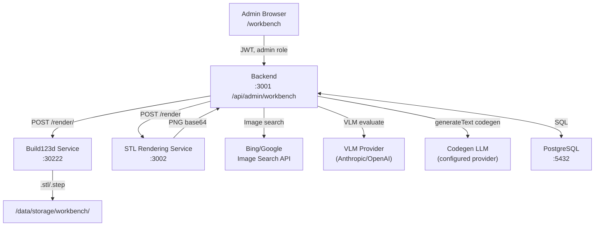

# Build123d LLM Workbench — Design Document

> **Status:** Draft v0.3 — 2026-02-24
> **Owner:** kreuzhofer
> **Branch:** `claude/build123d-llm-workbench-Zzddt`

---

## 1. Overview & Goals

The Build123d LLM Workbench is an admin-only feature within the Chat3D application. Its purpose is to generate, validate, and curate a high-quality dataset of Build123d Python code examples for fine-tuning an open-weight LLM specifically for 3D CAD code generation.

### Problem

No currently available LLM generates reliable Build123d code out of the box. Build123d is a niche Python CAD library; models hallucinate incorrect class names, wrong argument order, and invalid geometry operations. A fine-tuned model with a well-curated dataset would dramatically improve code generation quality inside Chat3D.

### Solution

A progressively structured, largely automated dataset generation pipeline:

1. A **complexity curriculum** of ~11 categories, ordered from simple primitives to complex PCB cases.
2. **100 user-facing example prompts per category** written upfront (natural language descriptions of objects, no code hints), stored as Markdown files in the repository.
3. An **automated generation and evaluation loop**: generate code → render → screenshot → VLM evaluate → auto-approve or auto-fix.
4. **Human review only for edge cases** that exhaust the auto-fix budget.
5. Approved examples accumulate into an **exportable training dataset** for LLM fine-tuning.

### Scale Targets

| Milestone | Prompts | Target validated examples |
|-----------|---------|--------------------------|
| v1 (initial run) | ~1,100 (100 × 11 categories) | 1,000 |
| Final | Same prompts, multiple generation seeds | 10,000 |

The path from 1,000 to 10,000 is re-running each prompt with varied temperature/random seeds (9–10 generation passes per prompt), not writing more prompts.

### Scope

- Admin-only feature, accessible at `/workbench` in the frontend.
- Backend API under `/api/admin/workbench/`.
- New standalone Docker service: `stl-rendering-service` (Puppeteer + Three.js STL/3MF renderer).
- New database tables in the existing PostgreSQL instance.
- No changes to the user-facing Chat3D experience.

---

## 2. Key Design Decisions

### 2.1 Integrated into Chat3D, Not a Separate App

The workbench reuses the existing auth system (admin role), LLM infrastructure (Vercel AI SDK), Build123d render service, and database. A separate app would duplicate all of this.

### 2.2 STL Rendering Service as a Separate Docker Container

Puppeteer + Three.js requires Chromium — inappropriate to include in the main backend image. Extracted as `services/stl-rendering-service/`. Implementation derived from `chat3d-docker` project (`imageRenderer.ts`).

- New env var: `STL_RENDERING_SERVICE_URL` (default: `http://stl-rendering-service:3002`)

### 2.3 Categories Are Complexity Groups, Not Individual Examples

Categories group examples by the Build123d concepts they exercise. There are ~11 categories, ordered by complexity from **Primitives** (1) to **PCB Cases** (10). Each category contains 100 user-facing example prompts. The curriculum controls what complexity of code the LLM learns to generate progressively.

### 2.4 Example Prompts Are User-Facing Natural Language

Example prompts describe what object to generate **from the user's perspective** — exactly what a user would type into Chat3D. They contain **no code hints, no API references, no implementation guidance**. That information lives in the system prompt.

Good: `"A cylindrical spice jar lid with a flat top, 50mm diameter, 8mm tall, and a lip on the inside rim for friction fit."`

Bad: `"Use Cylinder(radius=25, height=8) with a shell operation to create a hollow lid."`

### 2.5 VLM Auto-Evaluation Is the Primary Quality Gate

At 10,000 examples, manual review of every example is not feasible. The VLM (visual language model) evaluates rendered screenshots against the original prompt and scores 1–10. Score ≥ 7 triggers auto-approval. The auto-fix loop uses VLM suggestions to guide code correction. Humans review only examples that exhaust the fix budget.

Derived from `chat3d-docker`'s `visualEval.ts`. Key adaptations:
- Uses Vercel AI SDK (not raw OpenAI SDK) for consistency.
- Supports both Anthropic and OpenAI as VLM providers.
- Category complexity level is injected into the evaluation prompt.
- Retry logic added (the original has none).

### 2.6 System Prompt as a Versioned File Asset

The comprehensive Build123d system prompt is stored as `src/data/build123d-system-prompt.md`, version-controlled, and seeded into the `workbench_system_prompts` table. It teaches the LLM the full Build123d API surface — it is not per-category. Future prompt versions can be stored for A/B testing.

### 2.7 Full Example Retrieval for Few-Shot Context

When selecting prior approved examples as few-shot context, always retrieve **complete code examples**, never chunks. Limit count (max 6) rather than size. Chunking risks truncating import statements, context managers, or export calls, making examples misleading.

### 2.8 Target Fine-Tuning Model: Qwen3-Coder-Next

| Property | Value |
|----------|-------|
| Architecture | MoE, 80B total, **3B active/token** |
| Context window | 256K tokens |
| 4-bit GGUF size | ~46 GB (fits single DGX Spark, 128 GB unified) |
| BF16 LoRA training | Single DGX Spark with Unsloth |
| MoE training speedup | 12× faster, 35% less VRAM (Unsloth Triton kernels) |
| SWE-Bench Verified | 70.6 |
| License | Apache 2.0 |
| Hardware | 2× DGX Spark (128 GB unified each, Blackwell GB10) |

Runner-up: `Qwen2.5-Coder-32B` (64 GB BF16, very mature fine-tuning toolchain).

### 2.9 Training Dataset Output Format

Deferred — will target LLaMA-Factory JSONL conversation format as default (compatible with broadest range of frameworks). Final decision when training begins.

### 2.10 Reference Images via Web Image Search

To improve VLM evaluation quality, each prompt's key subject noun(s) are extracted and used to fetch 2–3 real-world reference images via the **Bing Image Search API** (generous free tier; configurable to Google Custom Search). These reference images are passed to the VLM alongside our 3D renders.

The VLM evaluation prompt explicitly instructs: *"Our renders are untextured 3D models — evaluate geometric similarity only, not texture, color, or photorealism. Does this 3D model represent the same type of object shown in the reference images? Do the overall shape, proportions, and key features match?"*

This gives strong grounding for abstract shape validation (e.g., "does this look like a mug?") without requiring photorealistic renders.

Implementation:
- New env vars: `IMAGE_SEARCH_PROVIDER` (`bing` | `google` | `none`), `IMAGE_SEARCH_API_KEY`, `IMAGE_SEARCH_ENGINE_ID` (Google only)
- Subject extraction: simple noun extraction from prompt text (e.g., "a hex bolt" → query `"hex bolt 3D shape"`)
- Cache search results by query string to avoid redundant API calls across iterations
- Max 3 reference images per evaluation; fall back gracefully if search unavailable

### 2.11 Color in Example Prompts

Build123d supports per-part coloring via the `Color` class:
```python
part.part.color = Color("red")           # named color
part.part.color = Color(0.8, 0.2, 0.2)  # RGB float
part.part.color = Color(0.8, 0.2, 0.2, 0.7)  # RGBA
```

Colors are preserved in **3MF export** (`export_3mf`) but not in STL. Approximately **5% of example prompts** (55 of 1,100) will include color expectations, distributed toward higher complexity categories (7–11) where multi-part objects make color meaningful.

For colored examples:
- The generation prompt instructs the LLM to use `Color` and export 3MF instead of STEP
- The STL rendering service accepts 3MF via `ThreeMFLoader` (already used by the Chat3D frontend) in addition to STL
- The VLM can then evaluate color correctness alongside shape

---

## 3. Architecture Overview



### New Docker Services

| Service | Port | Purpose |
|---------|------|---------|
| `stl-rendering-service` | 3002 | STL/3MF → PNG via Puppeteer + Three.js |

### New Environment Variables

| Variable | Default | Purpose |
|----------|---------|---------|
| `STL_RENDERING_SERVICE_URL` | `http://stl-rendering-service:3002` | STL rendering service URL |
| `EVAL_VLM_PROVIDER` | `anthropic` | VLM provider for visual evaluation |
| `EVAL_VLM_MODEL` | `claude-sonnet-4-6` | VLM model name |
| `IMAGE_SEARCH_PROVIDER` | `bing` | Image search provider (`bing` \| `google` \| `none`) |
| `IMAGE_SEARCH_API_KEY` | — | Bing or Google Custom Search API key |
| `IMAGE_SEARCH_ENGINE_ID` | — | Google Custom Search engine ID (Google only) |

---

## 4. File Structure for Curriculum

Category definitions and example prompts live in the repository as Markdown files, version-controlled alongside the code.

```
workbench/
  system-prompt.md              ← comprehensive Build123d reference for the LLM
  categories/
    01-primitives.md            ← 100 example prompts, complexity tier 1
    02-sketch-operations.md     ← complexity tier 2
    03-extrusions-revolutions.md
    04-boolean-operations.md
    05-surface-modifications.md
    06-arrays-patterns.md
    07-simple-objects.md
    08-mechanical-components.md
    09-electronic-components.md
    10-enclosures.md
    11-pcb-cases.md
```

### Category File Format

```markdown
---
rank: 1
name: Primitives
complexity: 1
description: >
  Basic 3D primitive shapes available directly in build123d.
  No sketches required — these are the fundamental building blocks.
---

## Examples

1. A solid cube paperweight, 60mm on each side.

2. A tall candleholder cylinder, 35mm outer diameter and 180mm tall.

3. A decorative sphere 80mm in diameter.

4. A chess pawn base — a truncated cone, 40mm bottom diameter,
   20mm top diameter, 12mm tall.

...
```

Prompts describe the **object and its visible properties** (shape, size, purpose), not how to build it. A seeder script reads all category files, parses frontmatter + numbered list of prompts, and populates `workbench_categories` and `workbench_example_prompts` tables.

---

## 5. Database Schema

### 5.1 `workbench_categories`

```sql
CREATE TABLE workbench_categories (
  id          UUID PRIMARY KEY DEFAULT gen_random_uuid(),
  rank        INTEGER NOT NULL UNIQUE,
  name        VARCHAR(255) NOT NULL,
  complexity  INTEGER NOT NULL CHECK (complexity BETWEEN 1 AND 10),
  description TEXT NOT NULL,
  created_at  TIMESTAMPTZ NOT NULL DEFAULT NOW(),
  updated_at  TIMESTAMPTZ NOT NULL DEFAULT NOW()
);
```

### 5.2 `workbench_example_prompts`

Stores the 100 user-facing prompts per category. This is the input side — the "questions" in the training dataset.

```sql
CREATE TABLE workbench_example_prompts (
  id           UUID PRIMARY KEY DEFAULT gen_random_uuid(),
  category_id  UUID NOT NULL REFERENCES workbench_categories(id) ON DELETE CASCADE,
  index        INTEGER NOT NULL,          -- 1–100 within category
  prompt       TEXT NOT NULL,             -- the user-facing natural language description
  created_at   TIMESTAMPTZ NOT NULL DEFAULT NOW(),
  UNIQUE (category_id, index)
);

CREATE INDEX idx_wb_prompts_category ON workbench_example_prompts(category_id);
```

### 5.3 `workbench_examples`

Stores generated code attempts for each prompt. Multiple attempts per prompt (from fix iterations and re-runs for dataset expansion).

```sql
CREATE TABLE workbench_examples (
  id                  UUID PRIMARY KEY DEFAULT gen_random_uuid(),
  prompt_id           UUID NOT NULL REFERENCES workbench_example_prompts(id) ON DELETE CASCADE,
  iteration           INTEGER NOT NULL DEFAULT 1,   -- attempt number (1 = first try)
  generation_seed     INTEGER,                      -- random seed used for generation
  code                TEXT NOT NULL,
  render_status       VARCHAR(20) NOT NULL DEFAULT 'pending'
                      CHECK (render_status IN ('pending', 'rendering', 'success', 'error')),
  render_error        TEXT,
  stl_path            TEXT,
  step_path           TEXT,
  screenshot_front    TEXT,    -- base64 PNG
  screenshot_top      TEXT,    -- base64 PNG
  screenshot_iso      TEXT,    -- base64 PNG
  eval_score          INTEGER CHECK (eval_score BETWEEN 1 AND 10),
  eval_issues         JSONB,   -- string[]
  eval_suggestions    JSONB,   -- string[] — fed back into fix prompt
  approval_status     VARCHAR(20) NOT NULL DEFAULT 'pending'
                      CHECK (approval_status IN ('pending', 'auto_approved', 'human_approved', 'rejected')),
  rejection_note      TEXT,
  llm_model           VARCHAR(255),
  vlm_model           VARCHAR(255),
  prompt_tokens       INTEGER,
  completion_tokens   INTEGER,
  created_at          TIMESTAMPTZ NOT NULL DEFAULT NOW(),
  updated_at          TIMESTAMPTZ NOT NULL DEFAULT NOW()
);

CREATE INDEX idx_wb_examples_prompt ON workbench_examples(prompt_id);
CREATE INDEX idx_wb_examples_approval ON workbench_examples(approval_status);
CREATE INDEX idx_wb_examples_eval_score ON workbench_examples(eval_score);
```

### 5.4 `workbench_system_prompts`

```sql
CREATE TABLE workbench_system_prompts (
  id          UUID PRIMARY KEY DEFAULT gen_random_uuid(),
  version     INTEGER NOT NULL UNIQUE,
  label       VARCHAR(255) NOT NULL,
  content     TEXT NOT NULL,
  is_active   BOOLEAN NOT NULL DEFAULT FALSE,
  created_at  TIMESTAMPTZ NOT NULL DEFAULT NOW()
);
```

---

## 6. Automated Generation Pipeline

This is the core loop. For each `(category, prompt)` pair:

```
┌─ [1] GENERATE code  ←─────────────────────────────────────────────────┐
│     LLM (codegen provider)                                             │
│     Input: system_prompt + up to 6 approved examples + user prompt     │
│                                                                        │
▼                                                                (fix prompt:
[2] RENDER (Build123d service)                             render_error +
│   success → [3]                                          vlm.suggestions)
│   render_error, iter < MAX_FIX ────────────────────────────────────────┤
│   render_error, iter ≥ MAX_FIX → FLAG human review                     │
▼                                                                        │
[3] SCREENSHOT (stl-rendering-service)                                      │
│   3 angles: front, top, isometric                                      │
▼                                                                        │
[4] VLM EVALUATE                                                         │
│   Input: user prompt + 3 screenshots + category complexity level        │
│   Output: { score: 1–10, issues: string[], suggestions: string[] }     │
│                                                                        │
├── score ≥ 7:  AUTO-APPROVE → training dataset ✓                        │
│                                                                        │
├── score < 7, iter < MAX_FIX ───────────────────────────────────────────┘
│
└── score < 7, iter ≥ MAX_FIX → FLAG for human review
```

**MAX_FIX_ITERATIONS = 5**

The fix prompt combines both render errors and VLM visual suggestions, giving the code-generation LLM precise, actionable feedback on both syntactic and visual failures in a single unified loop.

### Fix Prompt Structure

```
{system_prompt}

{prior approved few-shot examples}

## Previous code (attempt {N}):
```python
{failed_code}
```

## Problems to fix:
{render_error if any}
{vlm.issues formatted as bullet list if any}

## Suggested corrections:
{vlm.suggestions formatted as bullet list if any}

Fix the code. Preserve the intended geometry described in the original request.
Return only the corrected Python code in a fenced code block.

## Original request:
{user_prompt}
```

---

## 7. Visual Evaluation (VLM)

### 7.1 Approach

Derived from `chat3d-docker` (`api/src/services/visualEval.ts` + `api/src/prompts/visualEval.ts`). The original uses GPT-4o via raw OpenAI SDK. We adapt it to use the Vercel AI SDK with multi-provider support.

### 7.2 Evaluation Prompt Structure

The VLM receives:
- **System prompt**: role definition, scoring rubric, output format requirement
- **User message**: evaluation instruction + model images (3× `image_url` blocks at `detail: 'high'`) + optional reference image

System prompt template:
```
You are a 3D model quality evaluator for Build123d CAD models.

The user requested: "{user_prompt}"
Category: {category_name} (complexity level {complexity}/10)

Evaluate the rendered 3D model shown in the images across three dimensions:
- Shape: Is the overall shape correct? Missing or extra geometry?
- Proportions: Are relative sizes of components correct?
- Features: Are requested details present and accurate?

Score the model from 1 to 10:
- 1–3: Poor — major elements missing or wrong shape
- 4–6: Partial — some elements correct, significant issues
- 7–8: Good — correct overall, minor issues only
- 9–10: Excellent — accurate representation of the request

Adjust your expectations to the category complexity level. A complexity-1 primitive
category only needs to demonstrate the basic shape correctly. A complexity-10 PCB case
must have accurate port cutouts, standoff placement, and structural features.

Our renders are untextured 3D models. If reference images are provided, evaluate
geometric similarity only — not texture, color (unless the prompt requests color),
or photorealism. Focus on: Does this 3D model represent the same type of object?
Do the overall shape, proportions, and key features match?

Return JSON only:
{
  "score": <integer 1–10>,
  "issues": ["<specific visual problem>", ...],
  "suggestions": ["<build123d code-level fix>", ...]
}
```

### 7.3 Provider Configuration

```typescript
// env vars: EVAL_VLM_PROVIDER (anthropic | openai), EVAL_VLM_MODEL
// Defaults: anthropic / claude-sonnet-4-6
// Fallback: openai / gpt-4o if Anthropic key not present
```

Uses `generateText()` from Vercel AI SDK with image content parts — consistent with the rest of the codebase. The `response_format: { type: 'json_object' }` mode is available via the SDK for both providers.

### 7.4 Response Parsing

Three-level fallback chain (preserved from original):
1. Extract JSON from markdown code fence if present
2. Direct `JSON.parse`
3. Regex extraction of score/issues/suggestions from unstructured text

Plus: retry logic (up to 2 retries on API failure before returning error result with score 1).

### 7.5 Auto-Approval Threshold

| Score | Action |
|-------|--------|
| ≥ 7 | `auto_approved` — enters training dataset immediately |
| 4–6 | Trigger fix loop with VLM suggestions |
| 1–3 | Trigger fix loop; if MAX_FIX exhausted, flag for human review |

Human `human_approved` status available for examples that were manually reviewed.

---

## 8. API Contract

All routes under `/api/admin/workbench` require `requireAuth` + `requireRole("admin")`.

### 8.1 Categories & Prompts

| Method | Path | Description |
|--------|------|-------------|
| `GET` | `/categories` | List all categories with prompt counts and approval stats |
| `GET` | `/categories/:id/prompts` | List prompts for a category with their example counts |
| `POST` | `/categories/seed` | Seed categories + prompts from `workbench/categories/*.md` |

### 8.2 Generation & Evaluation

| Method | Path | Description |
|--------|------|-------------|
| `POST` | `/generate` | Generate + render + screenshot + VLM eval for one prompt. Body: `{ promptId }` |
| `POST` | `/generate/batch` | Queue batch generation for all pending prompts in a category |
| `GET` | `/jobs/:jobId` | Poll batch job status |

### 8.3 Examples

| Method | Path | Description |
|--------|------|-------------|
| `GET` | `/examples/:id` | Get a single example with screenshots and eval result |
| `PATCH` | `/examples/:id/approve` | Human-approve an example |
| `PATCH` | `/examples/:id/reject` | Reject an example with note |
| `PATCH` | `/examples/:id/code` | Manually edit code, then re-render + re-evaluate |
| `POST` | `/examples/:id/retry` | Re-run the generation pipeline for this prompt |

### 8.4 System Prompts

| Method | Path | Description |
|--------|------|-------------|
| `GET` | `/system-prompts` | List versions |
| `GET` | `/system-prompts/active` | Get active version |
| `POST` | `/system-prompts/:id/activate` | Set active version |

### 8.5 Export

| Method | Path | Description |
|--------|------|-------------|
| `GET` | `/export/jsonl` | Download approved examples as LLaMA-Factory JSONL |
| `GET` | `/export/stats` | Counts per category: pending / auto_approved / human_approved / rejected / flagged |

---

## 9. STL Rendering Service

### 9.1 API

**`POST /render`**

```json
// Request
{
  "stlBase64": "<base64-encoded STL>",
  "width": 512,
  "height": 512,
  "angles": ["front", "top", "isometric"]
}

// Response 200
{
  "images": [
    { "angle": "front",     "base64": "<PNG base64>" },
    { "angle": "top",       "base64": "<PNG base64>" },
    { "angle": "isometric", "base64": "<PNG base64>" }
  ]
}

// Response 400 / 500
{ "error": "message", "type": "client" | "server" }
```

**`GET /health`** → `{ "status": "ok" }`

### 9.2 Implementation

- Node.js 20 + Express
- Puppeteer (`skipDownload: true`); Chromium from system package
- Three.js STLLoader in bundled HTML template (`stlRenderer.html`)
- Camera positions: front (+Z), top (+Y), isometric (+X+Y+Z diagonal)
- Docker flags: `--no-sandbox --disable-setuid-sandbox --use-gl=angle --use-angle=swiftshader`
- Timeouts: 30s render per angle, 10s Puppeteer launch

---

## 10. Build123d System Prompt

`workbench/system-prompt.md` — the single shared technical reference injected into every code-generation prompt. Covers:

1. Role and output contract (what the LLM must produce, exact format)
2. Import conventions (`from build123d import *`)
3. Build contexts (`BuildPart`, `BuildSketch`, `BuildLine`) and nesting rules
4. Location and orientation (`Location`, `Axis`, `Plane`, `Vector`, `Rotation`)
5. All primitives with correct signatures and units (mm)
6. Sketch primitives and operations (`make_face`, `make_hull`)
7. 3D operations: extrude, revolve, loft, sweep
8. Boolean operations and `Mode` enum
9. Edge/face selection: `.edges()`, `.faces()`, filter methods
10. Fillets, chamfers, shell, offset
11. Arrays and patterns: `GridLocations`, `PolarLocations`, `Locations`
12. Export functions: `export_step`, `export_stl`
13. Common failure modes to avoid (curated from observed LLM mistakes)

**Format requirements embedded in the prompt:**
- Standalone executable Python script
- Starts with `from build123d import *`
- Produces exactly one STEP file: `export_step(part.part, "{filename}.step")`
- No interactive elements, no `import sys`, no `matplotlib`
- All dimensions in millimeters
- Output wrapped in ` ```python ... ``` ` fenced code block

---

## 11. Complexity Curriculum (11 Categories)

| Rank | Category | Complexity | Prompts |
|------|----------|-----------|---------|
| 1 | Primitives | 1 | 100 |
| 2 | Sketch Operations | 2 | 100 |
| 3 | Extrusions & Revolutions | 3 | 100 |
| 4 | Boolean Operations | 4 | 100 |
| 5 | Surface Modifications | 5 | 100 |
| 6 | Arrays & Patterns | 5 | 100 |
| 7 | Simple Everyday Objects | 6 | 100 |
| 8 | Mechanical Components | 7 | 100 |
| 9 | Electronic Components | 8 | 100 |
| 10 | Generic Enclosures | 9 | 100 |
| 11 | PCB Cases | 10 | 100 |
| **Total** | | | **1,100** |

---

## 12. Training Dataset Format

### 12.1 JSONL (LLaMA-Factory conversation format)

One record per approved example:

```json
{
  "conversations": [
    {
      "from": "system",
      "value": "{full Build123d system prompt text}"
    },
    {
      "from": "human",
      "value": "{example prompt — the user-facing natural language description}"
    },
    {
      "from": "gpt",
      "value": "```python\n{approved code}\n```"
    }
  ]
}
```

### 12.2 Scale Targets

| Phase | Prompts | Runs/prompt | Target examples |
|-------|---------|-------------|----------------|
| v1 | 1,100 | 1 | ~900–1,000 (accounting for rejects) |
| v2 | 1,100 | 5 | ~4,500–5,000 |
| Final | 1,100 | 10 | ~9,000–10,000 |

Additional runs use varied temperature (0.7–1.2) and different random seeds to get stylistic variation in the generated code (different but equally valid approaches to the same object).

---

## 13. Frontend Design

### 13.1 Routes

| Path | Component | Description |
|------|-----------|-------------|
| `/workbench` | `WorkbenchPage` | Category overview + stats |
| `/workbench/:categoryId` | `WorkbenchCategoryPage` | Prompt list + generation controls |
| `/workbench/:categoryId/:promptId` | `WorkbenchPromptPage` | Example attempts, screenshots, eval scores |

All guarded by `AdminRouteGuard`. Navigation entry added to admin nav group.

### 13.2 Workbench Page

- Stats bar: total auto_approved / human_approved / pending / flagged
- Category cards: progress bar (approved / total prompts), complexity badge
- "Seed from files" button, "Export JSONL" button

### 13.3 Category Page

- Prompt list (100 rows): index, truncated prompt text, best eval score, approval status
- Filter: all / pending / approved / flagged
- "Run batch" button to queue all pending prompts for automated generation

### 13.4 Prompt Page

- Full prompt text at top
- Current best example: code + three screenshots + eval score + issues
- "Retry" button (re-runs the pipeline)
- "Edit code" + "Re-evaluate" for manual intervention
- History: accordion list of all previous attempts

---

## 14. Implementation Phases

### Phase 1 — STL Rendering Service

- [ ] `services/stl-rendering-service/` — Node.js + Express + Puppeteer + Three.js template
- [ ] `POST /render` and `GET /health` endpoints
- [ ] Dockerfile + `docker-compose.yml` addition
- [ ] `STL_RENDERING_SERVICE_URL` env var in backend config
- [ ] Build verification

### Phase 2 — Curriculum Content

- [ ] Write `workbench/system-prompt.md` (comprehensive Build123d reference)
- [ ] Write all 11 category files (`workbench/categories/01-primitives.md` … `11-pcb-cases.md`) with 100 prompts each
- [ ] Seeder script validates file format and reports prompt count per category

### Phase 3 — Backend API

- [ ] DB migration: 4 new tables
- [ ] `workbench.service.ts` — generation pipeline, VLM evaluation, fix loop
- [ ] `visual-eval.service.ts` — adapted from `chat3d-docker`, Vercel AI SDK, multi-provider
- [ ] `workbench.routes.ts` under `/api/admin/workbench`
- [ ] STL rendering service integration
- [ ] JSONL export
- [ ] Build verification

### Phase 4 — Frontend UI

- [ ] `WorkbenchPage`, `WorkbenchCategoryPage`, `WorkbenchPromptPage`
- [ ] Admin nav entry, route wiring
- [ ] `workbench.api.ts` frontend client
- [ ] Build verification

### Phase 5 — Batch Automation & Polish

- [ ] Batch job queue with progress polling
- [ ] Multiple seeds / re-run for dataset expansion
- [ ] System prompt editor in UI
- [ ] Export preview before download

---

## 15. Parts Knowledge Library (Future)

### 15.1 Problem

Higher-complexity categories (8–11) reference real-world hardware: Raspberry Pi 4, Arduino Uno, ESP32 DevKit, etc. The code-generation LLM needs precise dimensional knowledge to produce correct port cutout positions, standoff hole patterns, and PCB footprints. This knowledge should **not** be required in the user prompt — a user should be able to type *"A case for a Raspberry Pi 4"* without specifying that the USB-A ports are 17.4mm × 15.0mm at a 29mm offset from the board edge.

### 15.2 Approach

An expandable library of **part datasheets** stored as structured Markdown or YAML files, version-controlled in the repository and seeded into a `workbench_part_datasheets` table.

```
workbench/
  parts/
    raspberry-pi-4-model-b.md
    raspberry-pi-5.md
    raspberry-pi-zero-2-w.md
    arduino-uno-r3.md
    arduino-mega-2560.md
    arduino-nano.md
    esp32-devkit-v1.md
    esp32-cam.md
    nodemcu-esp8266-v3.md
    jetson-nano-b01.md
    ...
```

Each file contains:
- **PCB dimensions** (length × width × thickness in mm)
- **Mounting holes** (positions relative to a corner origin, hole diameter, recommended standoff height)
- **Port inventory** (type, position, cutout dimensions: width × height × offset from board edge)
- **Connectors** (GPIO header position, ribbon cable slots, antenna connectors)
- **Thermal zones** (SoC position for heatsink/vent placement)
- **Keep-out zones** (areas that need clearance, e.g., SD card slot ejection path)

### 15.3 Context Injection

When a prompt mentions a known part (e.g., "Raspberry Pi 4"), the system automatically:
1. Detects the part reference via keyword matching or entity extraction.
2. Retrieves the matching datasheet from the library.
3. Appends it to the code-generation prompt as a structured reference section **after** the system prompt and **before** the user prompt.

This is analogous to RAG but with curated, hand-verified data instead of vector-search results. The datasheets are small enough (typically < 2K tokens each) to include in full without chunking.

### 15.4 Scope

This is **future work** — not in the current implementation phases. The initial training run will rely on the LLM's existing knowledge of popular board dimensions (which is reasonably good for Raspberry Pi / Arduino but poor for niche boards). The parts library becomes critical when:
- Expanding to niche boards (STM32 Nucleo variants, custom PCBs)
- Requiring sub-millimeter accuracy on port cutout placement
- Training for production-quality enclosure design

### 15.5 Database Extension (Future)

```sql
CREATE TABLE workbench_part_datasheets (
  id          UUID PRIMARY KEY DEFAULT gen_random_uuid(),
  slug        VARCHAR(255) NOT NULL UNIQUE,  -- e.g., "raspberry-pi-4-model-b"
  name        VARCHAR(255) NOT NULL,
  keywords    TEXT[] NOT NULL,               -- matching triggers: ["raspberry pi 4", "rpi4", "pi 4 model b"]
  content     TEXT NOT NULL,                 -- full datasheet markdown
  created_at  TIMESTAMPTZ NOT NULL DEFAULT NOW(),
  updated_at  TIMESTAMPTZ NOT NULL DEFAULT NOW()
);
```

---

## 16. 3D Printing Design Guidelines (Future)

### 16.1 Problem

Fine-tuning for correct Build123d code is necessary but not sufficient. For practical use, generated enclosures and parts must be **3D-printable** without excessive supports, warping, or failed prints. This is a separate concern from geometric correctness.

### 16.2 Approach

An optional **3D-printability guidelines** document stored as `workbench/3d-printing-guidelines.md`. When activated, this is appended to the system prompt to bias the LLM toward print-friendly designs.

Topics to cover:
- **Overhangs**: Maximum unsupported overhang angle (typically 45°); when to add chamfers or support ribs
- **Bridges**: Maximum bridging span (typically 50mm); how to break long bridges with intermediate supports
- **Minimum wall thickness**: Typically 1.2mm (3 perimeters at 0.4mm nozzle)
- **Minimum hole diameter**: Typically 2mm; compensation for shrinkage on small holes
- **Threads**: Avoid printed threads < M6; prefer heat-set inserts for M2–M4; thread pitch and clearance
- **Snap fits**: Recommended deflection, wall thickness, and draft angles for FDM snap clips
- **Orientation awareness**: Design features with a flat bottom for bed adhesion; minimize the number of support-requiring overhangs
- **Tolerances**: Typical FDM tolerance ±0.2mm; clearance fits for mating parts (0.3–0.5mm gap)
- **Elephant's foot**: First-layer compensation; chamfer bottom edges 0.4mm
- **Split bodies**: When to split a part into multiple pieces for easier printing
- **Screw bosses**: Wall thickness around heat-set inserts, recommended hole dimensions

### 16.3 Context Injection

This guideline document is **optional** and controlled via a toggle:
- Stored as a versioned entry in `workbench_system_prompts` (separate from the main Build123d API reference)
- An `include_print_guidelines` boolean flag on batch generation jobs controls whether it's appended
- Useful for A/B testing: generate the same prompt with and without print guidelines to measure impact

### 16.4 Scope

This is **future work** — not in the current implementation phases. The initial training run focuses on geometric correctness. Print-friendliness is a quality-of-life improvement that can be layered on in a subsequent training iteration, potentially as a separate LoRA adapter or merged fine-tune.

---

## 17. Open Questions / Deferred Decisions

| # | Question | Status |
|---|----------|--------|
| 1 | Fine-tuning framework (LLaMA-Factory vs Axolotl vs Unsloth) | Deferred |
| 2 | VLM default: Anthropic `claude-sonnet-4-6` or OpenAI `gpt-4o`? | Anthropic preferred; configurable |
| 3 | Reference image per prompt (for VLM comparison)? | Nice-to-have; Phase 5 |
| 4 | Rate limiting on `/generate` batch endpoint? | Add in Phase 3 |
| 5 | File storage path for workbench renders | `/data/storage/workbench/{exampleId}/` |
| 6 | Batch job persistence (in-memory vs DB-backed queue)? | Start in-memory; upgrade if needed |
| 7 | Parts knowledge library: initial board set and datasheet format? | Future — see §15 |
| 8 | 3D-printability guidelines: include in v1 training or separate LoRA? | Future — see §16 |
| 9 | Parts library: keyword matching vs embedding-based retrieval? | Future — start with keywords |

---

*End of Design Document v0.3*
