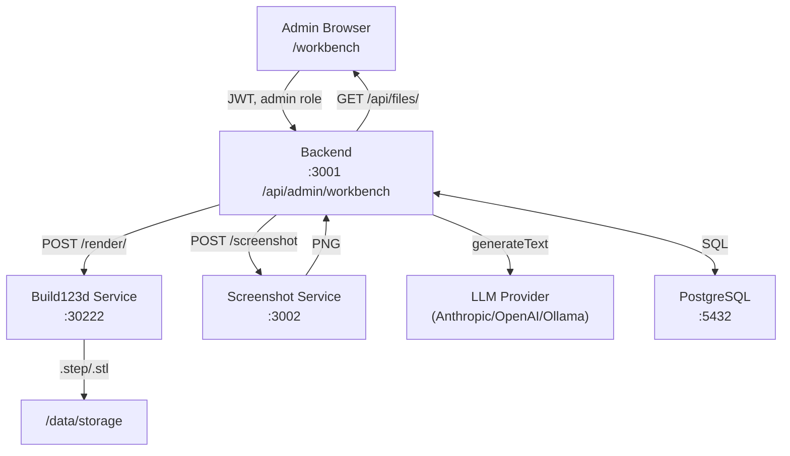

# Build123d LLM Workbench — Design Document

> **Status:** Draft v0.1 — 2026-02-24
> **Owner:** kreuzhofer
> **Branch:** `claude/build123d-llm-workbench-Zzddt`

---

## 1. Overview & Goals

The Build123d LLM Workbench is an admin-only feature within the Chat3D application. Its purpose is to generate, validate, and curate a high-quality dataset of Build123d Python code examples, which will be used to fine-tune an open-weight LLM specifically for 3D CAD code generation.

### Problem

No currently available LLM generates reliable Build123d code out of the box. Build123d is a relatively niche Python CAD library, and models hallucinate incorrect class names, wrong argument order, and invalid geometry operations. A fine-tuned model with a well-curated dataset would dramatically improve code generation quality inside Chat3D.

### Solution

A progressively structured dataset generation pipeline:

1. A **complexity curriculum** of 50 categories, ordered from simple primitives to complex assemblies.
2. An **iterative code generation and validation loop** per category: generate → render → screenshot → human review → approve or fix.
3. Validated examples from simpler categories **feed as few-shot context** into generation prompts for harder categories.
4. Approved examples accumulate into an **exportable training dataset** for LLM fine-tuning.

### Scope

- Admin-only feature, accessible at `/workbench` in the frontend.
- Backend API under `/api/admin/workbench/`.
- New standalone Docker service: `screenshot-service` (Puppeteer + Three.js STL renderer).
- New database tables in the existing PostgreSQL instance.
- No changes to the user-facing Chat3D experience.

---

## 2. Key Design Decisions

### 2.1 Integrated into Chat3D, Not a Separate App

The workbench reuses the existing auth system (admin role check), LLM infrastructure (Vercel AI SDK + provider configuration), Build123d render service, and database. A separate app would duplicate all of this for no benefit at this stage.

### 2.2 Screenshot Service as a Separate Docker Container

The Puppeteer + Three.js STL-to-PNG renderer requires Chromium, which is a heavyweight dependency inappropriate to include in the main backend image. It is extracted as a standalone service:

- Keeps backend image lean.
- Can be scaled or replaced independently (e.g., replace with a GPU renderer later).
- Based on the implementation in the previous `chat3d-docker` project (`imageRenderer.ts`).
- New environment variable: `SCREENSHOT_SERVICE_URL`.

### 2.3 Full Example Retrieval (No Chunking)

When selecting prior examples for few-shot context, we always retrieve **complete code examples**, never partial chunks. Chunking risks cutting off import statements, context managers, or the export call — making examples useless or misleading. We limit the number of examples injected rather than their size.

### 2.4 Human-in-the-Loop for Visual Validation

The render service tells us if code is syntactically correct and produces a valid geometry file. It does **not** tell us if the object looks right. A cube with wrong proportions still renders successfully. Therefore:

- Automated validation = no render error + no Python exception.
- Visual validation = human reviews the screenshot and approves or rejects.
- The LLM fix loop handles render errors automatically (up to `MAX_AUTO_FIX_ITERATIONS = 5`).
- After that, human intervention is required.

### 2.5 System Prompt as a Versioned File Asset

The Build123d comprehensive system prompt is stored as a file asset in the backend (`src/data/build123d-system-prompt.md`), not in the database. This keeps it version-controlled, easily editable, and trivial to include in training data. A future extension could store multiple versions in the DB for A/B testing prompt strategies.

### 2.6 Target Fine-Tuning Model: Qwen3-Coder-Next

**Selected:** `Qwen3-Coder-Next` (released February 2026, Alibaba Qwen team)

| Property | Value |
|----------|-------|
| Architecture | MoE, 80B total params, **3B active per token** |
| Context window | 256K tokens |
| 4-bit GGUF size | ~46 GB (fits single DGX Spark, 128 GB) |
| BF16 LoRA training | Fits single DGX Spark with Unsloth |
| SWE-Bench Verified | 70.6 (state of the art at its class) |
| Inference throughput | ~10× vs dense equivalent |
| License | Apache 2.0 |
| Fine-tuning framework | Unsloth (MoE training 12× faster, 35% less VRAM) |

**Why not MiniMax-Text-01:** 456B total params, does not fit 128 GB DGX Spark even quantized, proprietary license, no public fine-tuning toolchain.

**Runner-up:** `Qwen2.5-Coder-32B` (64 GB BF16, Apache 2.0, very mature fine-tuning toolchain via LLaMA-Factory / Axolotl / Unsloth). Use if Qwen3-Coder-Next tooling proves immature.

### 2.7 Training Dataset Output Format

Deferred — will target LLaMA-Factory JSONL (conversation format with `system`/`user`/`assistant` roles) as the default, which is compatible with the broadest range of training frameworks. Final format decision comes when we begin training runs.

---

## 3. Architecture Overview



### New Docker Services

| Service | Image | Port | Purpose |
|---------|-------|------|---------|
| `screenshot-service` | Custom (Node 20 + Chromium) | 3002 | STL → PNG via Puppeteer + Three.js |

### New Environment Variables

| Variable | Default | Purpose |
|----------|---------|---------|
| `SCREENSHOT_SERVICE_URL` | `http://screenshot-service:3002` | URL of screenshot service |

---

## 4. Database Schema

Three new tables, all scoped to admin use (no `owner_id` — they are global admin resources).

### 4.1 `workbench_categories`

```sql
CREATE TABLE workbench_categories (
  id          UUID PRIMARY KEY DEFAULT gen_random_uuid(),
  rank        INTEGER NOT NULL UNIQUE,           -- 1–50, sort order
  tier        INTEGER NOT NULL,                  -- 0–5, complexity tier
  name        VARCHAR(255) NOT NULL,
  description TEXT NOT NULL,                     -- human-readable goal description
  hint        TEXT,                              -- optional: suggested approach / key APIs to use
  status      VARCHAR(30) NOT NULL DEFAULT 'pending'
              CHECK (status IN ('pending', 'in_progress', 'has_draft', 'approved', 'skipped')),
  created_at  TIMESTAMPTZ NOT NULL DEFAULT NOW(),
  updated_at  TIMESTAMPTZ NOT NULL DEFAULT NOW()
);
```

**Statuses:**
- `pending` — not started
- `in_progress` — generation/validation is actively being worked on
- `has_draft` — at least one example has been generated but none approved yet
- `approved` — at least one example approved; category is usable as few-shot context
- `skipped` — consciously excluded from the dataset

### 4.2 `workbench_examples`

```sql
CREATE TABLE workbench_examples (
  id              UUID PRIMARY KEY DEFAULT gen_random_uuid(),
  category_id     UUID NOT NULL REFERENCES workbench_categories(id) ON DELETE CASCADE,
  iteration       INTEGER NOT NULL DEFAULT 1,    -- auto-increments per category
  code            TEXT NOT NULL,                 -- executable Build123d Python
  render_status   VARCHAR(20) NOT NULL DEFAULT 'pending'
                  CHECK (render_status IN ('pending', 'rendering', 'success', 'error')),
  render_error    TEXT,                          -- error message if render failed
  stl_path        TEXT,                          -- path to generated .stl file (for screenshot)
  step_path       TEXT,                          -- path to generated .step file
  screenshot_front    TEXT,                      -- base64 PNG, front angle
  screenshot_top      TEXT,                      -- base64 PNG, top angle
  screenshot_iso      TEXT,                      -- base64 PNG, isometric angle
  approval_status VARCHAR(20) NOT NULL DEFAULT 'pending'
                  CHECK (approval_status IN ('pending', 'approved', 'rejected')),
  rejection_note  TEXT,                          -- human note if rejected
  llm_model       VARCHAR(255),                  -- which model generated this
  prompt_tokens   INTEGER,
  completion_tokens INTEGER,
  created_at      TIMESTAMPTZ NOT NULL DEFAULT NOW(),
  updated_at      TIMESTAMPTZ NOT NULL DEFAULT NOW()
);

CREATE INDEX idx_wb_examples_category ON workbench_examples(category_id);
CREATE INDEX idx_wb_examples_approval ON workbench_examples(approval_status);
```

### 4.3 `workbench_system_prompts`

```sql
CREATE TABLE workbench_system_prompts (
  id          UUID PRIMARY KEY DEFAULT gen_random_uuid(),
  version     INTEGER NOT NULL UNIQUE,
  label       VARCHAR(255) NOT NULL,
  content     TEXT NOT NULL,                     -- full system prompt text
  is_active   BOOLEAN NOT NULL DEFAULT FALSE,    -- only one active at a time
  created_at  TIMESTAMPTZ NOT NULL DEFAULT NOW()
);
```

Seeded with `version=1` from `src/data/build123d-system-prompt.md` on first run. Later versions can be added via the UI for prompt A/B testing.

---

## 5. API Contract

All routes under `/api/admin/workbench` require `requireAuth` + `requireRole("admin")` middleware.

### 5.1 Categories

| Method | Path | Description |
|--------|------|-------------|
| `GET` | `/categories` | List all categories (sorted by rank) |
| `GET` | `/categories/:id` | Get category + its examples |
| `POST` | `/categories` | Create a category (manual or bulk seed) |
| `PATCH` | `/categories/:id` | Update status, hint, name, description |
| `POST` | `/categories/seed` | Seed the default 50-category curriculum |

### 5.2 Examples

| Method | Path | Description |
|--------|------|-------------|
| `GET` | `/examples/:id` | Get a single example (with screenshots) |
| `POST` | `/examples/generate` | Generate a new example for a category (LLM + render + screenshot) |
| `POST` | `/examples/:id/render` | Re-render an existing example's code |
| `POST` | `/examples/:id/screenshot` | Re-screenshot an already-rendered example |
| `PATCH` | `/examples/:id/approve` | Approve an example |
| `PATCH` | `/examples/:id/reject` | Reject an example with optional note |
| `PATCH` | `/examples/:id/code` | Update code manually (for human fixes) |

### 5.3 System Prompts

| Method | Path | Description |
|--------|------|-------------|
| `GET` | `/system-prompts` | List all system prompt versions |
| `GET` | `/system-prompts/active` | Get the currently active system prompt |
| `POST` | `/system-prompts` | Create a new version |
| `POST` | `/system-prompts/:id/activate` | Set as the active system prompt |

### 5.4 Dataset Export

| Method | Path | Description |
|--------|------|-------------|
| `GET` | `/export/jsonl` | Export all approved examples as LLaMA-Factory JSONL |
| `GET` | `/export/stats` | Summary: approved/pending/rejected counts per tier |

### 5.5 Screenshot Service (Proxy)

The backend proxies screenshot requests so the frontend never calls the screenshot service directly.

| Method | Path | Description |
|--------|------|-------------|
| `POST` | `/screenshot` | Render code → STL → PNG. Body: `{ code, angles? }` |

---

## 6. Screenshot Service

### 6.1 REST API

**Base URL:** `http://screenshot-service:3002`

#### `POST /screenshot`

Request body:
```json
{
  "stlBase64": "<base64-encoded STL file content>",
  "width": 512,
  "height": 512,
  "angles": ["front", "top", "isometric"]
}
```

Response (success `200`):
```json
{
  "images": [
    { "angle": "front",      "base64": "<PNG base64>" },
    { "angle": "top",        "base64": "<PNG base64>" },
    { "angle": "isometric",  "base64": "<PNG base64>" }
  ]
}
```

Response (error `400` / `500`):
```json
{
  "error": "human-readable message",
  "type": "client" | "server"
}
```

#### `GET /health`

Returns `{ "status": "ok" }` when Puppeteer is ready.

### 6.2 Implementation

- Node.js 20 + Express
- Puppeteer with `skipDownload: true`; Chromium provided by `chromium` package
- Three.js loaded into the headless browser page via bundled HTML template
- Three angles: `front` (camera at +Z), `top` (camera at +Y), `isometric` (+X+Y+Z diagonal)
- STL is injected as a `data:` URI; `window.renderImage(stlDataUri, angle)` returns a PNG data URL
- 30-second timeout per angle; 10-second Puppeteer launch timeout
- Docker flags: `--no-sandbox`, `--disable-setuid-sandbox`, `--use-gl=angle`, `--use-angle=swiftshader`

### 6.3 Dockerfile

```
Base: node:20-alpine
Install: chromium package + dependencies
Copy: service source + bundled Three.js HTML template
Port: 3002
```

### 6.4 Docker Compose Addition

```yaml
screenshot-service:
  build:
    context: ./services/screenshot-service
  ports:
    - "3002:3002"
  environment:
    - NODE_ENV=production
  restart: unless-stopped
```

---

## 7. Build123d System Prompt

The system prompt (`src/data/build123d-system-prompt.md`) is the single most critical asset. It must be a **dense, self-contained reference** that teaches the LLM everything it needs to generate correct Build123d code without hallucination.

### 7.1 Required Sections

1. **Role and output contract** — LLM identity, what it must produce, exact format requirements.
2. **Code structure requirements** — mandatory patterns (BuildPart context, single export call, no `print()`, no file I/O beyond export).
3. **Import conventions** — `from build123d import *` is the only supported import.
4. **Build contexts** — `BuildPart`, `BuildSketch`, `BuildLine`; how nesting works; what `mode=Mode.ADD/SUBTRACT/INTERSECT` means.
5. **Primitives** — complete list with correct signatures, default values, and units (mm).
6. **Location and orientation** — `Location`, `Axis`, `Plane`, `Vector`, `Rotation`; how to translate/rotate objects; `with Locations(...)` context.
7. **Sketch operations** — `Circle`, `Rectangle`, `RegularPolygon`, `Ellipse`, `Polyline`, `Spline`, `make_face()`, `make_hull()`.
8. **3D operations** — `extrude`, `revolve`, `loft`, `sweep`; required arguments and return types.
9. **Boolean operations** — `fuse`, `cut`, `intersect`; usage with `mode=Mode.SUBTRACT` inside context vs explicit calls.
10. **Edge/face selection** — `.edges()`, `.faces()`, `.vertices()`; filter by `Axis`, `GeomType`, `Select`; sort patterns.
11. **Fillets and chamfers** — `fillet`, `chamfer`; selecting all edges vs specific edges.
12. **Shell and offset** — `shell` for hollow parts; `offset` for expanding/contracting faces.
13. **Arrays and patterns** — `GridLocations`, `PolarLocations`, `Locations` with multiple points.
14. **Export functions** — `export_step`, `export_stl`, `export_3mf`; file naming conventions.
15. **Common mistakes to avoid** — curated list of known LLM failure modes (wrong class names, missing context managers, calling methods on wrong types, etc.).

### 7.2 Format Requirements Embedded in the Prompt

The prompt must specify exactly:
- Code must be executable as a standalone Python script.
- Must begin with `from build123d import *`.
- Must produce exactly one STEP file via `export_step(part.part, "{filename}.step")`.
- The filename is injected by the caller; the LLM must use it as a template variable.
- No interactive elements, no user input, no `import sys`, no `matplotlib`.
- All dimensions in millimeters unless explicitly stated otherwise.
- Output must be wrapped in a fenced code block: ` ```python ... ``` `.

### 7.3 Example Selection for Few-Shot Context

When generating for a category of rank `N` in tier `T`:
- Retrieve approved examples from categories with rank `< N`, ordered by tier descending.
- Take at most **3 examples** from the immediately adjacent tier (`T-1`), and **1 example** from each earlier tier (up to 3 earlier tiers).
- Maximum total: **6 examples** injected into the prompt.
- Each example is included in full (never truncated).
- Examples are formatted as: description header + fenced Python code block.

---

## 8. Complexity Curriculum (50 Categories)

### Tier 0 — Primitives and Build Contexts (1–8)

| Rank | Name | Description |
|------|------|-------------|
| 1 | Box primitive | Single Box with explicit dimensions |
| 2 | Cylinder primitive | Single Cylinder; demonstrate arc_size for partial cylinder |
| 3 | Sphere primitive | Single Sphere; demonstrate arc_size parameters |
| 4 | Cone primitive | Cone (pointed) and truncated cone (top_radius > 0) |
| 5 | Torus primitive | Torus (donut) demonstrating major/minor radius |
| 6 | Multi-primitive positioning | 2–3 primitives placed using `with Locations(...)` |
| 7 | Sketch basics | BuildSketch with Circle, Rectangle, RegularPolygon; make_face |
| 8 | BuildPart context deep dive | Nested BuildPart + BuildSketch + BuildLine; mode=Mode.ADD/SUBTRACT |

### Tier 1 — Core Operations (9–18)

| Rank | Name | Description |
|------|------|-------------|
| 9  | Extrude from sketch | Rectangle sketch → extruded solid |
| 10 | Extrude with taper | Tapered extrusion using `taper` parameter |
| 11 | Revolve | L-profile revolved around axis |
| 12 | Loft | Two different profiles lofted into solid |
| 13 | Sweep | Circle profile swept along a curved path |
| 14 | Boolean union | Two overlapping solids fused |
| 15 | Boolean difference | Cylinder subtracted from box (through-hole) |
| 16 | Boolean intersection | Keep only overlapping volume |
| 17 | Fillet all edges | Box with all edges rounded |
| 18 | Chamfer selected edges | Box with chamfered top edges only |

### Tier 2 — Simple Composite Objects (19–28)

| Rank | Name | Description |
|------|------|-------------|
| 19 | Bracket with holes | Flat plate with 4 through-holes via GridLocations |
| 20 | Bushing | Cylinder with concentric through-hole |
| 21 | L-bracket | Two rectangular extrusions joined at 90° |
| 22 | T-connector | Three-way T-shaped solid |
| 23 | Rounded box | Box with fillet on all edges |
| 24 | Stepped shaft | Multiple-diameter cylinder (3 steps) |
| 25 | Flat washer | Ring/annulus (cylinder − cylinder) |
| 26 | Hex prism | Extruded hexagonal sketch |
| 27 | Simple hook | Swept curve forming a hook shape |
| 28 | Hollow box (shell) | Box with open top via shell operation |

### Tier 3 — Mechanical Components (29–38)

| Rank | Name | Description |
|------|------|-------------|
| 29 | Hex bolt head | Hexagonal prism + cylinder shank |
| 30 | Hex nut | Hexagonal prism with centered threaded hole |
| 31 | Flat head screw | Countersunk head + shank |
| 32 | Simple spur gear | Involute tooth profile revolved into gear |
| 33 | Keyed shaft | Shaft with keyway slot cut along length |
| 34 | Simple hinge | Two barrel halves + pin |
| 35 | Clip / snap fit | Cantilevered snap beam on a plate |
| 36 | Spring coil | Sweep of circle along helical path |
| 37 | Pulley | Grooved cylinder with central bore |
| 38 | Bearing housing | Cylindrical housing with two flange holes |

### Tier 4 — Electronic / Enclosure Components (39–46)

| Rank | Name | Description |
|------|------|-------------|
| 39 | PCB standoff | Hex standoff with M3 thread pocket |
| 40 | DIN rail clip | Standard DIN 35 rail mounting clip |
| 41 | Cable tie mount | Surface mount with cable tie loop |
| 42 | Panel cutout frame | Rectangular panel with lip for display |
| 43 | M3 insert pocket | Cylindrical boss with blind hole for heat insert |
| 44 | Raspberry Pi camera mount | Plate matching Pi Camera v3 hole pattern |
| 45 | OLED display bezel | Bezel with cutout for 0.96" OLED |
| 46 | Panel mounting bracket | L-bracket with counterbore holes |

### Tier 5 — Complex Assemblies (47–50)

| Rank | Name | Description |
|------|------|-------------|
| 47 | Raspberry Pi 5 — bottom tray | Bottom half of Pi 5 enclosure (PCB standoffs, port cutouts) |
| 48 | Raspberry Pi 5 — lid | Top half with ventilation slots and GPIO access |
| 49 | Arduino Mega enclosure | Full enclosure with USB, power, and header access |
| 50 | Generic project box | Parametric enclosure with configurable cable glands |

---

## 9. Code Generation Pipeline

For each category, the workbench runs the following pipeline:

```
1. SELECT CATEGORY (human picks which category to work on next)
         │
         ▼
2. BUILD PROMPT
   - Load active system prompt
   - Select up to 6 approved examples from lower-rank categories
   - Compose: system_prompt + examples + category_description + hint
         │
         ▼
3. GENERATE CODE (LLM via Vercel AI SDK)
   - Provider: configured codegen provider (Anthropic/OpenAI/Ollama)
   - Extract Python code from fenced block
         │
         ▼
4. RENDER (Build123d service)
   - POST /render/ with code + filename
   - On error: capture error message, increment iteration count
   - If render_error AND iteration < MAX_AUTO_FIX_ITERATIONS (5):
       → LLM receives error + previous code → generates fix → back to step 4
   - If iteration >= MAX_AUTO_FIX_ITERATIONS: mark as needs_manual_fix
         │
         ▼
5. SCREENSHOT (screenshot-service)
   - POST /screenshot with stlBase64 + angles [front, top, isometric]
   - Store three PNG images on the example record
         │
         ▼
6. HUMAN REVIEW
   - Admin views code + three screenshots
   - Decision: APPROVE, REJECT (with note), or EDIT CODE (manual fix → back to step 4)
         │
         ▼
7. ON APPROVE
   - example.approval_status = 'approved'
   - category.status = 'approved'
   - Example is now available as few-shot context for higher-rank categories
```

### 9.1 Auto-Fix Loop Detail

When a render error occurs:

```
Fix prompt structure:
  [system_prompt]
  [prior approved examples]

  ## Previous code that failed to render:
  ```python
  {failed_code}
  ```

  ## Render error:
  {error_message}

  Fix the code above. Preserve the intended geometry.
  Return only the corrected Python code in a fenced code block.
```

Each fix attempt increments `iteration` and creates a new `workbench_examples` row (preserving history). The previous failed code is stored, never overwritten.

---

## 10. Frontend Design

### 10.1 Routes

| Path | Component | Description |
|------|-----------|-------------|
| `/workbench` | `WorkbenchPage` | Category list overview |
| `/workbench/:categoryId` | `WorkbenchCategoryPage` | Category detail with editor + previews |

Both routes are guarded by `AdminRouteGuard`.

Navigation: added to the admin section of `authenticatedNavGroups` (visible only when `isAdmin`).

### 10.2 Workbench Page (`/workbench`)

**Top section:**
- `PageHeader` with "LLM Workbench" title and "Seed Categories" button (triggers `/categories/seed`).
- Stats bar: counts per tier and approval status (from `/export/stats`).

**Category table:**
- Columns: Rank, Tier badge, Name, Status badge, Examples count, Actions.
- Filter by tier and status.
- Click row → navigate to category detail.
- "Generate" action button on each row for quick dispatch.

### 10.3 Category Page (`/workbench/:categoryId`)

**Left panel (40%):**
- Category name, description, hint.
- Status badge + "Mark as Skipped" action.
- Code editor (`<textarea>` or basic code editor with monospace font).
- Action buttons: "Generate", "Render + Screenshot", "Approve", "Reject".
- Iteration counter: "Attempt 3 / 5 max auto-fix".

**Right panel (60%):**
- Three screenshot thumbnails: Front, Top, Isometric.
- Click to expand to full size.
- Render status badge (pending / rendering / success / error).
- Render error message (if any), copyable.

**History section (below):**
- Table of all previous iterations for this category.
- Columns: Iteration, Status, Approved, Render Status, Created at, View Code.

### 10.4 Dataset Export Panel (in Admin tab or separate `/workbench/export`)

- Stats: total approved examples, breakdown by tier.
- "Export JSONL" button → downloads file.
- "View Active System Prompt" → opens system prompt text in a read-only viewer.

---

## 11. Training Dataset Format

Each approved example becomes one training record in the fine-tuning dataset.

### 11.1 JSONL Structure (LLaMA-Factory conversation format)

```json
{
  "conversations": [
    {
      "from": "system",
      "value": "{full Build123d system prompt text}"
    },
    {
      "from": "human",
      "value": "{category description + any additional context}"
    },
    {
      "from": "gpt",
      "value": "```python\n{approved code}\n```"
    }
  ]
}
```

One JSON object per line. File: `workbench-dataset-{timestamp}.jsonl`.

### 11.2 Example Count Targets

| Tier | Categories | Target examples/category | Target total |
|------|-----------|--------------------------|--------------|
| 0 | 8 | 3 | 24 |
| 1 | 10 | 3 | 30 |
| 2 | 10 | 2 | 20 |
| 3 | 10 | 2 | 20 |
| 4 | 8 | 2 | 16 |
| 5 | 4 | 2 | 8 |
| **Total** | **50** | | **~118** |

A dataset of ~100–150 high-quality, validated examples is the minimum viable fine-tuning set. Quality over quantity: one well-validated example is worth 10 generated-but-unchecked examples.

---

## 12. Implementation Phases

### Phase 1 — Screenshot Service (current)

- [ ] Create `services/screenshot-service/` directory
- [ ] Node.js + Express app with Puppeteer + Three.js HTML template
- [ ] `POST /screenshot` endpoint accepting STL base64
- [ ] `GET /health` endpoint
- [ ] Dockerfile
- [ ] Add to `docker-compose.yml`
- [ ] Add `SCREENSHOT_SERVICE_URL` env var and config entry
- [ ] Verify build succeeds

### Phase 2 — Backend Workbench API

- [ ] DB migration: `workbench_categories`, `workbench_examples`, `workbench_system_prompts`
- [ ] Write comprehensive `build123d-system-prompt.md` asset
- [ ] Seed script for 50 categories
- [ ] `workbench.service.ts` (generation pipeline logic)
- [ ] `workbench.routes.ts` under `/api/admin/workbench`
- [ ] Screenshot proxy via screenshot service
- [ ] Dataset export endpoint (JSONL)
- [ ] Verify backend builds

### Phase 3 — Frontend Workbench UI

- [ ] `WorkbenchPage` component (category list + stats)
- [ ] `WorkbenchCategoryPage` component (editor + screenshots + history)
- [ ] Add `/workbench` route to `app.tsx` (admin-guarded)
- [ ] Add "Workbench" to admin nav group
- [ ] Frontend API client: `workbench.api.ts`
- [ ] Verify frontend builds

### Phase 4 — Polish & Dataset Pipeline

- [ ] System prompt editor in UI
- [ ] Multiple examples per category (rerun for additional variety)
- [ ] Batch generation mode (run through all `pending` categories automatically)
- [ ] Export preview (show sample records before downloading)
- [ ] JSONL format validation on export

---

## 13. Open Questions / Decisions Deferred

| # | Question | Status |
|---|----------|--------|
| 1 | Fine-tuning framework (LLaMA-Factory vs Axolotl) | Deferred — decide when training begins |
| 2 | Multiple approved examples per category or one best example? | Start with one; extend in Phase 4 |
| 3 | Should the auto-fix loop stream tokens back to the UI? | Nice-to-have; Phase 3 polish |
| 4 | Rate limiting on `/generate` endpoint? | Add in Phase 2 (reuse existing rate limit infra) |
| 5 | Where to store generated STL/STEP files for workbench? | Under `/data/storage/workbench/{exampleId}/` |
| 6 | System prompt versioning for A/B testing? | Phase 4 |

---

*End of Design Document v0.1*
