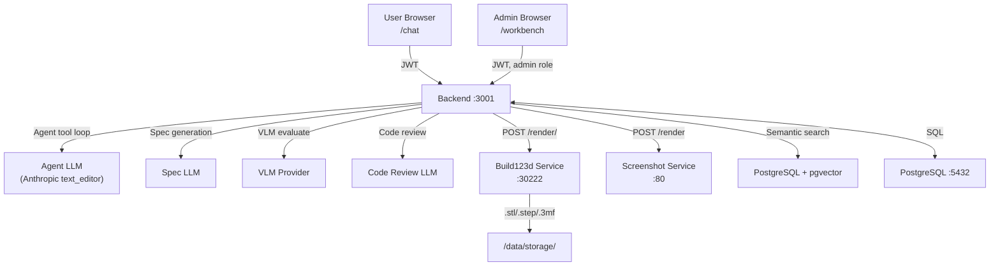

# Code Generation Pipeline & LLM Workbench

> **Last updated:** 2026-03-10
> **Supersedes:** `build123d-llm-workbench.md`, `agentic-codegen-analysis.md`

---

## 1. Overview

Chat3D uses an agent-based pipeline to generate Build123d Python code from natural language. Two use cases share the same engine:

1. **Chat (user-facing):** Users describe 3D objects → agent generates, renders, and returns CAD files (.step/.stl/.3mf).
2. **Workbench (admin-only):** Batch generation of curated prompt→code examples for fine-tuning an LLM specialized in Build123d code.

### Why This Exists

No current LLM generates reliable Build123d code out of the box. Build123d is a niche Python CAD library; models hallucinate class names, wrong argument order, and invalid geometry. The pipeline compensates through:

- A tiered Build123d system prompt (25 composable sections)
- Pre-render validation (AST + 10 lint rules)
- Agent-based iterative generation with tool use (validate, render, search examples/knowledge)
- Multi-angle VLM evaluation with verification checklists
- A validated external Build123d knowledge base
- Few-shot example retrieval via semantic search with operation-aware re-ranking

The workbench produces a curated training dataset to eventually fine-tune a model that generates correct Build123d code natively.

---

## 2. Architecture



### Docker Services

| Service | Port | Purpose |
|---------|------|---------|
| postgres | 5432 | PostgreSQL 16 + pgvector |
| backend | 3001 (internal) | Express API, agent orchestration |
| frontend | 80 | React SPA via nginx |
| build123d | 30222 | Build123d Python rendering + validation |
| screenshot-service | 80 | STL/3MF → PNG (Puppeteer + Three.js) |

### LLM Purposes (configured via Admin UI)

| Purpose | Used For |
|---------|----------|
| `conversation` | Conversation stage — decide intent, respond to user |
| `agent_codegen` | Agent loop — code generation with tool use |
| `spec_generation` | Pre-codegen specification analysis |
| `vlm_evaluation` | Visual evaluation of rendered screenshots |
| `code_review` | Code quality scoring against spec |
| `embeddings` | Vector embeddings for semantic search |
| `workbench_codegen` | Workbench-specific codegen (falls back to `agent_codegen`) |

---

## 3. Code Generation Pipeline

### 3.1 Conversation Stage (Chat only)

The conversation LLM receives user messages + history and decides:
- `[CODEGEN_NEEDED]` → proceed to code generation
- `[CHAT_ONLY]` → respond with text only

Uses prompt caching (4,096 token minimum for Anthropic/Bedrock).

### 3.2 Spec Generation

`spec-generation.service.ts`

Before code generation, an LLM analyzes the prompt and produces:
- **Interpretation**: Natural-language restatement of what to build
- **Verification checklist**: 3–6 binary yes/no questions for VLM evaluation
- **Code assertions**: Dimensional checks (e.g., "width == 50mm")
- **Disambiguation questions**: Flags ambiguous prompts (pauses generation in chat)

Complexity classification (from `detectPromptOperations()` count):
- 0–2 operations → `simple` (capped fix iterations)
- 3–5 operations → `medium`
- 6+ operations → `complex` (triggers multi-agent decomposition)

Toggleable via `spec_generation_enabled` generation setting. Fail-open: LLM errors don't block the pipeline.

### 3.3 Agent Code Generation

`agent-codegen.service.ts`

The core engine uses Vercel AI SDK `generateText()` with Anthropic's `text_editor_20250728` built-in tool. The agent runs an autonomous tool-use loop:

```
Agent Loop (max N steps, configurable via generation_settings)
│
├── text_editor (view/create/str_replace/insert) — edit code in virtual filesystem
├── validate_code — AST parse + lint (10 rules) via Build123d /validate/ endpoint
├── render_project — render via Build123d /render/ or /render-project/
├── validate_and_render — combined validation + render
├── search_examples — semantic search over approved workbench examples
├── search_knowledge — semantic search over validated external knowledge base
├── lookup_api — retrieve specific Build123d API sections on demand
├── list_files — view project file listing
└── submit_result — signal completion with final file paths
```

The agent decides the workflow: create code → validate → fix issues → render → submit. The tool loop IS the fix loop — no separate retry mechanism.

**Virtual filesystem** (`agent-filesystem.service.ts`): In-memory `Map<string, string>` per generation run. Supports multi-file projects (`main.py` + component files).

**Infrastructure retry**: Exponential backoff (2s, 4s, 8s, 16s) with 5 max attempts for Build123d service timeouts/errors. Infrastructure errors (network, timeout) are distinguished from code errors and don't consume agent steps.

**Provider requirement**: Requires direct Anthropic provider (not Bedrock) for `text_editor_20250728` tool support.

### 3.4 Multi-Agent Decomposition

`agent-multi.service.ts`

For `complex` prompts (6+ detected operations):

1. **Decomposition LLM** splits the prompt into 2–6 independent components
2. **Sub-agents** run sequentially, each with isolated filesystem + component-specific prompt. Validate-only (no render) to save cycles.
3. **Assembly agent** receives all component files, writes `main.py` to import/assemble, validates, and renders the final model.

Automatic fallback to single-agent if decomposition fails. Progress updates flow to frontend: decomposing → component [N/M] → assembling.

### 3.5 System Prompt Architecture

`prompts/system-prompts.ts` — 25 composable sections

Three-tier knowledge loading:

| Tier | When Loaded | Size | Content |
|------|-------------|------|---------|
| **Tier 1 (Core)** | Always | ~220 lines | Core Build123d patterns, common mistakes, output contract, primitives |
| **Tier 2 (Task-relevant)** | Based on detected operations | 0–280 lines | Relevant API sections (e.g., loft/sweep docs only when needed) |
| **Tier 3 (RAG)** | On-demand via agent tools | Variable | External knowledge base, full API reference sections |

- **Initial generation**: Tiered prompt (Tier 1 + relevant Tier 2) — 4,000–10,000 tokens instead of ~16,000
- **Agent `lookup_api` tool**: Retrieves specific Tier 3 sections on demand

Operation detection: keyword matching on user prompt + spec interpretation determines which Tier 2 sections to include.

### 3.6 Pre-Render Validation

Build123d `/validate/` and `/validate-project/` endpoints. 10 AST-based lint rules:

| Rule | Severity | What it catches |
|------|----------|-----------------|
| `no_box_centered` | error | `Box()` with `centered` kwarg (doesn't exist) |
| `no_shell_class` | error | Direct `Shell()` call (use `shell()` method) |
| `locations_bare_int` | error | `Locations()` with bare int args |
| `no_export_calls` | warning | `export_step()`, `Mesher()` (handled by template) |
| `no_build123d_import` | warning | `from build123d import *` (handled by template) |
| `no_forbidden_imports` | error | `import sys`, `matplotlib`, etc. |
| `no_show_calls` | error | `show()`, `show_object()` |
| `no_interactive` | warning | `input()`, `print()` |
| `missing_make_face` | warning | `BuildLine` in `BuildSketch` without `make_face()` |
| `fillet_before_boolean` | warning | `fillet()`/`chamfer()` before boolean ops |

Errors (severity=`error`) prevent rendering. Warnings are informational.

### 3.7 Error Classification

`utils/render-errors.ts` — 7 categories with domain-specific fix guidance:

| Category | Example | Action |
|----------|---------|--------|
| INFRASTRUCTURE | Timeout, service unreachable | Retry with backoff, don't regenerate |
| API_MISUSE | Undefined names, missing imports | Fix guidance with correct API usage |
| GEOMETRY | Empty geometry, degenerate shapes | Specific geometric corrections |
| KERNEL_ERROR | BRep_API failures | Rebuild strategy |
| SYNTAX | Validation failures | Direct syntax fix |
| TYPE_ERROR | Wrong argument types | Type correction hints |
| UNKNOWN | Unclassified | Generic retry |

---

## 4. Evaluation System

### 4.1 Visual Evaluation (VLM)

`visual-eval.service.ts`

After rendering, the screenshot service produces images from 9 angles (front, back, left, right, top, bottom, isometric, ortho_45, ortho_45_bottom). The VLM evaluates:

- **Scoring**: 1–10 scale across shape, proportions, and feature accuracy
- **Issues**: Specific visual problems
- **Suggestions**: Build123d code-level fixes
- **Verification checklist**: Binary yes/no answers to spec-generated questions (e.g., "Does the model have exactly 3 holes?")
- **VLM-guided zoom**: VLM can request `zoom_detail_view` for high-res 1024px re-renders of specific regions (max 5 per evaluation)

Response parsing: Three-level fallback (JSON in code fence → direct parse → regex extraction). 2 retries on transient errors.

### 4.2 Code Evaluation

`code-eval.service.ts` — two complementary approaches:

1. **Assertion checker** (deterministic, no LLM cost):
   - Extracts variable values from code via regex
   - Checks against spec assertions (e.g., `width == 50`, `height >= 20`)
   - Operators: `==`, `>=`, `<=`, `approx` (±10%)

2. **Code review LLM**:
   - Validates parameter accuracy, feature completeness, constraint satisfaction
   - 1–10 score with issues
   - Falls back through `code_review` → `spec_generation` → `conversation` models

### 4.3 Composite Scoring

`computeCompositeScore()` blends visual + code scores:
- Configurable weight via `codeEvalWeight` generation setting
- Assertion penalty via sqrt factor (50% pass rate → ~25% penalty)
- Disagreement handling: if visual and code scores differ by ≥4, takes lower + 1

### 4.4 Auto-Approval (Workbench)

| Condition | Action |
|-----------|--------|
| Score ≥ threshold AND ≥ 80% checklist pass | `auto_approved` — enters training dataset |
| Score < threshold, agent has steps remaining | Agent continues iterating |
| Score < threshold, max steps exhausted | Flagged for human review |

---

## 5. Knowledge & Context

### 5.1 Few-Shot Example Retrieval

`workbench-embeddings.service.ts`

Approved workbench examples are embedded (1536-dim via `text-embedding-3-large`) and retrieved via semantic search:

- **Operation-aware re-ranking**: Fetches 3× candidates, scores with 70% semantic similarity + 30% operation overlap
- `detected_operations` TEXT[] column on prompts with GIN index
- Always retrieves **complete code examples** (never chunks) — max 6 per generation

### 5.2 External Knowledge Base

`knowledge-search.service.ts`, `knowledge-crawl.service.ts`

Pre-crawled, validated corpus of external Build123d code:

| Source Type | Content |
|-------------|---------|
| `github_example` | Examples from build123d repo |
| `github_test` | Test files from build123d repo |
| `docs` | Build123d readthedocs pages |
| `manual` | Admin-curated entries |
| `reference` | Curated reference patterns |

**Search**: Hybrid Reciprocal Rank Fusion (RRF) merging semantic (cosine similarity on embeddings) + lexical (PostgreSQL full-text search).

Each entry is validated against Build123d `/validate/` and tagged with the build123d version. The agent accesses it via `search_knowledge(query)`.

Admin UI: `KnowledgeTab.tsx` — source management, crawl triggers, validation pipeline, entry browser.

### 5.3 Prompt Caching

`buildCacheableSystem()` — Vercel AI SDK v6 `cache_control` on system messages. 4,096 token minimum for Anthropic/Bedrock. Cache metrics tracked in `LlmUsageEvent` table.

---

## 6. Code Projects

### 6.1 Project Tracking

`code-project.service.ts`

- `code_projects` table: One per chat context, stores `current_code`, `current_files` (JSONB for multi-file), `last_rendered_item_id`
- `code_project_versions` table: Version history with code snapshots per successful render
- Modification detection uses `getProjectCode(contextId)` with fallback to `findMostRecentCode()`

### 6.2 File Storage Layout

```
chat/{contextId}/
  code/{itemId}.b123d                        # Source code
  artifacts/{itemId}.{stl,step,3mf}          # Render outputs
  artifacts/{itemId}-screenshot-{angle}.png   # Screenshots
  {contextId}-{uuid}.{ext}                   # User uploads

workbench/{categoryId}/
  code/{exampleId}.b123d
  artifacts/{exampleId}.{stl,step,3mf,png}
```

---

## 7. LLM Workbench (Dataset Generation)

### 7.1 Goals

Generate a high-quality dataset of Build123d prompt→code examples for fine-tuning:

| Milestone | Prompts | Runs/prompt | Target examples |
|-----------|---------|-------------|----------------|
| v1 | 1,100 (100 × 11 categories) | 1 | ~900–1,000 |
| v2 | 1,100 | 5 | ~4,500–5,000 |
| Final | 1,100 | 10 | ~9,000–10,000 |

Scaling from 1,000 to 10,000 is done by re-running each prompt with varied temperature/seeds, not writing more prompts.

### 7.2 Complexity Curriculum (11 Categories)

Category files in `workbench/categories/`:

| Rank | Category | Complexity |
|------|----------|-----------|
| 1 | Primitives | 1 |
| 2 | Sketch Operations | 2 |
| 3 | Extrusions & Revolutions | 3 |
| 4 | Boolean Operations | 4 |
| 5 | Surface Modifications | 5 |
| 6 | Arrays & Patterns | 5 |
| 7 | Simple Everyday Objects | 6 |
| 8 | Mechanical Components | 7 |
| 9 | Electronic Components | 8 |
| 10 | Generic Enclosures | 9 |
| 11 | PCB Cases | 10 |

100 user-facing natural language prompts per category. Prompts describe what to build from a user's perspective (no code hints, no API references).

### 7.3 Database Schema

- `workbench_categories` — id, rank, name, complexity, description
- `workbench_example_prompts` — id, category_id, index (1–100), prompt, detected_operations[], embedding
- `workbench_examples` — id, prompt_id, iteration, code, render_status, eval_score, eval_checklist_results, approval_status, llm_model, usage stats
- `workbench_system_prompts` — versioned system prompts with active toggle
- `workbench_prompt_tags` — tagging for discovery

### 7.4 Automated Pipeline

For each prompt:
1. **Spec generation** → interpretation, checklist, assertions, complexity
2. **Agent codegen** → create/edit code, validate, fix, render (same engine as chat)
3. **Screenshot** → 9 angles via screenshot service
4. **Evaluate** → VLM + code eval → composite score
5. **Auto-approve** or flag for human review

Batch: `POST /generate/batch` queues all pending prompts in a category.

### 7.5 Workbench API

All routes under `/api/admin/workbench`, admin-only.

| Group | Routes |
|-------|--------|
| Categories & Prompts | `GET /categories`, `GET /categories/:id/prompts`, `POST /categories/seed` |
| Generation | `POST /generate`, `POST /generate/batch`, `GET /jobs/:jobId` |
| Examples | `GET /examples/:id`, `PATCH .../approve`, `PATCH .../reject`, `PATCH .../code`, `POST .../retry`, `DELETE ...` |
| Embeddings | `POST /embeddings/backfill`, `GET /embeddings/status` |
| Operations | `POST /operations/backfill` |
| System Prompts | `GET /system-prompts`, `GET /system-prompts/active`, `POST /system-prompts/:id/activate` |
| Export | `GET /export/jsonl`, `GET /export/stats` |

### 7.6 Training Dataset Format

LLaMA-Factory JSONL conversation format:

```json
{
  "conversations": [
    { "from": "system", "value": "{Build123d system prompt}" },
    { "from": "human", "value": "{example prompt}" },
    { "from": "gpt", "value": "```python\n{approved code}\n```" }
  ]
}
```

### 7.7 Target Fine-Tuning Model

| Property | Value |
|----------|-------|
| Model | Qwen3-Coder-Next |
| Architecture | MoE, 80B total, 3B active/token |
| Context window | 256K tokens |
| 4-bit GGUF | ~46 GB (fits single DGX Spark) |
| Training | BF16 LoRA on DGX Spark with Unsloth |
| License | Apache 2.0 |

Runner-up: `Qwen2.5-Coder-32B` (64 GB BF16, mature toolchain).

### 7.8 Frontend

- `/workbench` — Category overview + stats + progress bars
- `/workbench/:categoryId` — Prompt list, batch controls, filters
- `/workbench/:categoryId/:promptId` — Example attempts, screenshots, eval scores, manual review

---

## 8. Curation Pipeline (Chat → Workbench)

`curation-*.service.ts`

Promotes high-quality user chat results into workbench examples:

1. **Sync candidates**: Chats with positive signals (rating ≥ 1 OR download ≥ 1) become curation candidates
2. **LLM distillation**: Refines user prompt into clean, actionable spec
3. **Tag suggestion**: LLM suggests category tags
4. **Similarity check**: Compare against existing workbench entries (prevents duplicates)
5. **Promotion**: Approved candidate → workbench example with code, renders, evaluation

Admin UI under `/api/admin/curation/`.

---

## 9. Open Topics

### 9.1 Not Yet Implemented

| Topic | Description | Priority |
|-------|-------------|----------|
| **Multiple seeds for dataset expansion** | Re-run each prompt with varied temperature/seeds (9–10 passes) to scale from 1,000 to 10,000 examples | High |
| **Reference images via image search** | Fetch real-world reference images (Bing/Google) for VLM evaluation grounding — geometric similarity only, not texture/color | Medium |
| **Incremental modification** | When user says "make the handle longer," agent identifies the relevant function in the project and edits only that code | Medium |
| **Color in examples** | ~5% of prompts with color expectations, 3MF export, VLM color evaluation | Low |
| **Export preview** | Preview JSONL export before downloading | Low |
| **Rate limiting on batch endpoint** | Throttle `/generate/batch` requests | Low |

### 9.2 Parts Knowledge Library

Structured datasheets for real-world hardware (Raspberry Pi, Arduino, ESP32, etc.) with precise dimensions, port positions, mounting holes. Auto-injected into codegen prompt when a known part is referenced.

**Why**: Higher-complexity categories (8–11) need precise dimensional knowledge for port cutouts, standoff patterns, PCB footprints. Users shouldn't need to specify that USB-A ports are 17.4mm × 15.0mm.

**Approach**: Curated Markdown/YAML files in `workbench/parts/`, seeded into a `workbench_part_datasheets` table, keyword-matched to user prompts. Small enough (< 2K tokens each) to include in full.

Becomes critical for niche boards and sub-millimeter accuracy. Initial training relies on LLM's existing knowledge of popular boards.

### 9.3 3D Printing Design Guidelines

Optional guidelines appended to system prompt to bias toward print-friendly designs: overhang limits (45°), minimum wall thickness (1.2mm), snap fits, tolerances (±0.2mm FDM), elephant's foot compensation, heat-set insert bosses, bridging limits, etc.

Controlled via toggle for A/B testing. Could be a separate LoRA adapter or merged fine-tune. Initial training focuses on geometric correctness.

### 9.4 Fine-Tuning Decisions

| Decision | Status |
|----------|--------|
| Framework (LLaMA-Factory vs Axolotl vs Unsloth) | Deferred |
| Training data format | Targeting LLaMA-Factory JSONL |
| Parts library: keyword matching vs embedding retrieval | Start with keywords |
| Print guidelines: v1 training or separate LoRA | Separate |

### 9.5 Build123d Service Enhancements

| Feature | Description |
|---------|-------------|
| `POST /analyze` | Code structure analysis (AST info, dependency graph) |
| `POST /execute-partial` | Partial execution for debugging intermediate geometry |

---

## 10. Research References

Key techniques informing the pipeline design:

| Technique | Source | Application |
|-----------|--------|-------------|
| VLM binary validation questions | CADCodeVerify (arxiv 2410.05340) | Verification checklist in eval |
| Three-tier knowledge architecture | Codified Context (arxiv 2602.20478) | Tiered system prompt |
| Agent trajectory pruning | AgentDiet (arxiv 2509.23586) | Context management in agent loop |
| Adaptive temperature on retry | LLMLOOP (TU Wien) | Temperature escalation in agent |
| Retrieval → Plan → Code → Debug | MapCoder | Spec → agent → eval pipeline structure |
| Navigator + Driver separation | PairCoder | Spec generation vs. code generation split |
| Diff-based edits | Code Surgery (fabianhertwig.com) | Agent `text_editor` for targeted edits |
| Multi-agent with analyst + debugger | arxiv 2505.02133 | Multi-agent decomposition for complex models |
| Designer → Coder agents for CAD | forma-ai-service | Spec-first approach for Build123d |
| Visual feedback in CAD agents | Bailo (medium) | VLM evaluation with zoom |

---

*End of document*
