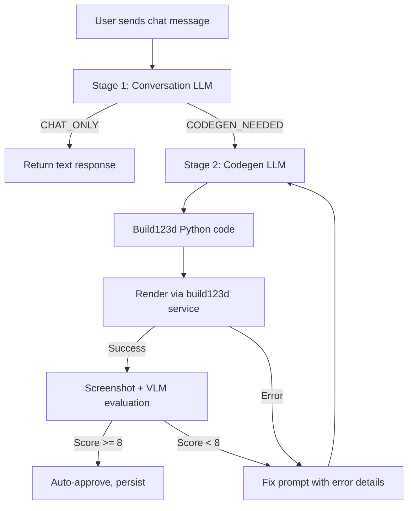
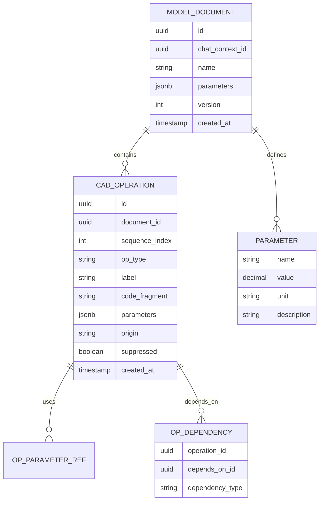
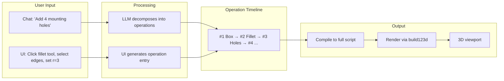
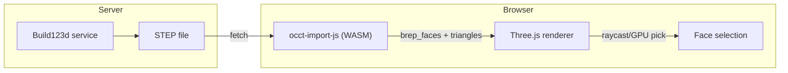
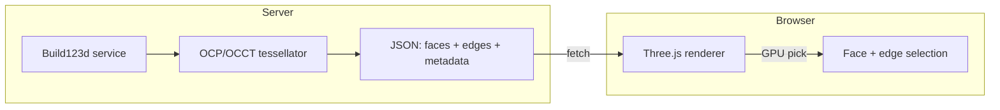
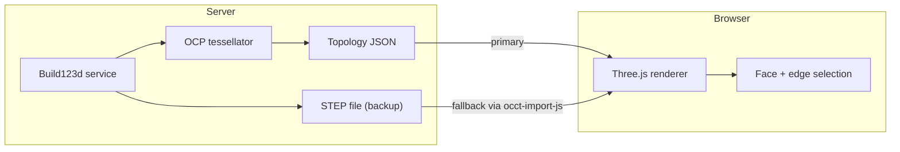

# Parametric History Vision: From Chat to CAD Timeline

## Executive Summary

This document analyzes how Chat3D currently generates build123d code and explores how the system could evolve toward a parametric CAD experience similar to Fusion360's feature timeline. The core thesis: **build123d's Python API maps almost 1:1 to Fusion360's operation tree**, making it architecturally feasible to unify LLM-driven code generation with interactive CAD operations under a shared operation history model.

---

## Part 1: Current Code Generation Architecture

### Two-Stage LLM Pipeline

Chat3D uses a sequential two-stage pipeline to go from natural language to rendered 3D model:



**Stage 1 — Intent Detection** (`CONVERSATION_SYSTEM_PROMPT`):
- Determines if the user request requires 3D model generation
- Outputs `[CODEGEN_NEEDED]` or `[CHAT_ONLY]` tag
- Provides brief acknowledgment of what will be generated

**Stage 2 — Code Generation** (`CODEGEN_SYSTEM_PROMPT`):
- 457-line system prompt containing the full build123d API reference
- Produces a complete, self-contained Python script
- Iterates up to 5 times using render errors and VLM visual evaluation as feedback

### Code Structure: Monolithic and Stateless

Each generation produces a **single, complete script** — all geometry in one `BuildPart()` context:

```python
# Parameters
base_width = 60
hole_radius = 8

# All geometry in one block
with BuildPart() as part:
    Box(base_width, 40, 15)
    fillet(part.edges() | Axis.Z, 5)
    Cylinder(hole_radius, 15, mode=Mode.SUBTRACT)

root_part = part.part
```

Key characteristics:
- **No imports, no exports** — stored "clean"; the rendering service wraps it in a template that adds `from build123d import *` and export calls
- **Parameter convention** — named variables at the top, not hardcoded numbers inline
- **Self-contained** — no module reuse across generations; each script is isolated
- **No structural decomposition** — there's no concept of "operations" or "features" as discrete units

### Modification Handling

When a user iterates ("make it bigger", "add a hole"), the system uses **modification prompts** rather than starting from scratch:

```
## Working Baseline Code
{previous complete script that rendered successfully}

## Modification Request
{user's follow-up request}

## Requirements
- Start from baseline code above
- Make TARGETED modifications
- Do NOT rewrite from scratch
- Preserve all working geometry unless user explicitly asked to change
```

The LLM receives the full previous code and produces a full new script with changes applied. This is effective but:
- The LLM decides what to change — there's no structural diff
- There's no way to know *which lines* represent the modification
- The entire script is one atomic unit — you can't isolate or undo individual changes

### History Model: Linear and Destructive

```
Timeline (current):

[1] User: "Create a cube"
[2] Assistant: Cube v1 (complete script)
[3] User: "Make it taller"
[4] Assistant: Cube v2 (complete new script, modified from v1)
[5] User: "Add mounting holes"
[6] Assistant: Cube v3 (complete new script, modified from v2)
```

- **Revert is destructive** — reverting to item #4 deletes items #5 and #6 permanently (including files)
- **No version comparison** — can't diff what changed between v2 and v3 structurally
- **No selective undo** — can't remove the "mounting holes" while keeping "make it taller"
- **No edit-in-place** — can't go back and change the height in step #4 and have it propagate to #6

---

## Part 2: How Fusion360's Parametric History Works

### The Feature Timeline

Fusion360 represents a model as an **ordered list of features** (operations), each transforming the state of the model:

```
Timeline: [New Body] → [Extrude] → [Fillet] → [Hole] → [Pattern] → [Shell]
                                                  ▲
                                          timeline cursor
```

Core concepts:

| Concept | Description |
|---------|-------------|
| **Feature** | A single CAD operation (extrude, fillet, hole, etc.) with specific parameters |
| **Timeline** | Ordered sequence of features applied to build the model |
| **Rollback marker** | Can be dragged backward to see model state at any point |
| **Edit feature** | Double-click any past feature to change its parameters; all subsequent features replay |
| **Suppress feature** | Temporarily disable a feature without deleting it |
| **Reorder** | Drag features to change order (may cause errors if dependencies break) |
| **Dependency graph** | Features reference geometry from prior features (faces, edges, bodies) |
| **Broken feature** | A feature that fails because its referenced geometry no longer exists after an upstream edit |

### What Makes It Powerful

1. **Non-destructive editing**: Every change is preserved as a discrete operation. Nothing is lost.
2. **Time travel**: Scrub the timeline to see the model at any historical state.
3. **Parametric updates**: Change a dimension in step 2, and steps 3-10 automatically update.
4. **Exploration**: Suppress features to test alternatives without losing work.
5. **Transparency**: The full construction history is visible and auditable.

---

## Part 3: The Natural Mapping

### Build123d API ↔ Fusion360 Operations

Build123d's Python API maps remarkably well to Fusion360's operation vocabulary:

| Fusion360 Operation | Build123d Equivalent | Notes |
|---------------------|---------------------|-------|
| New Body → Box | `Box(w, h, d)` | Direct mapping |
| New Body → Cylinder | `Cylinder(r, h)` | Direct mapping |
| New Body → Sphere | `Sphere(r)` | Direct mapping |
| Extrude (sketch) | `extrude(amount=h)` | Requires prior sketch |
| Revolve | `revolve(axis=Axis.Y)` | Axisymmetric parts |
| Sweep | `sweep(path=wire)` | Path-based extrusion |
| Loft | `loft([s1, s2])` | Between sketch sections |
| Fillet | `fillet(edges, radius)` | Edge selection + radius |
| Chamfer | `chamfer(edges, length)` | Edge selection + length |
| Shell | `offset(amount=-t, openings=...)` | Hollow out |
| Boolean (join) | `mode=Mode.ADD` | Union |
| Boolean (cut) | `mode=Mode.SUBTRACT` | Subtraction |
| Boolean (intersect) | `mode=Mode.INTERSECT` | Intersection |
| Mirror | `mirror(about=Plane.XZ)` | Symmetry |
| Linear Pattern | `GridLocations(dx, dy, nx, ny)` | Rectangular array |
| Circular Pattern | `PolarLocations(r, count)` | Rotational array |
| Sketch → Rectangle | `Rectangle(w, h)` in `BuildSketch()` | 2D primitive |
| Sketch → Circle | `Circle(r)` in `BuildSketch()` | 2D primitive |
| Sketch → Polygon | `Polygon(points)` in `BuildSketch()` | Arbitrary 2D shape |
| Construction Plane | `Plane(origin, x_dir, z_dir)` | Reference geometry |

This 1:1 mapping is not coincidental — build123d was designed as a programmatic CAD kernel, modeling the same operations that GUI-based CAD tools offer.

### The Key Insight

**A build123d script is already a serialized operation history.** Each API call in the script corresponds to one CAD feature. The difference is that today we treat the script as an opaque blob, rather than as a structured sequence of operations with metadata.

---

## Part 4: Proposed Architecture — The Operation History Model

### Core Data Model

Replace the monolithic code string with a structured operation list:



### Operation Entry Structure

```typescript
interface CadOperation {
  id: string;                          // UUID
  sequenceIndex: number;               // Position in timeline
  type: CadOperationType;             // Enumerated operation type
  label: string;                       // Human-readable: "Fillet vertical edges"
  codeFragment: string;                // Build123d Python snippet for this operation
  parameters: Record<string, ParameterValue>;  // Extractable, editable values
  dependsOn: string[];                 // IDs of operations this references
  origin: "llm" | "user_ui" | "import"; // Who created this operation
  suppressed: boolean;                 // Temporarily disabled (like Fusion360)
  createdAt: string;
}

type CadOperationType =
  | "create_body"      // Box, Cylinder, Sphere, Cone, etc.
  | "sketch"           // BuildSketch context with 2D geometry
  | "extrude"          // Extrude a sketch
  | "revolve"          // Revolve a sketch
  | "sweep"            // Sweep along path
  | "loft"             // Loft between sections
  | "fillet"           // Fillet edges
  | "chamfer"          // Chamfer edges
  | "shell"            // Shell/offset
  | "boolean"          // Boolean operation with another body
  | "mirror"           // Mirror about plane
  | "pattern"          // Linear or circular pattern
  | "transform"        // Move/rotate/scale
  | "custom"           // Complex multi-line operation (e.g., gear teeth)
  ;

interface ParameterValue {
  value: number | string;
  unit?: string;          // "mm", "deg", etc.
  description?: string;   // "Fillet radius"
  min?: number;           // Valid range for UI slider
  max?: number;
}
```

### Compilation: Operations → Executable Script

A compiler function stitches operations into a renderable script:

```python
def compile_operations(operations, parameters):
    """Compile an operation list into a full build123d script."""
    lines = []

    # Parameter declarations
    for name, param in parameters.items():
        lines.append(f"{name} = {param.value}  # {param.unit or 'mm'}")
    lines.append("")

    # Main build context
    lines.append("with BuildPart() as part:")

    for op in operations:
        if op.suppressed:
            lines.append(f"    # [SUPPRESSED] Op {op.sequence_index}: {op.label}")
            continue

        lines.append(f"    # Op {op.sequence_index}: {op.label}")
        # Indent each line of the code fragment
        for line in op.code_fragment.split("\n"):
            lines.append(f"    {line}")
        lines.append("")

    lines.append("root_part = part.part")
    return "\n".join(lines)
```

### The Bidirectional Flow



**Chat → Operations**: The LLM produces structured operation entries instead of a monolithic script. A single user request ("add 4 mounting holes at the corners") might produce multiple operations: a sketch, a cut extrude, and a pattern.

**UI → Operations**: A user clicking "fillet" in the 3D viewport, selecting edges, and entering a radius creates the same `CadOperation` entry — just with `origin: "user_ui"`.

**Operations → Code → Render**: The compiler stitches all active (non-suppressed) operations into one script, sends it to the build123d service, and displays the result.

---

## Part 5: LLM Prompt Changes

### Current: Monolithic Output

```
Generate a complete build123d script. Return ONE fenced Python code block.
Assign final solid to root_part.
```

### Proposed: Structured Operation Output

The codegen system prompt would instruct the LLM to output structured operations:

```
Generate build123d operations as a JSON array. Each operation represents
one CAD feature. The system will compile them into a full script.

Output format:
```json
{
  "parameters": {
    "base_width": { "value": 60, "unit": "mm", "description": "Base width" },
    "hole_radius": { "value": 8, "unit": "mm", "description": "Hole radius" }
  },
  "operations": [
    {
      "type": "create_body",
      "label": "Base box",
      "codeFragment": "Box(base_width, 40, 15)",
      "parameters": ["base_width"]
    },
    {
      "type": "fillet",
      "label": "Round vertical edges",
      "codeFragment": "fillet(part.edges() | Axis.Z, 5)",
      "parameters": []
    },
    {
      "type": "boolean",
      "label": "Center hole",
      "codeFragment": "Cylinder(hole_radius, 15, mode=Mode.SUBTRACT)",
      "parameters": ["hole_radius"]
    }
  ]
}
```
```

### Modification Prompts

Instead of "here's the full baseline code, modify it", the prompt becomes:

```
Current operation timeline:
#1 [create_body] Base box: Box(base_width, 40, 15)
#2 [fillet] Round vertical edges: fillet(part.edges() | Axis.Z, 5)
#3 [boolean] Center hole: Cylinder(hole_radius, 15, mode=Mode.SUBTRACT)

User request: "Add 4 mounting holes at the corners"

Respond with:
- New operations to APPEND to the timeline
- OR modifications to EXISTING operations (reference by #number)
- OR operations to DELETE (reference by #number)
```

This gives the LLM a structured view of the model's construction history, mirroring how a CAD user would think about modifications.

---

## Part 6: Capabilities Unlocked

### Timeline Scrubbing (Time Travel)

Render the model at any historical state by compiling only operations 1..N:

```typescript
async function renderAtStep(document: ModelDocument, step: number) {
  const activeOps = document.operations
    .filter(op => op.sequenceIndex <= step && !op.suppressed);
  const script = compileOperations(activeOps, document.parameters);
  return await renderService.render(script);
}
```

Users drag a slider to scrub through the construction history, seeing the model build up step by step — exactly like Fusion360.

### Edit-in-Place

Change a parameter on operation #2 and recompile everything:

```typescript
function editOperation(document: ModelDocument, opId: string, newParams: Record<string, number>) {
  const op = document.operations.find(o => o.id === opId);
  // Update code fragment with new parameter values
  op.codeFragment = substituteParameters(op.codeFragment, newParams);
  // Recompile full script from operation #1 through end
  const script = compileOperations(document.operations, document.parameters);
  // Re-render — may fail if downstream operations break
  return renderService.render(script);
}
```

### Selective Undo / Suppress

Toggle individual operations without destroying history:

```typescript
function suppressOperation(document: ModelDocument, opId: string) {
  const op = document.operations.find(o => o.id === opId);
  op.suppressed = true;
  // Recompile without this operation
  const script = compileOperations(
    document.operations.filter(o => !o.suppressed),
    document.parameters
  );
  return renderService.render(script);
}
```

### Operation Reordering

Drag operation #4 before operation #2:

```typescript
function reorderOperation(document: ModelDocument, opId: string, newIndex: number) {
  // Move operation in the sequence
  const op = document.operations.splice(currentIndex, 1)[0];
  document.operations.splice(newIndex, 0, op);
  // Re-index
  document.operations.forEach((o, i) => o.sequenceIndex = i + 1);
  // Recompile — may produce errors if dependencies are violated
  try {
    const script = compileOperations(document.operations, document.parameters);
    return renderService.render(script);
  } catch (e) {
    // Mark broken operations (like Fusion360's broken feature icon)
    return { error: e, brokenAt: newIndex };
  }
}
```

### Branching / Comparison

Fork the timeline at a specific point to explore alternatives:

```
Branch A: [Box] → [Fillet r=5] → [4 Holes] → [Shell t=2]
                         ↑
                    fork point
Branch B: [Box] → [Chamfer l=3] → [Slot] → [Ribs]
```

Both branches share operations 1 (Box) and diverge from there. Users can compare rendered results side-by-side.

### Hybrid Workflow Example

A realistic session combining chat and UI:

```
[Chat] User: "Create an electronics enclosure, 120x80x40mm"
  → LLM produces operations:
    #1 [create_body] Outer shell box
    #2 [shell] Hollow interior, 2mm walls
    #3 [create_body] Lid (separate body)

[UI] User clicks fillet tool, selects top edges of box, enters r=3
  → UI generates:
    #4 [fillet] Round top edges of enclosure

[Chat] User: "Add ventilation slots on the left side"
  → LLM produces:
    #5 [sketch] Slot pattern sketch on left face
    #6 [boolean] Cut slots through wall

[UI] User selects operation #2, changes wall thickness from 2mm to 3mm
  → System recompiles all operations, re-renders
  → Operations #3-#6 may need adjustment (LLM-assisted repair)

[UI] User suppresses operation #4 (fillet) to compare with/without
  → Instant re-render without fillets

[Chat] User: "Add PCB mounting bosses inside"
  → LLM sees current timeline (including suppressed #4), produces:
    #7 [create_body] Mounting boss geometry
    #8 [pattern] 4x boss pattern at corners
```

---

## Part 7: Technical Challenges

### Challenge 1: LLM Decomposition Quality

**Problem**: Getting an LLM to produce well-factored, independently editable operations rather than tightly coupled code.

**Example of the difficulty**: A user says "create a gear." The current LLM produces ~50 lines of interconnected math. Decomposing this into independent operations is artificial — the gear teeth, the involute profile, and the hub are deeply interdependent.

**Mitigation strategies**:
- Allow **composite operations** — "create gear teeth" can be a single `custom` operation containing 20 lines. Not every operation needs to be a single API call. Granularity should match user intent, not API granularity.
- **Incremental decomposition** — start with coarse operations (the initial generation can be one big operation), then let subsequent modifications produce finer-grained additions.
- **Post-hoc analysis** — use a secondary LLM pass to decompose a monolithic script into operations after the fact, annotating which lines belong to which logical feature.

### Challenge 2: Replay Failures (Broken Features)

**Problem**: Editing operation #2 can break operation #5 if #5 depends on geometry that no longer exists after the edit.

**Example**: Operation #2 creates a cylinder. Operation #5 fillets the top edge of that cylinder. If the user changes operation #2 to a cone, operation #5 fails because the expected edge topology changed.

**Mitigation strategies**:
- **Dependency tracking**: Each operation declares what geometry it depends on (edges, faces, vertices). When an upstream operation changes, check if downstream dependencies are still satisfiable.
- **Error isolation**: Render up to the break point. Show the user which operation broke and why.
- **LLM-assisted repair**: "Operation #5 (fillet top edges) failed because the referenced edges no longer exist after your change to operation #2. Suggested fix: update edge selection to `part.edges().filter_by(Axis.Z).sort_by(Axis.Z)[-4:]`"
- **Graceful degradation**: Skip broken operations (auto-suppress) and highlight them in the UI, rather than failing the entire render.

### Challenge 3: Variable Scoping Across Operations

**Problem**: Build123d uses Python scoping. An operation creating a sketch needs that sketch accessible to the operation that extrudes it.

**Example**:
```python
# Operation #3: Create mounting hole sketch
with BuildSketch(part.faces().sort_by(Axis.Z)[-1]):
    with GridLocations(40, 30, 2, 2):
        Circle(2.5)

# Operation #4: Cut mounting holes
extrude(amount=-10, mode=Mode.SUBTRACT)
```

Operation #4 implicitly depends on the sketch created in #3 being in scope.

**Mitigation strategies**:
- **Implicit context**: The build123d context manager (`BuildPart`, `BuildSketch`) handles most scoping naturally. Operations that logically pair (sketch + extrude) can be compiled as adjacent blocks.
- **Named intermediates**: The compiler can inject variable assignments between operations:
  ```python
  # Op #3
  with BuildSketch(...) as sketch_3:
      Circle(2.5)
  # Op #4
  extrude(amount=-10, mode=Mode.SUBTRACT)
  ```
- **Operation groups**: Some operations are logically paired (sketch + extrude). The data model can represent this as a parent-child relationship, where the group moves as a unit in the timeline.

### Challenge 4: 3D Viewport Interaction

**Problem**: For UI-driven operations, users need to click faces, select edges, and pick points in 3D space. This requires mapping between Three.js mesh geometry and build123d topology.

**Why this is hard**:
- STL files lose all topology — they're just triangles. No face/edge identity.
- 3MF preserves some structure but not CAD topology.
- STEP preserves full topology but Three.js can't load STEP natively.
- Build123d's internal face/edge IDs don't survive the export-import cycle.

**Mitigation strategies**:
- **STEP → Three.js bridge**: Use a server-side STEP-to-glTF converter (e.g., OpenCascade/pythonocc) that preserves face/edge IDs as mesh metadata. Three.js can load glTF with custom attributes.
- **Proximity-based selection**: Instead of exact topology matching, use geometric proximity — "the user clicked near coordinates (x, y, z), find the closest edge/face in build123d space." The build123d service could expose an API for geometry queries.
- **Predefined selection patterns**: For common operations (fillet all vertical edges, select top face), offer dropdown options that map to build123d selectors (`part.edges() | Axis.Z`, `part.faces().sort_by(Axis.Z)[-1]`) rather than requiring click selection.
- **Hybrid approach**: Start with predefined selectors for common patterns, add click-to-select for advanced users once the topology bridge is built.

### Challenge 5: Topology-Preserving Viewer (STEP in the Browser)

Challenge 4 above identifies the viewport interaction problem abstractly. This section provides a deep technical analysis of what exists today and the concrete options for solving it. **Switching from STL/3MF to a topology-preserving viewer is arguably the single most important infrastructure change** for enabling interactive CAD operations, because without face/edge identity in the rendered model, click-to-select is impossible.

See [Part 7b: STEP Viewer Technology Landscape](#part-7b-step-viewer-technology-landscape) below for the full research.

### Challenge 6: Performance

**Problem**: Every timeline edit requires recompiling and re-rendering the full model from scratch, since build123d doesn't support incremental evaluation.

**Mitigation strategies**:
- **Caching**: Cache render results keyed by operation hash. If operations 1-4 haven't changed, only re-render from operation 5 onward (though build123d doesn't support this natively, the cache can skip re-rendering identical operation prefixes).
- **Progressive rendering**: Show a low-fidelity preview quickly (from cached earlier state) while the full re-render completes.
- **Debouncing**: When scrubbing the timeline, debounce render requests and show the last cached result until the user stops.
- **Local preview**: For simple parameter changes (dimensions), compute an approximate preview client-side using Three.js transforms before the server re-renders the exact result.

---

## Part 7b: STEP Viewer Technology Landscape

Interactive CAD operations require the browser to understand the **topology** of the rendered model — which triangles belong to which B-Rep face, where the edges are, what surface type each face has. STL and 3MF files lose this information entirely (they're just triangle soups). STEP files preserve it but Three.js can't load STEP natively. This section surveys every viable approach to bridging that gap.

### Why STL/3MF Are Insufficient

| Format | Preserves Faces | Preserves Edges | Face/Edge Selectable | Notes |
|--------|----------------|-----------------|---------------------|-------|
| **STL** | No | No | No | Raw triangles, no grouping |
| **3MF** | Partial (mesh groups) | No | Limited | Groups by material/color, not topology |
| **STEP** | Yes (B-Rep) | Yes (curves) | Yes (with CAD kernel) | Full topology, but not renderable directly |
| **glTF** | Possible (mesh primitives) | No (not standard) | Yes (if per-face primitives) | Web-friendly, can carry face metadata |

### Available Libraries and Tools

#### 1. occt-import-js — Lightweight STEP Import for the Browser

| | |
|---|---|
| **Repository** | [github.com/kovacsv/occt-import-js](https://github.com/kovacsv/occt-import-js) |
| **npm** | `occt-import-js` |
| **License** | LGPL-2.1 |
| **Bundle size** | ~11.6 MB unpacked (WASM included) |
| **Last release** | v0.0.23 (December 2024) |
| **Maintained** | Yes, actively |

A focused Emscripten wrapper around OCCT's import functionality. Provides three functions: `ReadStepFile`, `ReadBrepFile`, `ReadIgesFile`. The output is a JSON object containing tessellated geometry ready for Three.js.

**Key feature — `brep_faces` array**: Each mesh in the output includes a `brep_faces` array tracking the first and last triangle indices for each original B-Rep face:

```javascript
const result = await occtimportjs.ReadStepFile(fileBuffer);
// result.meshes[0].brep_faces = [
//   { first: 0, last: 42, color: { r: 1.0, g: 0, b: 0 } },
//   { first: 43, last: 100 },
//   ...
// ]
```

This enables face selection in Three.js by raycasting to find the hit triangle, then looking up which `brep_faces` range contains that triangle index. Three.js integration is straightforward using `BufferGeometry.addGroup()` to create per-face material groups.

**Limitations**: No edge curve data in the output (only faces). Must be run in a Web Worker for large files. WASM memory limited to ~4 GB.

**Verdict**: Best fit for Chat3D if we want client-side STEP parsing with face selection. Simplest integration, smallest bundle, actively maintained, and the `brep_faces` output is exactly what's needed for face picking.

#### 2. opencascade.js — Full CAD Kernel in the Browser

| | |
|---|---|
| **Repository** | [github.com/donalffons/opencascade.js](https://github.com/donalffons/opencascade.js) |
| **Website** | [ocjs.org](https://ocjs.org/) |
| **npm** | `opencascade.js` |
| **License** | LGPL-2.1 |
| **Bundle size** | 50-70 MB raw; ~9 MB compressed; custom builds ~7 MB / 2.4 MB brotli |
| **Maintained** | Unclear (last tagged release 2020, but ongoing commits) |

A full port of the OpenCascade Technology (OCCT) CAD kernel to WebAssembly. Exposes nearly the entire OCCT API: `TopExp_Explorer` for iterating faces/edges/vertices, `BRep_Tool` for accessing surface geometry, `STEPCAFControl_Reader` for STEP import, Boolean operations, NURBS, everything.

**Topology preservation**: Full. You get the same `TopoDS_Shape` hierarchy as native OCCT — `Compound → Solid → Shell → Face → Wire → Edge → Vertex`. Can iterate faces with `TopExp_Explorer(shape, TopAbs_FACE)`, assign integer indices with `TopTools_IndexedMapOfShape`, and tessellate per-face with `BRepMesh_IncrementalMesh`.

**Integration complexity**: Very high. Raw C++ API translated to JS. Manual memory management (must call `.delete()` on OCCT objects). No React wrapper. Requires Web Workers. Custom builds need Docker tooling.

**Verdict**: Overkill for just viewing STEP files — this is a full CAD kernel. Only justified if Chat3D needs to perform Boolean operations or parametric modeling client-side. Powers bitbybit.dev and replicad.

#### 3. replicad — High-Level CAD Modeling in the Browser

| | |
|---|---|
| **Repository** | [github.com/sgenoud/replicad](https://github.com/sgenoud/replicad) |
| **Website** | [replicad.xyz](https://replicad.xyz/) |
| **npm** | `replicad`, `replicad-threejs-helper` |
| **License** | MIT |
| **Maintained** | Yes, actively |

A CadQuery-inspired modeling library built on opencascade.js. Provides `FaceFinder` and `EdgeFinder` classes with expressive filtering:

```javascript
shape.faces.filter(f => f.inPlane("XZ", 30))    // faces in a specific plane
shape.edges.filter(e => e.ofCurveType("CIRCLE")) // circular edges
```

The `replicad-threejs-helper` package converts replicad meshes to Three.js `BufferGeometry` with face/edge groups for highlighting.

**Verdict**: Excellent for browser-based CAD modeling with topology access. The FaceFinder/EdgeFinder API is elegant but designed for programmatic use, not interactive mouse selection. Overkill if we only need STEP viewing.

#### 4. three-cad-viewer — CAD-Specific Three.js Viewer

| | |
|---|---|
| **Repository** | [github.com/bernhard-42/three-cad-viewer](https://github.com/bernhard-42/three-cad-viewer) |
| **npm** | `three-cad-viewer` |
| **License** | MIT |
| **Maintained** | Yes (v3.5.1, ~3 months ago) |

A Three.js-based viewer designed specifically for pre-tessellated CAD geometry. Does NOT parse STEP files itself — expects tessellated input with four attributes: **vertices, triangles, normals, and edges** (edges as separate line segment data, not derived from the mesh).

This is the viewer used by the **OCP CAD Viewer** VS Code extension (the standard viewer for CadQuery/build123d development). Its companion library **ocp-tessellate** handles the Python-side tessellation, producing separate face mesh data and edge polyline data.

Features: hierarchical shape trees, clipping planes, edge rendering, GPU buffer updates when topology is unchanged. No direct face-level picking, but shape-level selection.

**Verdict**: The most natural fit if we do server-side tessellation, since build123d already uses OCP (the same Python bindings ocp-tessellate is built for). We could add ocp-tessellate to our build123d service to produce topology-preserving output alongside the existing STEP/3MF/STL exports.

#### 5. bitbybit.dev — OpenCascade CAD Algorithm Library

| | |
|---|---|
| **Repository** | [github.com/bitbybit-dev/bitbybit](https://github.com/bitbybit-dev/bitbybit) |
| **npm** | `@bitbybit-dev/occt`, `@bitbybit-dev/threejs` |
| **License** | MIT |
| **Maintained** | Yes (v1.0.0-rc.1, February 2026) |

A monorepo of 1400+ CAD algorithm packages wrapping opencascade.js. Supports Three.js, Babylon.js, and PlayCanvas backends. Provides STEP import, STEP-to-glTF conversion, face/wire/edge creation and manipulation, Web Worker support.

**STEP pipeline**: `fetchFile()` → `convertStepToGltf()` → `loadGlbFromArrayBuffer()`. Preserves assembly structure and part hierarchy.

**Verdict**: Good middle ground between raw opencascade.js and occt-import-js. More APIs than needed for just viewing, but the STEP-to-glTF pipeline is well-tested and the Three.js integration is solid.

#### 6. OCP.wasm — Build123d/CadQuery in the Browser

| | |
|---|---|
| **Repository** | [github.com/yeicor/OCP.wasm](https://github.com/yeicor/OCP.wasm) |
| **License** | MIT |
| **Maintained** | Experimental, no formal releases |

Ports OCP (the Python OpenCascade bindings used by build123d and CadQuery) to WebAssembly via Pyodide. In theory, this could run build123d scripts entirely client-side with no server.

**Verdict**: Far too heavy and immature for a STEP viewer. Interesting for a future "build123d playground" feature but not relevant to the topology-preserving viewer problem.

#### 7. CAD Exchanger Web Toolkit (Commercial)

| | |
|---|---|
| **npm** | `@cadexchanger/web-toolkit` |
| **License** | Commercial (thousands to tens-of-thousands USD/year) |

Uses Three.js for WebGL rendering. Requires server-side conversion: STEP → CDXFB (proprietary compressed binary) → browser. Supports interactive face/edge/vertex selection with configurable selection modes. Hover highlighting. 20+ CAD format support.

**Verdict**: Production-ready but expensive and proprietary. Architecturally validates our approach — their server-side conversion is essentially what we'd build with open-source tools.

### Library Comparison Matrix

| Library | STEP Parse | Face Topology | Edge Data | Face Selectable | Bundle Size | License | Complexity |
|---------|-----------|--------------|-----------|----------------|-------------|---------|------------|
| **occt-import-js** | Yes (WASM) | Yes (`brep_faces`) | No | Yes (triangle lookup) | ~11.6 MB | LGPL-2.1 | Low |
| **opencascade.js** | Yes (WASM) | Yes (full OCCT) | Yes | Yes (full AIS) | 50-70 MB | LGPL-2.1 | Very High |
| **replicad** | Export only | Yes (Finders) | Yes | Programmatic | ~7 MB custom | MIT | Medium |
| **three-cad-viewer** | No (needs input) | Shape-level | Yes (separate) | Shape-level | Tiny (JS) | MIT | Low |
| **bitbybit.dev** | Yes (STEP→glTF) | Yes (assembly) | Partial | Partial | Inherits OCCT | MIT | Medium |
| **OCP.wasm** | Via Python | Full (OCP) | Full | Via Python | Very Large | MIT | Very High |
| **CAD Exchanger** | Yes (server) | Yes (B-Rep) | Yes | Yes (configurable) | N/A | Commercial | Medium |

### How Onshape Solves This

Onshape is the leading browser-based CAD tool and their architecture is instructive:

- **Parasolid kernel runs server-side** on AWS — not in WASM, not in the browser
- The server computes tessellations and sends **only triangle data** (organized by face) to the client over WebSocket
- All rendering, rotation, zooming, and **selection** happens client-side via WebGL
- Face selection uses **GPU color-buffer picking**: each face is rendered with a unique ID-encoded color to an offscreen buffer, and the pixel under the cursor is read to identify the clicked face
- The client never sees raw B-Rep geometry — it works entirely with server-provided triangle groupings and metadata

**Key takeaway**: Onshape proves that server-side tessellation with per-face triangle grouping is production-viable at scale. The browser does pure rendering and picking; the CAD kernel stays on the server.

### Three.js Face/Edge Selection Techniques

Once you have per-face triangle groupings (from any of the approaches above), Three.js offers two picking methods:

#### CPU Raycasting with BufferGeometry Groups

```javascript
// Build geometry with per-face groups (from brep_faces or server data)
for (const face of brepFaces) {
    geometry.addGroup(face.first * 3, (face.last - face.first + 1) * 3, faceIndex);
    materials.push(new THREE.MeshPhongMaterial({ color: faceColor }));
}
const mesh = new THREE.Mesh(geometry, materials);

// On click: raycast → find hit triangle → look up face group
const intersects = raycaster.intersectObject(mesh);
if (intersects.length > 0) {
    const triangleIndex = intersects[0].faceIndex;
    const triangleStart = triangleIndex * 3;
    const faceId = geometry.groups.findIndex(g =>
        triangleStart >= g.start && triangleStart < g.start + g.count
    );
    highlightFace(faceId);
}
```

For large meshes, **three-mesh-bvh** (`npm: three-mesh-bvh`) provides BVH-accelerated raycasting with orders-of-magnitude speedup. With `firstHitOnly = true`, it terminates at the closest intersection.

#### GPU Color-Buffer Picking (Production CAD Approach)

Assign each face a unique color encoding its ID. Render to a 1x1 pixel offscreen target at the mouse position. Read the pixel to decode the face ID:

```javascript
// Assign ID colors per face
const idMaterials = faces.map((_, i) => {
    const id = i + 1;
    return new THREE.MeshBasicMaterial({
        color: new THREE.Color(
            (id & 0xFF) / 255,
            ((id >> 8) & 0xFF) / 255,
            ((id >> 16) & 0xFF) / 255
        )
    });
});

// Pick: render 1x1 pixel at mouse, read back
const pickTarget = new THREE.WebGLRenderTarget(1, 1);
camera.setViewOffset(w, h, mouseX, mouseY, 1, 1);
renderer.setRenderTarget(pickTarget);
renderer.render(pickScene, camera);
camera.clearViewOffset();
const px = new Uint8Array(4);
renderer.readRenderTargetPixels(pickTarget, 0, 0, 1, 1, px);
const faceId = px[0] + (px[1] << 8) + (px[2] << 16);
```

**Advantages**: Constant-time regardless of polygon count, pixel-perfect accuracy. This is what production CAD viewers (likely including Onshape) use.

### Edge Rendering: B-Rep Edges vs. Mesh Edges

A critical subtlety for CAD viewers. Three.js `EdgesGeometry` extracts edges by detecting sharp dihedral angles between adjacent triangles:

```javascript
const edges = new THREE.EdgesGeometry(geometry, thresholdAngle);
```

**This is wrong for CAD**:
- **Misses smooth edges**: Fillet/face boundaries where faces meet tangentially (angle ≈ 0°) are invisible
- **Creates false edges**: Curved surfaces (cylinders, spheres) produce tessellation artifacts
- **Jagged approximation**: Edge polylines follow triangle edges rather than actual smooth curves

**The correct approach** is to extract edges from the B-Rep model as **separate curve data** (line segments approximating the actual `Geom_Curve` of each `TopoDS_Edge`), then render them as `THREE.LineSegments` overlaid on the face mesh. This is what `ocp-tessellate` and `three-cad-viewer` do — the Shape data format includes vertices, triangles, normals, **and edges** as four separate attributes.

**Implication for Chat3D**: If we use `occt-import-js` (which doesn't provide edge data), we'll get face selection but poor edge rendering. For proper CAD-quality edge display and edge selection, we need either:
- Server-side edge extraction (via ocp-tessellate or custom pythonocc code) sent alongside face data
- Full client-side opencascade.js (expensive)

### Architectural Options for Chat3D

Given that Chat3D already runs build123d server-side (which uses OCP/OpenCascade internally), three viable architectures emerge:

#### Option A: Client-Side STEP Parsing (occt-import-js)



- **Pros**: Simplest integration. No server changes needed — just load the existing STEP file client-side. Face selection via `brep_faces`.
- **Cons**: 11.6 MB WASM bundle. No edge data. Parsing large STEP files client-side can be slow. Duplicates work (server already parsed STEP via build123d/OCP).
- **Best for**: Quick prototype, Stage 2 timeline scrubbing.

#### Option B: Server-Side Topology-Preserving Tessellation



- **Pros**: No WASM in browser. Full edge data. Server has full OCCT power for tessellation, edge extraction, face metadata (surface type, area, etc.). Leverages the existing build123d/OCP stack.
- **Cons**: Requires extending the build123d service (or adding a post-processing step) to produce per-face tessellation + edge data. Custom JSON format or glTF-with-extras.
- **Best for**: Production implementation, Stage 4 UI-driven operations.

The **ocp-tessellate** library is directly relevant here — it's built for exactly this purpose (tessellating OCP shapes with separate face/edge data for three-cad-viewer). Since build123d uses OCP internally, integrating ocp-tessellate into the rendering pipeline would be a natural fit.

#### Option C: Hybrid (Server Tessellation + Client Fallback)



- **Pros**: Best of both worlds. Server produces high-quality topology data for normal use. Client can fall back to STEP parsing for offline mode or when server topology data isn't available (legacy models).
- **Cons**: More code to maintain. Two parsing paths.
- **Best for**: Long-term architecture that handles both new and legacy models.

### Recommended Path

**Phase 1 (immediate)**: Use **occt-import-js** to parse the existing STEP files client-side. This requires zero server changes and immediately enables face selection for prototyping the timeline UI. Accept the limitation of no edge curves — use Three.js `EdgesGeometry` as a visual approximation.

**Phase 2 (with Stage 3-4)**: Add **server-side topology-preserving tessellation** using ocp-tessellate (or equivalent). This gives proper B-Rep edge rendering, face metadata (surface type for smart selectors like "all cylindrical faces"), and eliminates the 11.6 MB WASM download. The build123d service already has OCP — ocp-tessellate just adds a tessellation step.

**Phase 3 (optional)**: Keep occt-import-js as a fallback for legacy models that only have STEP files, or for an offline/embedded viewer mode.

### The Topological Naming Problem

One fundamental challenge shared by all approaches: **OCCT does not assign persistent IDs to topological entities**. Face indices depend on traversal order, which can change when the model is modified (e.g., adding a fillet creates new faces and renumbers existing ones). This is the infamous **Topological Naming Problem** that plagues all parametric CAD systems, including Fusion360.

For Chat3D's operation history model, this means:
- An operation that references "face #7" may break when an upstream operation changes and face numbering shifts
- Mitigation: Use **geometric selectors** instead of index-based references (e.g., "the face at Z=15 with normal pointing up" rather than "face #7"). Build123d's selector API (`part.faces().sort_by(Axis.Z)[-1]`) already works this way
- Long-term: Consider approaches like FreeCAD's TNP fix (mapping topological names through modification history) or replicad's FaceFinder/EdgeFinder pattern

---

## Part 8: Implementation Roadmap

### Stage 1 — Structured Operations (Backend Foundation)

**Goal**: Change the internal representation from monolithic code to structured operations, without changing the user-facing experience.

**Changes**:
- New database table `model_operations` or JSONB column on `chat_items`
- Modify codegen prompt to output structured operation JSON
- Build compiler that stitches operations into executable script
- Store both the operation list and the compiled script
- Backward-compatible: existing monolithic scripts treated as single `custom` operation

**User impact**: None visible. Same chat experience, same rendering. Foundation for everything else.

**Risk**: Low. Additive change, existing pipeline untouched as fallback.

### Stage 2 — Timeline UI + STEP Viewer

**Goal**: Show the operation timeline visually, enable basic interaction, and switch to a topology-preserving viewer.

**Changes**:
- New `OperationTimeline` React component below the 3D viewer
- Each operation shown as a labeled card with type icon
- Click to expand: see code fragment and parameters
- Toggle suppress on individual operations (re-render)
- Drag to reorder (re-render, show errors if broken)
- Timeline scrubber slider for time-travel preview
- **Replace STL/3MF viewer with STEP-based viewer** using occt-import-js (see Part 7b, Option A). This adds face selection capability (`brep_faces` triangle lookup) needed for later stages, and improves visual quality by rendering per-face geometry with proper edge detection
- Face hover highlighting to preview what the user would select

**User impact**: Users can see how their model was constructed, toggle features, explore alternatives, and see face outlines on the 3D model. Still primarily chat-driven for creating new operations.

**Risk**: Medium. UI complexity, render latency for time-travel, 11.6 MB WASM bundle for occt-import-js.

### Stage 3 — Parameter Editing

**Goal**: Allow direct editing of operation parameters without chat.

**Changes**:
- Click an operation → edit panel with parameter sliders/inputs
- Real-time re-render on parameter change (debounced)
- Parameter linking: change `base_width` and all operations referencing it update
- Undo/redo stack based on operation history

**User impact**: Hybrid workflow — chat to create, direct editing to refine. Faster iteration on dimensions without re-prompting the LLM.

**Risk**: Medium. Parameter extraction from code fragments needs robust parsing.

### Stage 4 — UI-Driven Operations

**Goal**: Create new operations via the 3D viewport UI, not just chat.

**Changes**:
- **Upgrade to server-side topology-preserving tessellation** (see Part 7b, Option B): extend build123d service with ocp-tessellate to produce per-face meshes + B-Rep edge polylines + face metadata (surface type, area, normal). This replaces the client-side occt-import-js from Stage 2 with higher-quality data and eliminates the WASM bundle
- **GPU color-buffer picking** for pixel-perfect, constant-time face/edge selection (see Part 7b, Three.js selection techniques)
- Operation toolbar: Fillet, Chamfer, Extrude, Cut, Mirror, Pattern
- Smart selector dropdowns powered by server-side face metadata (e.g., "all cylindrical faces", "top face", "vertical edges")
- Click-to-select for faces/edges using topology data from server
- UI-created operations produce the same `CadOperation` entries as LLM-created ones
- Chat remains available for complex requests; UI for quick adjustments

**User impact**: True CAD-like experience. Users can mix chat and direct manipulation seamlessly.

**Risk**: High. Requires extending the build123d service with ocp-tessellate, implementing GPU picking, and handling the Topological Naming Problem for robust face/edge references across operations.

### Stage 5 — Advanced Features

**Goal**: Full parametric CAD experience.

**Changes**:
- Timeline branching: fork at any point, compare branches side-by-side
- LLM-assisted repair: when editing breaks downstream operations, offer automated fixes
- Constraints and relationships: operations reference each other by named geometry
- Export timeline: generate a clean, documented Python script from the operation history
- Collaboration: multiple users editing the same timeline (operational transform or CRDT)

**User impact**: Professional CAD capability with AI assistance. Competitive with traditional CAD tools for simple-to-medium complexity parts.

**Risk**: High. Each sub-feature is a significant project.

---

## Part 9: Comparison Matrix

| Capability | Current Chat3D | Stage 1 | Stage 2 | Stage 3 | Stage 4 | Fusion360 |
|-----------|---------------|---------|---------|---------|---------|-----------|
| Create geometry via text | Yes | Yes | Yes | Yes | Yes | No |
| Create geometry via UI | No | No | No | No | Yes | Yes |
| View construction history | No | Internal | Yes | Yes | Yes | Yes |
| Time travel / rollback | Destructive | Destructive | Non-destructive | Non-destructive | Non-destructive | Non-destructive |
| Edit past parameters | No (full rewrite) | No | No | Yes | Yes | Yes |
| Suppress features | No | No | Yes | Yes | Yes | Yes |
| Reorder features | No | No | Yes | Yes | Yes | Yes |
| Selective undo | No | No | Yes | Yes | Yes | Yes |
| Parameter linking | No | Stored | Visible | Editable | Editable | Yes |
| Dependency tracking | No | Basic | Visual | Enforced | Enforced | Yes |
| Broken feature detection | No | No | Yes | Yes | Yes | Yes |
| Topology-preserving viewer | No (STL/3MF) | No | Yes (occt-import-js) | Yes | Yes (server tessellation) | Yes |
| Face/edge selection | No | No | Faces only | Faces only | Faces + edges | Yes |
| Branching | No | No | No | No | Possible | No (Fusion360 lacks this too) |
| AI-assisted repair | No | No | No | Possible | Yes | No |

---

## Part 10: Verdict and Recommendations

### Feasibility: High

The mapping between build123d's API and Fusion360's operation model is natural and well-aligned. Build123d was designed as a programmatic CAD kernel — its API calls correspond directly to CAD features. The transformation from "code as artifact" to "operations as data model, code as compilation output" is architecturally clean.

### Unique Advantage: AI + CAD Unification

No existing CAD tool offers the combination of:
1. **Natural language model creation** (Chat3D's current strength)
2. **Parametric feature history** (Fusion360's core paradigm)
3. **AI-assisted repair** when edits break downstream features (novel)
4. **Bidirectional flow** between text and GUI operations (novel)

This positions Chat3D not as a "worse Fusion360" but as a **new category** — AI-augmented parametric CAD where the construction history is the shared language between human and AI.

### Recommended Starting Point

**Stage 1 (structured operations)** is the critical foundation and carries low risk. It can be implemented without any user-facing changes, providing the data model that all subsequent stages build on. The key decision is the LLM prompt format — getting the LLM to reliably output well-structured operation JSON rather than monolithic scripts.

A good first experiment would be:
1. Create a new codegen prompt variant that outputs structured operations
2. Test it on 20-30 representative user prompts
3. Measure: Can the compiler reliably reconstruct working scripts from the operation output?
4. Compare: Is the operation-decomposed output as geometrically correct as the monolithic output?

If this experiment succeeds, the path to Stages 2-4 is clear.
