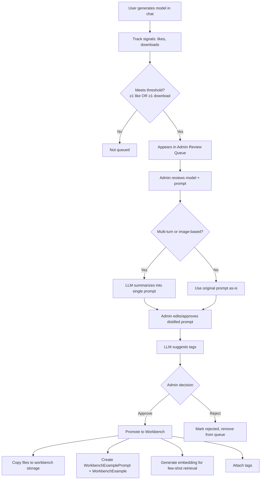

# User Content Curation Pipeline

## Goal

Enable admin review and promotion of user-generated 3D models into the workbench library, improving generation quality and building training data for future models.

## Design Decisions

| Decision | Choice |
|----------|--------|
| Positive signals only | Track likes (`rating = 1`) and download counts — no negative signal tracking |
| Download tracking | `download_count` on `chat_items`, incremented on each file download |
| Soft-delete for contexts | Add `deleted_at` timestamp to `chat_contexts`; grace period before hard delete |
| Review queue filter | At least 1 like OR at least 1 download on a chat item with successful render |
| Admin view | Show model + prompt context only, no usernames (privacy by default) |
| Prompt distillation | Automated LLM summarization for multi-turn or image-based conversations |
| Prompt storage | Distilled prompt stored separately; original conversation preserved |
| Tagging | System-wide tags table; LLM suggests tags for candidates, matching existing tags when possible |
| Target category | Single "User Generated Models" workbench category initially |
| Post-approval pipeline | No re-generation or re-evaluation; use existing files/screenshots from chat |
| Workbench integration | Approved models get embeddings and become available for few-shot retrieval |

## Architecture Overview



## Phase 1: Signal Tracking + Admin Review Queue

### Scope
- Add `download_count` to `chat_items`
- Soft-delete for `chat_contexts` (add `deleted_at`, update delete logic with grace period)
- Admin API endpoints for review queue
- Admin UI tab showing candidates (models with ≥1 like or ≥1 download)
- Display: ISO screenshot, prompt text, like count, download count, conversation length
- Actions: "Review" (opens detail view), "Dismiss" (hide from queue without deleting)

### Database Changes

```sql
-- Add download_count to chat_items
ALTER TABLE chat_items ADD COLUMN download_count INTEGER NOT NULL DEFAULT 0;

-- Soft-delete for chat_contexts
ALTER TABLE chat_contexts ADD COLUMN deleted_at TIMESTAMPTZ;

-- Curation tracking
CREATE TABLE curation_candidates (
  id UUID PRIMARY KEY DEFAULT gen_random_uuid(),
  chat_item_id UUID NOT NULL REFERENCES chat_items(id),
  status VARCHAR(20) NOT NULL DEFAULT 'pending',  -- pending, reviewing, approved, rejected, dismissed
  reviewed_at TIMESTAMPTZ,
  notes TEXT,
  created_at TIMESTAMPTZ NOT NULL DEFAULT now(),
  updated_at TIMESTAMPTZ NOT NULL DEFAULT now()
);
```

### API Endpoints

- `GET /api/admin/curation/candidates` — List candidates (filter by status)
- `GET /api/admin/curation/candidates/:id` — Get candidate detail (chat item + context messages)
- `PATCH /api/admin/curation/candidates/:id` — Update status (dismiss, approve, reject)

### Soft-Delete Behavior
- `DELETE /api/chat/contexts/:id` sets `deleted_at = now()` instead of hard delete
- Soft-deleted contexts are hidden from user's context list
- A background job (or manual admin action) hard-deletes after grace period (e.g., 30 days)
- Curation candidates from soft-deleted contexts remain reviewable during grace period

### File Download Tracking
- Existing `GET /api/files/download` endpoint increments `download_count` on the associated chat item
- Need to resolve chat item from file path (pattern: `chat/{contextId}/{itemId}.{ext}`)

---

## Phase 2: LLM Prompt Summarization + Tagging

### Scope
- LLM-powered prompt distillation for multi-turn/image-based conversations
- System-wide tags table
- LLM-powered tag suggestion (matching existing tags, proposing new ones)
- Admin UI for editing distilled prompts and managing tag suggestions

### Database Changes

```sql
-- Tags system
CREATE TABLE tags (
  id UUID PRIMARY KEY DEFAULT gen_random_uuid(),
  name VARCHAR(100) NOT NULL UNIQUE,
  created_at TIMESTAMPTZ NOT NULL DEFAULT now()
);

-- Tag assignments for curation candidates
CREATE TABLE curation_candidate_tags (
  candidate_id UUID NOT NULL REFERENCES curation_candidates(id) ON DELETE CASCADE,
  tag_id UUID NOT NULL REFERENCES tags(id) ON DELETE CASCADE,
  suggested_by VARCHAR(20) NOT NULL DEFAULT 'llm',  -- llm, admin
  PRIMARY KEY (candidate_id, tag_id)
);

-- Add distilled prompt to curation candidates
ALTER TABLE curation_candidates ADD COLUMN distilled_prompt TEXT;
ALTER TABLE curation_candidates ADD COLUMN original_prompt TEXT;
```

### Summarization Logic
- Triggered when admin clicks "Review" on a candidate
- Collects all messages from the chat context (user + assistant turns)
- Sends to LLM with instructions to produce a single, clear prompt describing the final model
- For image-based chats: includes assistant's description of the image as context
- Admin can edit the distilled prompt before approval

### Tag Suggestion Logic
- After prompt distillation, LLM is asked to suggest 1-5 tags
- LLM receives the list of existing tags and is instructed to prefer matches
- New tags are created only when no existing tag fits
- Admin can add/remove tags before approval

---

## Phase 3: Approval & Workbench Promotion

### Scope
- Approval workflow that creates workbench entries from approved candidates
- Copy files from chat storage to workbench storage
- Generate embedding for the distilled prompt
- Attach tags to workbench prompt

### Database Changes

```sql
-- Tags on workbench prompts
CREATE TABLE workbench_prompt_tags (
  prompt_id UUID NOT NULL REFERENCES workbench_example_prompts(id) ON DELETE CASCADE,
  tag_id UUID NOT NULL REFERENCES tags(id) ON DELETE CASCADE,
  PRIMARY KEY (prompt_id, tag_id)
);

-- Link curation candidate to created workbench example
ALTER TABLE curation_candidates ADD COLUMN workbench_example_id UUID REFERENCES workbench_examples(id);
```

### Promotion Process
1. Admin approves candidate with finalized prompt and tags
2. System creates `WorkbenchExamplePrompt` in "User Generated Models" category
3. System copies files (3mf, step, stl, b123d, screenshots) from `chat/` to `workbench/` storage
4. System creates `WorkbenchExample` with `approvalStatus = 'human_approved'`
5. System generates embedding for the distilled prompt
6. System attaches tags to the workbench prompt
7. Candidate status updated to `approved` with link to workbench example

### File Mapping
- Source: `chat/{contextId}/{itemId}.{ext}` and `chat/{contextId}/{itemId}-screenshot-{angle}.png`
- Target: `workbench/{categoryId}/{exampleId}.{ext}` and `workbench/{categoryId}/{exampleId}-{angle}.png`

---

## Phase 4: Similarity Check (Duplicate Prevention)

### Scope
- Before approving a candidate, show the reviewer how similar the distilled prompt is to existing workbench entries
- Helps avoid promoting duplicate or near-duplicate models into the library
- Uses existing vector embeddings infrastructure (`findSimilarExamples`)

### Similarity Check
- Triggered on demand via "Check Similarity" button (requires distilled prompt)
- Embeds the distilled prompt and compares against all existing workbench prompt embeddings
- Returns top 5 most similar existing prompts with cosine similarity scores
- Displays a novelty score (1 − max similarity) with color-coded recommendation:
  - **< 0.70 similarity** → "Novel" (green) — safe to add
  - **0.70–0.85** → "Similar" (yellow) — review carefully
  - **> 0.85** → "Likely duplicate" (red) — probably skip
- Shows thumbnails + prompts of the most similar existing workbench examples for visual comparison

### API Endpoint
- `POST /api/admin/curation/candidates/:id/check-similarity`
  - Requires distilled prompt to be set
  - Returns: `{ noveltyScore, maxSimilarity, matches: [{ prompt, similarity, exampleId, screenshotPath }] }`
  - Read-only check, no DB persistence

### UI
- New section in curation drawer between prompt and tags sections
- "Check Similarity" button (enabled when distilled prompt exists)
- Novelty score badge with color coding
- Scrollable list of similar existing models with thumbnails and similarity percentages

---

## Implementation Status

- [x] **Phase 1**: Signal Tracking + Admin Review Queue
  - [x] Add `download_count` to `chat_items`
  - [x] Implement download count increment in file download endpoint
  - [x] Soft-delete for `chat_contexts`
  - [x] Create `curation_candidates` table
  - [x] Admin API endpoints for curation
  - [x] Admin UI: Curation tab with candidate list
  - [x] Admin UI: Candidate detail view
- [x] **Phase 2**: LLM Prompt Summarization + Tagging
  - [x] Create `tags` and `curation_candidate_tags` tables
  - [x] LLM prompt distillation service
  - [x] LLM tag suggestion service
  - [x] Admin UI: Prompt editing + tag management
- [x] **Phase 3**: Approval & Workbench Promotion
  - [x] Create `workbench_prompt_tags` table
  - [x] Promotion service (file copy, workbench entry creation, embedding generation)
  - [x] Admin UI: Approval action with confirmation
  - [x] "User Generated Models" workbench category (seed data)
- [x] **Phase 4**: Similarity Check (Duplicate Prevention)
  - [x] Similarity check endpoint (embed distilled prompt, compare against workbench)
  - [x] Admin UI: Similarity section with novelty score + similar model thumbnails
